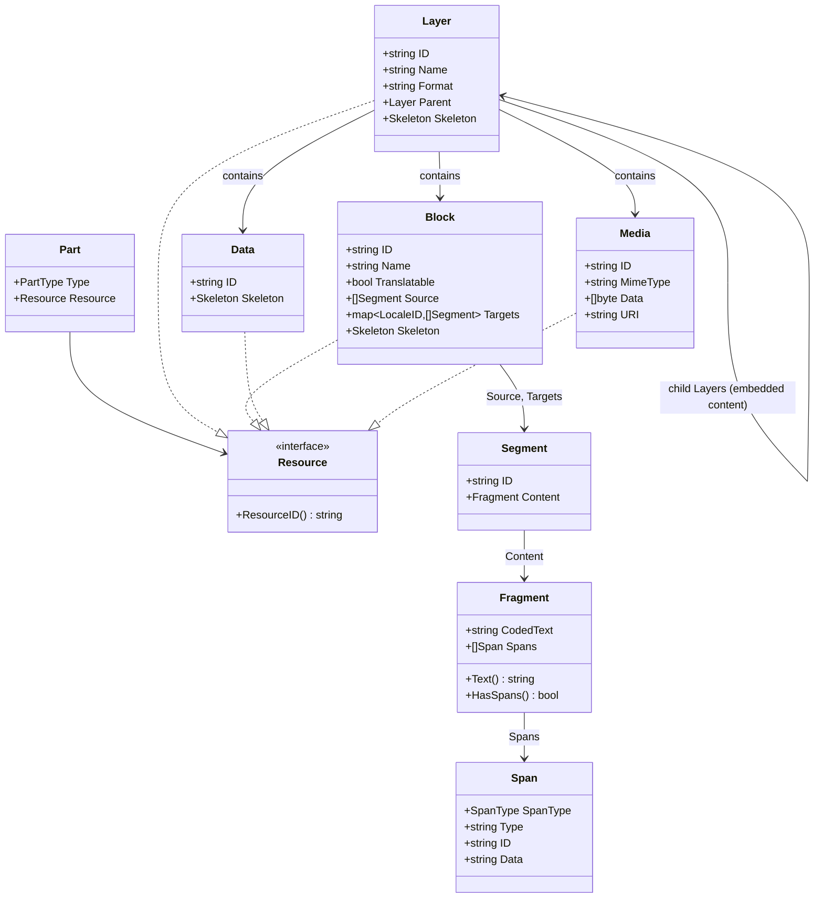
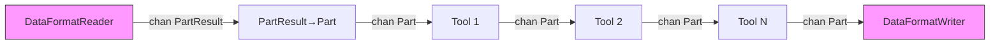
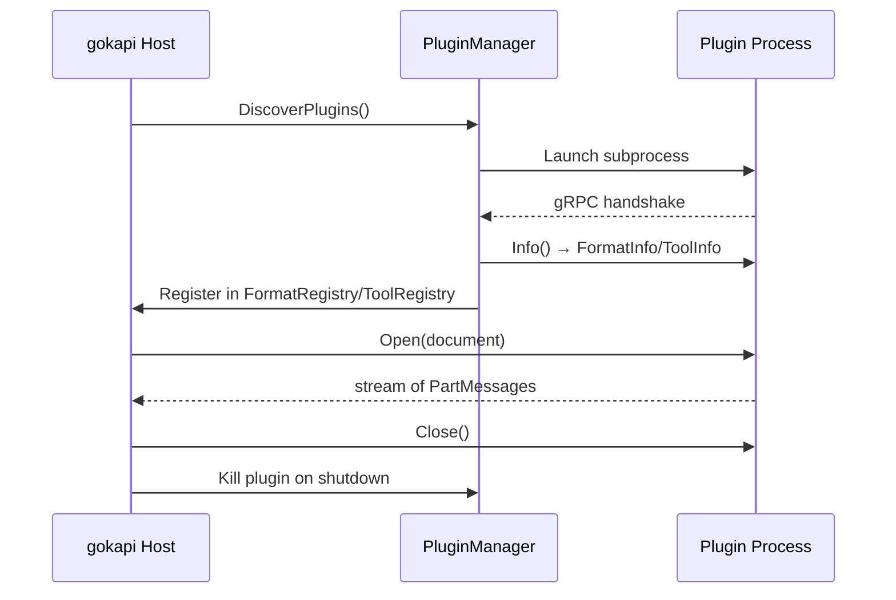
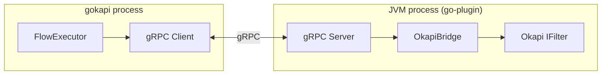

# gokapi: Architecture

## Table of Contents
- [Package Layout](#package-layout)
- [Content Model](#content-model)
- [Data Format Layer](#data-format-layer)
- [Tool Layer](#tool-layer)
- [Flow Execution](#flow-execution)
- [Skeleton System](#skeleton-system)
- [Configuration](#configuration)
- [Plugin System](#plugin-system)
- [Okapi Bridge](#okapi-bridge)
- [AI/LLM Integration](#aillm-integration)
- [Build and Distribution](#build-and-distribution)

---

## Package Layout

```
gokapi/
├── go.mod
├── go.sum
├── core/                          # Core framework library
│   ├── model/                     # Content model types
│   │   ├── part.go               # Part, PartType, PartResult
│   │   ├── block.go              # Block (translatable content)
│   │   ├── layer.go              # Layer (structural grouping: document/section/embedded)
│   │   ├── fragment.go           # Fragment (text with spans)
│   │   ├── span.go               # Span (inline markup)
│   │   ├── data.go               # Data (non-translatable)
│   │   ├── media.go              # Media (binary content)
│   │   ├── group.go              # GroupStart, GroupEnd
│   │   ├── rawdocument.go        # RawDocument
│   │   ├── skeleton.go           # Skeleton, SkeletonPart
│   │   ├── locale.go             # LocaleID, locale utilities
│   │   └── annotation.go         # Annotation interface, AltTranslation
│   ├── format/                    # Data format interfaces
│   │   ├── reader.go             # DataFormatReader interface
│   │   ├── writer.go             # DataFormatWriter interface
│   │   ├── base_reader.go        # BaseFormatReader (embedding target)
│   │   ├── base_writer.go        # BaseFormatWriter (embedding target)
│   │   ├── config.go             # DataFormatConfig interface
│   │   └── detect.go             # FormatDetector (sniffing, MIME, extension)
│   ├── tool/                      # Tool interfaces
│   │   ├── tool.go               # Tool interface
│   │   ├── base.go               # BaseTool with event dispatch
│   │   └── config.go             # ToolConfig interface
│   ├── flow/                      # Flow execution
│   │   ├── flow.go               # Flow struct
│   │   ├── executor.go           # FlowExecutor, DefaultFlowExecutor
│   │   └── builder.go            # FlowBuilder (fluent API)
│   ├── registry/                  # Format and tool registries
│   │   ├── format.go             # FormatRegistry
│   │   ├── tool.go               # ToolRegistry
│   │   └── plugin.go             # PluginManager
│   ├── config/                    # Application configuration
│   │   └── config.go             # Viper-based AppConfig
│   └── encoding/                  # Text encoding utilities
│       └── encoder.go            # Encoder, EncoderManager
│
├── formats/                       # Data format implementations
│   ├── plaintext/                 # Plain text format
│   │   ├── reader.go
│   │   ├── writer.go
│   │   ├── config.go
│   │   └── reader_test.go
│   ├── html/                      # HTML format
│   │   ├── reader.go
│   │   ├── writer.go
│   │   ├── config.go
│   │   ├── parser.go             # HTML-specific parsing
│   │   └── reader_test.go
│   ├── xml/                       # Generic XML format
│   ├── xliff/                     # XLIFF 1.2 format
│   ├── xliff2/                    # XLIFF 2.0 format
│   ├── json/                      # JSON format
│   ├── yaml/                      # YAML format
│   ├── po/                        # Gettext PO format
│   ├── properties/                # Java .properties format
│   ├── markdown/                  # Markdown format
│   └── register.go               # init() registration of all native formats
│
├── tools/                         # Tool implementations
│   ├── segmentation/              # SRX segmentation
│   │   ├── tool.go
│   │   ├── srx.go                # SRX rule parsing
│   │   └── tool_test.go
│   ├── leveraging/                # TM leveraging
│   ├── search/                    # Search and replace
│   ├── wordcount/                 # Word count
│   ├── qualitycheck/              # QA checking
│   ├── copysource/                # Copy source to target
│   ├── encoding/                  # Encoding conversion
│   ├── linebreak/                 # Line break normalization
│   └── register.go               # init() registration of all native tools
│
├── ai/                            # AI/LLM integration
│   ├── provider/                  # LLM provider interfaces
│   │   ├── provider.go           # LLMProvider interface
│   │   ├── anthropic.go          # Anthropic Claude provider
│   │   ├── openai.go             # OpenAI provider
│   │   └── ollama.go             # Ollama local provider
│   ├── tools/                     # AI-powered tools
│   │   ├── translate.go          # AI translation tool
│   │   ├── qualitycheck.go       # AI-powered QA
│   │   ├── terminology.go        # AI terminology extraction
│   │   └── review.go             # AI translation review
│   └── prompt/                    # Prompt templates
│       ├── translate.go
│       └── qa.go
│
├── plugin/                        # Plugin system
│   ├── proto/                     # gRPC protobuf definitions
│   │   └── v1/
│   │       ├── format.proto
│   │       ├── tool.proto
│   │       └── common.proto
│   ├── host/                      # Plugin host (gokapi side)
│   │   ├── manager.go            # PluginManager
│   │   ├── format_client.go      # gRPC client for format plugins
│   │   └── tool_client.go        # gRPC client for tool plugins
│   ├── server/                    # Plugin server helpers (plugin side)
│   │   ├── format_server.go      # gRPC server for format plugins
│   │   └── tool_server.go        # gRPC server for tool plugins
│   ├── bridge/                    # Okapi bridge
│   │   ├── java_bridge.go        # JVM subprocess manager
│   │   └── okapi-bridge/          # Bridge plugin source (separate repo)
│   │       ├── pom.xml
│   │       └── src/
│   └── registry/                  # Remote plugin registry client
│       └── remote.go
│
├── cmd/                           # CLI entry points
│   └── kapi/                      # CLI application
│       └── main.go
│
├── apps/                          # Desktop/GUI applications
│   └── bowrain/                   # Desktop GUI application (Wails)
│       ├── main.go
│       ├── app.go                 # Go backend exposed to frontend
│       ├── wails.json
│       └── frontend/              # React + TypeScript + Tailwind + shadcn/ui
│           ├── package.json
│           ├── vite.config.ts
│           ├── src/
│           └── ...
│
├── internal/                      # Internal utilities
│   ├── icu/                       # ICU/Unicode utilities
│   ├── xmlutil/                   # XML processing helpers
│   └── testutil/                  # Test helpers
│
├── testdata/                      # Shared test data files
│   ├── html/
│   ├── xml/
│   ├── xliff/
│   └── ...
│
├── .github/
│   └── workflows/
│       ├── ci.yml                 # CI: test, lint, build
│       └── release.yml            # Release: goreleaser + homebrew
│
├── .goreleaser.yml                # GoReleaser configuration
└── docs/                          # This documentation
```

---

## Content Model

The content model defines the types that flow through a Flow. It replaces Okapi's Event/TextUnit/TextContainer/TextFragment/Code hierarchy with more intuitive names and introduces **hierarchical Layers** for embedded content.



### Layer: Hierarchical Structural Grouping

A **Layer** is a top-level structural grouping — a document, a section, or embedded content. Layers are the key innovation over Okapi's content model.

**Key insight:** Embedded content (HTML inside JSON values, CDATA in XML, rich text in spreadsheet cells) becomes a **child Layer** with its own DataFormat. The parent Layer's DataFormatReader detects embedded content and delegates to the appropriate child DataFormatReader/Writer for processing.

```
Example: JSON file with embedded HTML values

Layer (root, format="json")
├── Block (key: "title", text: "Welcome")
├── Block (key: "subtitle", text: "Hello world")
├── Layer (child, format="html", key: "body")     ← embedded HTML
│   ├── Block (text: "Click ")
│   │   └── Fragment with Spans: <a href="...">here</a>
│   ├── Block (text: "More content")
│   └── Data (non-translatable HTML structure)
├── Block (key: "footer", text: "Copyright 2025")
└── Media (key: "logo", image data)
```

This replaces Okapi's `START_SUBFILTER` / `END_SUBFILTER` and `START_SUBDOCUMENT` / `END_SUBDOCUMENT` events with a clean hierarchical structure. Child Layers carry a `Format` field indicating which DataFormatReader/Writer handles their content.

### Part Stream

Parts flow through channels as the core streaming mechanism. Layer start/end events bracket structural sections:

```
DataFormatReader.Read(ctx) → chan PartResult
    → PartResult{Part: &Part{Type: PartLayerStart, Resource: &Layer{Format: "json"}}}
    → PartResult{Part: &Part{Type: PartBlock, Resource: &Block{Name: "title", ...}}}
    → PartResult{Part: &Part{Type: PartLayerStart, Resource: &Layer{Format: "html", ...}}}  ← child
    → PartResult{Part: &Part{Type: PartBlock, Resource: &Block{...}}}                        ← inside child
    → PartResult{Part: &Part{Type: PartLayerEnd, Resource: &Layer{...}}}                     ← child ends
    → PartResult{Part: &Part{Type: PartBlock, Resource: &Block{Name: "footer", ...}}}
    → PartResult{Part: &Part{Type: PartLayerEnd, Resource: &Layer{...}}}
    → (channel closed)
```

### Inline Span Encoding

Fragments use a "coded text" approach inherited from Okapi: inline markup is replaced by special Unicode marker characters (in the private use area U+E000-U+E0FF). The actual markup data is stored in the `Spans` slice. This allows string operations on the text without corrupting markup.

```
Source HTML: "Click <b>here</b> for info"

Fragment:
    CodedText: "Click \uE001here\uE002 for info"
    Spans: [
        {SpanType: SpanOpening, Type: "bold", Data: "<b>"},
        {SpanType: SpanClosing, Type: "bold", Data: "</b>"},
    ]
```

---

## Data Format Layer

Data Formats parse documents into Parts and reconstruct documents from Parts.

### DataFormatReader

Produces a channel of `PartResult` (Part + error pair). The channel-based design enables concurrent consumption by downstream Tools.

```go
reader := html.NewReader()
reader.Open(ctx, rawDoc)
for result := range reader.Read(ctx) {
    if result.Error != nil {
        // handle error
    }
    part := result.Part
    // process part
}
reader.Close()
```

### DataFormatWriter

Consumes Parts from a channel and writes the reconstructed document:

```go
writer := html.NewWriter()
writer.SetOutput("output.html")
writer.SetLocale(model.LocaleFrench)
writer.Write(ctx, partsChan)
writer.Close()
```

### Format Detection

Format detection uses a multi-strategy approach via the `FormatDetector`:

1. **MIME type mapping** — Each DataFormat declares its primary and alias MIME types. Given a MIME type (e.g., from HTTP `Content-Type`), the detector maps it to the correct format.
2. **File extension** — Each DataFormat declares supported extensions (e.g., `.html`, `.htm`). Fast and reliable when extensions are available.
3. **Content sniffing** — Each DataFormat can declare magic bytes or content patterns for detection. The detector reads the first N bytes and matches against registered signatures (e.g., `%PDF`, `PK` for ZIP/DOCX, `<?xml`, `<!DOCTYPE html>`).
4. **Cascade** — `FormatDetector.Detect()` tries all strategies in order: explicit MIME type → extension → content sniffing. Returns the first confident match.

```go
type FormatDetector struct {
    registry *FormatRegistry
}

// Detect determines the format using all available signals.
func (d *FormatDetector) Detect(path string, reader io.ReadSeeker, mimeType string) (string, error)

// DetectByMIME maps a MIME type to a format name.
func (d *FormatDetector) DetectByMIME(mimeType string) (string, error)

// DetectByExtension maps a file extension to a format name.
func (d *FormatDetector) DetectByExtension(ext string) (string, error)

// DetectByContent sniffs content bytes to determine format.
func (d *FormatDetector) DetectByContent(reader io.ReadSeeker) (string, error)
```

Each DataFormatReader registers detection metadata:
```go
type FormatSignature struct {
    MIMETypes  []string   // e.g., ["text/html", "application/xhtml+xml"]
    Extensions []string   // e.g., [".html", ".htm", ".xhtml"]
    MagicBytes [][]byte   // e.g., [][]byte{[]byte("<!DOCTYPE"), []byte("<html")}
    Sniff      func([]byte) bool  // Custom content sniffing function (optional)
}
```

### Native vs. Plugin Formats

- **Native formats** (Phase 2): Implemented in Go, registered via `init()` in `formats/register.go`
- **Plugin formats** (Phase 3+): External executables communicating via gRPC, discovered by `PluginManager`
- **Java bridge formats** (Phase 4): Okapi Java filters wrapped as go-plugin executables

---

## Tool Layer

Tools process Parts in a Flow. Each Tool reads from an input channel and writes to an output channel.

### Tool Processing Pattern

```go
// Tool.Process signature:
Process(ctx context.Context, in <-chan *model.Part, out chan<- *model.Part) error
```

The `BaseTool` provides default dispatch logic: it reads from `in`, dispatches each Part to the appropriate `Handle*` method based on `PartType`, and sends the result to `out`. Concrete tools override specific handlers.

### Tool Categories (mapping from Okapi step categories)

| Category | Description | Examples |
|---|---|---|
| **Transform** | Modify content in-place | Segmentation, search/replace, case change |
| **Enrich** | Add metadata or translations | TM leveraging, AI translation, terminology |
| **Validate** | Check quality without modifying | QA checks, word count, spell check |
| **Convert** | Transform between representations | Encoding conversion, line break normalization |

---

## Flow Execution

A Flow chains Tools together with goroutines and channels:



Each arrow is a buffered Go channel. Each box runs in its own goroutine. Context cancellation propagates to all stages.

### Concurrency Model

- One goroutine per tool stage (concurrent pipeline stages)
- Buffered channels (configurable, default 64) for backpressure
- `context.Context` for cancellation and timeout
- `errgroup.Group` for coordinated error handling across goroutines
- **Parallel document processing**: `WithMaxConcurrency(n)` enables bounded fan-out across documents using a semaphore pattern. Each document gets a fresh tool chain created from `ToolFactories` to avoid shared state. Default is sequential (MaxConcurrency=1).
- **Collector aggregation**: `Collector` interface enables cross-document result accumulation (e.g., word count summaries). Collectors are fed after each document completes and must be safe for concurrent use.

### Error Handling

Errors propagate via:
1. `PartResult.Error` from DataFormatReaders (error alongside the stream)
2. `Tool.Process()` return value (stops the pipeline)
3. `context.Cancel()` to signal all goroutines

When any stage errors, the context is canceled, and all goroutines drain and exit.

---

## Skeleton System

The Skeleton preserves non-translatable document structure for reconstruction. gokapi supports two strategies:

### 1. Fragment-Based (classic Okapi approach)

The Skeleton stores interleaved literal text and references to Blocks/Data. During writing, the writer replaces references with translated content.

```
Skeleton for "Hello <b>world</b>":
    Parts: [
        SkeletonText{Text: "<p>"},
        SkeletonRef{ResourceID: "tu1"},   → replaced with translated Block
        SkeletonText{Text: "</p>"},
    ]
```

Best for: formats where the structure is complex and interleaved (HTML, XML, XLIFF).

### 2. Re-Parse (simpler alternative)

The writer re-reads the source document during writing, replacing translatable content as it encounters it. No skeleton is stored — the source document IS the skeleton.

```
Writing flow:
    1. Re-open source document with the same DataFormatReader
    2. For each Block encountered, look up its translation
    3. Write the document structure with translated content
```

Best for: simple formats (plain text, properties, JSON) where re-parsing is trivial and skeleton storage adds unnecessary complexity.

### Strategy Selection

Each DataFormat declares its preferred skeleton strategy. The FlowExecutor uses this to configure the appropriate writing approach.

---

## Configuration

### Viper Integration

All configuration uses [Viper](https://github.com/spf13/viper) for flexible config sources:

- YAML config files (`gokapi.yaml`)
- Environment variables (`GOKAPI_*` prefix)
- CLI flags (via Cobra integration in kapi)
- Defaults in code

### Configuration Hierarchy

```
CLI flags (highest priority)
  ↓
Environment variables (GOKAPI_*)
  ↓
Project config (./gokapi.yaml)
  ↓
User config (~/.config/gokapi/gokapi.yaml)
  ↓
System config (/etc/gokapi/gokapi.yaml)
  ↓
Code defaults (lowest priority)
```

### Per-Format and Per-Tool Config

Each DataFormat and Tool has its own config struct implementing `DataFormatConfig` or `ToolConfig`. These are loaded from the relevant section of `gokapi.yaml`:

```yaml
formats:
  html:
    encoding: UTF-8
    preserveWhitespace: false
  xliff:
    version: "2.0"

tools:
  segmentation:
    srxPath: "./rules/default.srx"
  ai-translation:
    provider: anthropic
    model: claude-sonnet-4-20250514
```

---

## Plugin System

### Architecture

gokapi uses [HashiCorp go-plugin](https://github.com/hashicorp/go-plugin) for out-of-process plugin execution over gRPC. This enables:

- Plugins in any language (Go, Java, Python, Rust, etc.)
- Process isolation (plugin crashes don't kill the host)
- Versioned plugin protocol
- Health checking and automatic restart

### Plugin Types

| Type | gRPC Service | Description |
|---|---|---|
| `format_reader` | `DataFormatReaderPlugin` | Reads documents, streams Parts |
| `format_writer` | `DataFormatWriterPlugin` | Writes documents from Parts |
| `tool` | `ToolPlugin` | Bidirectional Part processing |

### Plugin Lifecycle



### Plugin Discovery

1. **Local directory**: Scan `~/.config/gokapi/plugins/` for executables matching `gokapi-format-*` or `gokapi-tool-*`
2. **Project directory**: Scan `./plugins/` for project-specific plugins
3. **Remote registry**: Fetch versioned plugins from a registry URL (configured in `gokapi.yaml`)

### Versioning

Plugins declare a version in their `Info()` response. The registry supports semantic versioning:

```yaml
plugins:
  registry: "https://plugins.gokapi.dev"
  formats:
    - name: openxml
      version: ">=1.0.0"
    - name: idml
      version: "1.2.3"
```

---

## Okapi Bridge

The Okapi bridge wraps existing Okapi Java filters as gokapi plugins. This gives immediate access to all 43 Okapi filters without rewriting them.

### Architecture



### How it works

1. A Go executable (`gokapi-okapi-bridge`) launches a JVM with a gRPC server
2. The server accepts `Open()` calls specifying which Okapi filter class to use
3. The Java side instantiates the Okapi filter, opens the document, and streams `PartMessage` responses
4. Part serialization converts between Okapi's `Event`/`TextUnit` and gokapi's `Part`/`Block` models
5. The Go side receives `PartMessage` via gRPC and converts to native `Part` objects

### Conversion Layer

| Okapi Java | gRPC Wire | gokapi Go |
|---|---|---|
| `Event(START_DOCUMENT, ...)` | `PartMessage{type: LAYER_START, ...}` | `Part{Type: PartLayerStart, Resource: &Layer{...}}` |
| `Event(TEXT_UNIT, TextUnit)` | `PartMessage{type: BLOCK, resource_json: ...}` | `Part{Type: PartBlock, Resource: &Block{...}}` |
| `Event(START_SUBFILTER, ...)` | `PartMessage{type: LAYER_START, ...}` | `Part{Type: PartLayerStart, Resource: &Layer{Format: "html", ...}}` (child) |
| `TextUnit.getSource()` | JSON field `source_segments` | `Block.Source` (`[]*Segment`) |
| `TextFragment.getCodedText()` | JSON field `coded_text` | `Fragment.CodedText` |
| `Code` | JSON field `spans[]` | `Span` |

### Bundled Java component

The Java bridge component lives in `plugin/bridge/java/` as a Maven project. It packages as a fat JAR containing:
- The gRPC server
- All Okapi filter dependencies
- The conversion layer

Build: `cd plugin/bridge/java && mvn package`

---

## AI/LLM Integration

AI capabilities are integrated as first-class Tools, composable in any Flow.

### LLM Provider Interface

```go
type LLMProvider interface {
    Name() string
    Translate(ctx context.Context, req TranslateRequest) (*TranslateResponse, error)
    Chat(ctx context.Context, messages []Message) (*Message, error)
    Complete(ctx context.Context, prompt string) (string, error)
}
```

Implementations: Anthropic (Claude), OpenAI, Ollama (local).

### AI Tools

| Tool | Description | Flow Position |
|---|---|---|
| `ai-translate` | Translates Blocks using an LLM | After segmentation and TM leveraging |
| `ai-qa` | Checks translation quality using LLM | After translation, before writing |
| `ai-terminology` | Extracts terms and builds glossaries | Standalone or enrichment pass |
| `ai-review` | Reviews translations with explanations | Post-translation review pass |

### Context-Aware Translation

AI translation tools can leverage the full content model:
- **Block context**: surrounding Blocks for better translation
- **Segment alignment**: honor SRX segmentation boundaries
- **Terminology**: glossary-constrained translation
- **TM matches**: use fuzzy matches as hints
- **Format awareness**: preserve inline Spans correctly

### Example Flow with AI

```yaml
# gokapi.yaml flow definition
flows:
  ai-translate:
    tools:
      - segmentation:
          srxPath: "./rules/default.srx"
      - leveraging:
          tmPath: "./tm/project.tmx"
          threshold: 0.7
      - ai-translate:
          provider: anthropic
          model: claude-sonnet-4-20250514
          glossaryPath: "./glossary.tbx"
          skipExactMatches: true
      - ai-qa:
          provider: anthropic
          checks: [terminology, fluency, accuracy]
```

---

## Build and Distribution

### CI/CD (GitHub Actions)

**ci.yml** — Runs on every push/PR:
- `go test ./...`
- `go vet ./...`
- `golangci-lint`
- Build all targets (linux/darwin/windows, amd64/arm64)

**release.yml** — Runs on tag push (`v*`):
- GoReleaser builds all binaries
- Creates GitHub Release with changelogs
- Updates Homebrew formula in `homebrew-tap` repo
- Builds and signs Bowrain app bundles

### GoReleaser Configuration

```yaml
builds:
  - id: kapi
    main: ./cmd/kapi
    binary: kapi
    goos: [linux, darwin, windows]
    goarch: [amd64, arm64]
  - id: bowrain
    main: ./apps/bowrain
    binary: bowrain
    goos: [linux, darwin, windows]
    goarch: [amd64, arm64]

brews:
  - name: kapi
    repository:
      owner: <org>
      name: homebrew-tap
    homepage: "https://gokapi.dev"
    description: "CLI tool for localization and translation"

  - name: bowrain
    repository:
      owner: <org>
      name: homebrew-tap
    homepage: "https://gokapi.dev"
    description: "Desktop GUI for localization flows"
    cask: true
```

### Distribution Channels

| Channel | Target | Tool |
|---|---|---|
| Homebrew formula | kapi CLI (macOS/Linux) | `brew install <org>/tap/kapi` |
| Homebrew Cask | Bowrain GUI (macOS) | `brew install --cask <org>/tap/bowrain` |
| GitHub Releases | All platforms | Direct download |
| Go install | Go developers | `go install github.com/<org>/gokapi/cmd/kapi@latest` |
| Docker | Server deployments | `docker pull ghcr.io/<org>/gokapi` |
