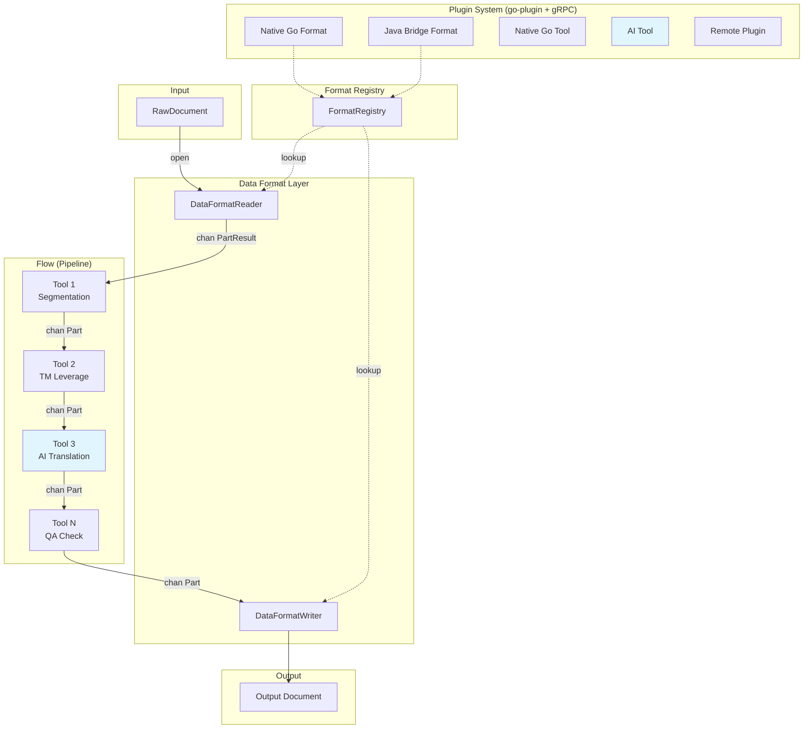
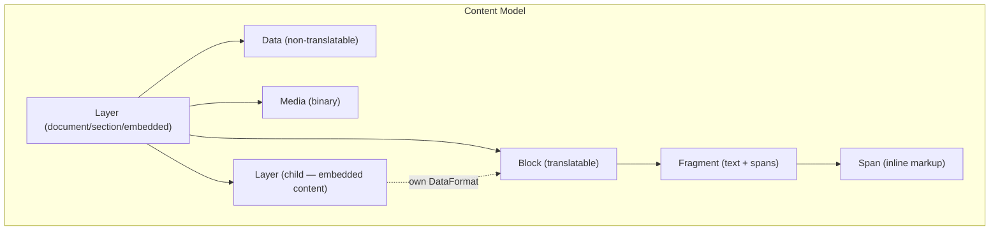

# gokapi: Project Overview

## Vision

gokapi is a modern, AI-native reimagining of the [Okapi Framework](https://okapiframework.org/) in Go. It preserves the battle-tested concepts of Okapi — format-aware document parsing, pipeline-based processing, and pluggable tools — while embracing Go idioms, modern AI capabilities, and a reimagined content model with intuitive terminology.

**Goals:**
- Process 80+ document formats for localization and translation
- Channel-based concurrent processing flows
- HashiCorp go-plugin architecture for extensible Data Formats and Tools
- AI/LLM integration as first-class Tools (translation, QA, terminology)
- Java bridge for leveraging existing Okapi filter implementations
- Single-binary distribution for CLI (`kapi`) and desktop app (`Bowrain`)

## Terminology Mapping

gokapi reimagines Okapi's concepts with clearer, more intuitive names.

### Core Concepts

| Okapi (Java) | gokapi (Go) | Description |
|---|---|---|
| Filter | **Data Format** | Parses documents into content parts and reconstructs them |
| IFilter | **DataFormatReader** | Reads a document, producing a stream of Parts |
| IFilterWriter | **DataFormatWriter** | Reconstructs a document from a stream of Parts |
| Step | **Tool** | Processes content parts in a flow (segmentation, QA, MT, etc.) |
| Pipeline | **Flow** | A sequence of Tools that content parts stream through |
| PipelineDriver | **FlowExecutor** | Orchestrates flow execution across batch items |
| Filter Configuration | **DataFormatConfig** | Configuration for a specific data format |
| IParameters | **ToolConfig** / **DataFormatConfig** | Configuration structs with Viper integration |
| FilterConfigurationMapper | **FormatRegistry** | Registry of available data formats and their configs |

### Content Model

Okapi's content model (TextUnit, TextContainer, TextFragment, Code) is reimagined with more intuitive names and a hierarchical Layer structure:

| Okapi (Java) | gokapi (Go) | Description |
|---|---|---|
| Event | **Part** | A unit of content flowing through a Flow |
| EventType | **PartType** | Type discriminator for Parts |
| StartDocument / StartSubDocument / StartSubFilter | **Layer** | A top-level structural grouping (document, section, or embedded content). Layers nest — embedded content (HTML inside JSON, CDATA in XML) becomes a child Layer with its own DataFormat. |
| TextUnit | **Block** | A translatable block of content (the primary content carrier) |
| TextFragment | **Fragment** | Text content with inline markup spans |
| Code | **Span** | An inline markup element within a Fragment (tag, placeholder) |
| DocumentPart | **Data** | Non-translatable document data |
| StartGroup | **GroupStart** | Signals the beginning of a structural group within a Layer |
| EndGroup | **GroupEnd** | Signals the end of a structural group |
| RawDocument | **RawDocument** | An unprocessed input document (retained) |
| GenericSkeleton | **Skeleton** | Preserved document structure for reconstruction |
| *(new)* | **Media** | Binary or media content (images, embedded objects) |
| *(new — replaces TextContainer)* | **Block.Source / Block.Targets** | Source and target segments live directly on the Block (no intermediate type) |

### Format Detection

| Okapi (Java) | gokapi (Go) | Description |
|---|---|---|
| FilterConfigurationMapper | **FormatRegistry** | Registry with format lookup by name |
| *(limited)* | **FormatDetector** | Content-based format sniffing: magic bytes, content patterns, extension, MIME type mapping |

### Applications

| Okapi | gokapi | Description |
|---|---|---|
| Tikal | **kapi** | CLI tool for extraction, merging, conversion, flow execution |
| Rainbow | **Bowrain** | Desktop GUI for flow configuration and execution (Wails + React) |
| Longhorn | *(Phase 8)* | REST API server for remote flow execution |
| CheckMate | *(integrated)* | QA checking integrated as a Tool |
| Ratel | *(integrated)* | SRX segmentation integrated as a Tool |
| Olifant / Pensieve | *(Phase 8)* | Translation memory system |

## Architecture Diagram

**Key insight:** Embedded content (HTML inside JSON values, CDATA in XML, rich text in spreadsheet cells) becomes a **child Layer** with its own DataFormat. The parent Layer's DataFormatReader detects embedded content and delegates to the appropriate child DataFormatReader. This replaces Okapi's separate `StartSubDocument`/`StartSubFilter` events with a clean hierarchical model.

## What Stays, What Changes, What's New

### Stays (core concepts preserved)
- Event-driven streaming architecture (documents parsed into parts, processed by tools)
- Format reader/writer separation (parse vs. reconstruct)
- Skeleton-based document reconstruction
- Batch processing of multiple documents
- SRX-based segmentation
- XLIFF as interchange format
- Translation memory leveraging
- Quality checking

### Changes (reimagined in Go)
- **Java inheritance hierarchies** → Go interfaces + struct embedding
- **Synchronous hasNext/next iteration** → Channel-based concurrent streaming (`chan PartResult`)
- **Java SPI classpath scanning** → HashiCorp go-plugin with gRPC + explicit registry
- **Exception-based errors** → `PartResult` carrying both Part and error
- **XML/properties config files** → Viper-based configuration (YAML/JSON/env/flags)
- **Content model naming** → Intuitive: Layer (structural), Block, Fragment, Span, Media, Data
- **Embedded content (subfilters)** → Nested Layers with per-Layer DataFormats (replaces `StartSubFilter`/`StartSubDocument`)
- **Java annotations for DI** → Interface-based setter injection or options pattern
- **Eclipse SWT GUI** → Wails + Vite + React + TypeScript + TailwindCSS + shadcn/ui
- **Maven multi-module build** → Go modules + GitHub Actions CI/CD
- **JVM distribution** → Single binary via Homebrew (kapi) + Homebrew Cask (Bowrain)

### New (gokapi additions)
- **AI/LLM as first-class Tools** — LLM translation, AI-powered QA, smart terminology extraction
- **Format sniffing** — Content-based format detection with magic bytes, patterns, and MIME type mapping
- **Concurrent flow execution** — goroutines per tool stage, channel backpressure
- **Hierarchical Layers** — Embedded content naturally represented as child Layers with their own DataFormats
- **Versioned plugin system** — Remote plugin registries, semantic versioning
- **Java bridge** — Existing Okapi filters available as go-plugin plugins
- **Media parts** — First-class support for binary/media content in the content model
- **Modern desktop UI** — Bowrain with React-based UI via Wails
- **Homebrew distribution** — `brew install kapi`, `brew install --cask bowrain`
