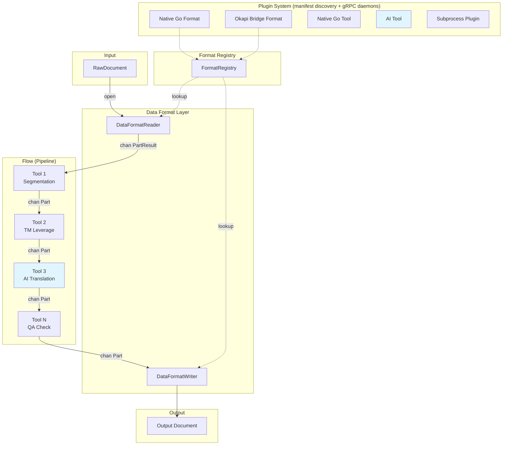
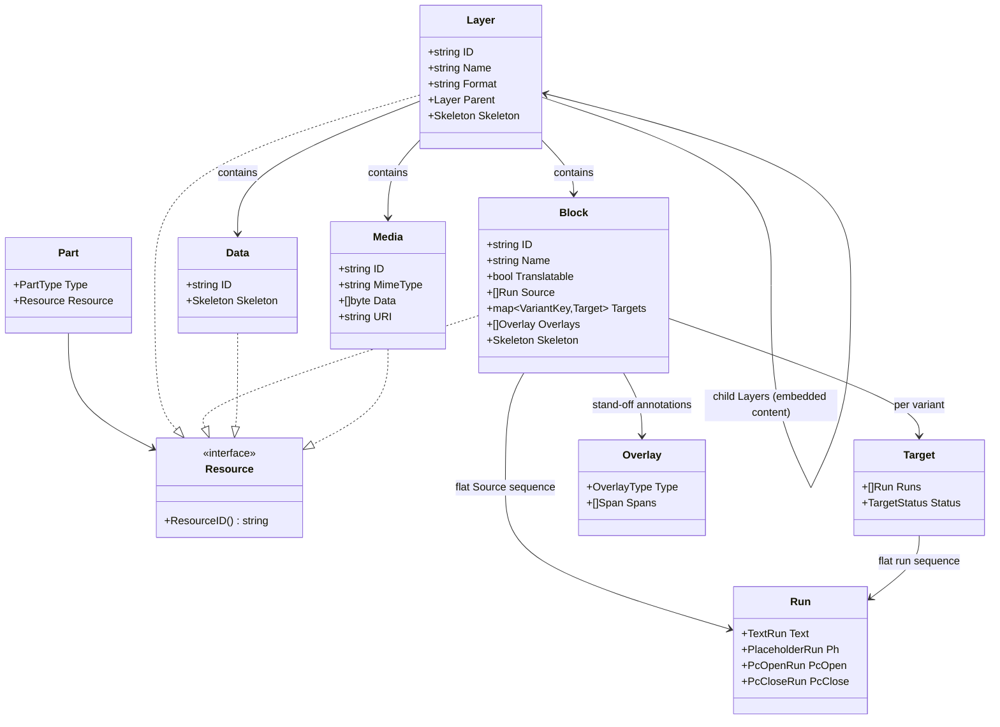

# neokapi: Architecture

neokapi is an AI-native reimagining of the [Okapi Framework](https://okapiframework.org/)
in Go. For the reasoning behind each major design choice, see the
[Architecture Decisions](../../web/docs/contribute/architecture/README.md).

## Architecture Diagram



Documents flow through a channel-based concurrent pipeline. Each tool runs in
its own goroutine. Buffered channels provide backpressure. See
[AD-004: Processing engine](../../web/docs/contribute/architecture/004-processing-engine.md).

## Package Layout

The project is a **multi-module monorepo** with seven Go modules coordinated by
`go.work`. The **framework** (`github.com/neokapi/neokapi`) at the repo root
provides the localization engine and stays platform-agnostic. A shared **CLI**
base (`cli/`) is reused by both the **kapi** binary and bowrain. The **kapi
desktop** app and the four **bowrain** modules (`bowrain`, `bowrain/core`,
`bowrain/cli`, `bowrain/plugin`) build on top. The bowrain modules are
documented here as cross-module facts; their own architecture lives under
`bowrain/docs/`.

```
neokapi/
├── go.work                          # workspace: framework + cli + kapi + kapi-desktop + bowrain modules
│
│   ── Framework Module (repo root) ──
├── go.mod                           # module github.com/neokapi/neokapi (Apache-2.0)
├── core/
│   ├── model/                       # Part, Block, Layer, Run, Target, Overlay, Data, Media
│   ├── format/                      # DataFormatReader/Writer interfaces, detection
│   ├── tool/                        # Tool interface, BaseTool dispatch
│   ├── flow/                        # Executor, Builder, pipeline orchestration
│   ├── registry/                    # FormatRegistry, ToolRegistry
│   ├── encoding/                    # Character encoding detection/conversion
│   ├── locale/                      # BCP-47 locale utilities
│   ├── editor/                      # Block index serialization and preview generation
│   ├── version/                     # Build version info (set via ldflags)
│   ├── formats/                     # Built-in format implementations (one package per format)
│   ├── storage/                     # Shared SQLite DB infrastructure (Open, Migrate)
│   ├── project/                     # .kapi project file format (Load, Save, Validate)
│   ├── tools/                       # Built-in utility tools (word count, pseudo, etc.)
│   ├── brand/                       # Brand-voice profiles + checks
│   ├── check/                       # Unified content checks
│   ├── plugin/                      # Plugin runtime support
│   │   ├── manifest/                # manifest.json parsing + validation
│   │   ├── protoconvert/            # Part ⇆ Okapi Event conversion
│   │   └── proto/                   # gRPC protobuf (v1 connector, v2 BridgeService)
│   └── internal/testutil/           # Shared test helpers (RawDocFromString, CollectBlocks, …)
├── sievepen/                        # Translation memory (interface + in-memory + SQLite + matching)
├── termbase/                        # Terminology (interface + in-memory + SQLite + import/export)
├── providers/
│   ├── ai/                          # package aiprovider — LLM providers + AI tools
│   └── mt/                          # package mtprovider — MT providers + MT tools
├── bench/                           # Benchmarks
├── examples/                        # Plugin examples
│
│   ── CLI Module ──
├── cli/
│   ├── go.mod                       # module github.com/neokapi/neokapi/cli (framework only)
│   ├── config/                      # Viper-based app configuration (~/.config/kapi/)
│   ├── pluginhost/                  # Manifest discovery + dispatch + Mode-C daemon pool
│   ├── output/                      # Shared output formatting + types
│   └── storage/                     # SQLite-backed termbase and TM for CLI workflows
│
│   ── Kapi Module ──
├── kapi/
│   ├── go.mod                       # module github.com/neokapi/neokapi/kapi (framework + cli)
│   ├── cmd/kapi/                    # Thin root cmd wiring shared CLI commands
│   └── preset/                      # Built-in preset definitions
│
│   ── Kapi Desktop Module ──
├── apps/
│   └── kapi-desktop/                # Wails v3 desktop app (Go + React/TS)
│       ├── go.mod                   # module github.com/neokapi/neokapi/kapi-desktop
│       ├── backend/                 # Go backend: project, flows, runner, credentials, plugins
│       └── frontend/                # React + Vite + TailwindCSS
│
│   ── Bowrain Modules (cross-module) ──
├── bowrain/
│   ├── go.mod                       # module github.com/neokapi/neokapi/bowrain
│   ├── core/                        # module github.com/neokapi/neokapi/bowrain/core (framework only)
│   ├── cli/                         # module github.com/neokapi/neokapi/bowrain/cli (kapi-bowrain plugin)
│   ├── plugin/                      # module github.com/neokapi/neokapi/bowrain/plugin (schema/commands/connector/mcp)
│   ├── auth/ store/ connector/ service/ event/ server/   # server-side packages
│   ├── cmd/bowrain-server/          # Echo v4 REST API server
│   ├── cmd/bowrain-worker/          # Background worker
│   └── apps/                        # bowrain desktop, web, ctrl, pulse
│
│   ── Shared Frontend ──
├── package.json                     # Root npm workspace coordinating frontend packages
├── packages/
│   ├── ui/                          # @neokapi/ui-primitives — shadcn/ui primitives
│   ├── flow-editor/                 # @neokapi/flow-editor — shared React flow editor
│   ├── kapi-react/                  # @neokapi/kapi-react — React component library
│   └── …                            # docs-shared, kapi-playground, reference-data, …
│
│   ── Non-Go Assets ──
├── docs/                            # Architecture notes, maintainer docs (this directory)
└── web/                        # Docusaurus documentation site (ADs + internal notes)
```

The format packages live in the framework module under `core/formats/` — one
package (reader.go, writer.go, config.go) per format, all registered via
`init()`. They span localization, document, data, subtitle, and office
families. For the current set and their configuration options, see the
generated Format Reference rather than a hardcoded list.

## Content Model



Embedded content (HTML inside JSON, CDATA in XML) is modeled as nested
Layers, each with its own DataFormat. See
[AD-002: Content model](../../web/docs/contribute/architecture/002-content-model.md).

### Inline Content as Runs

A block's `Source` (and each `Target`) is a flat `[]Run` — a discriminated
union of typed `Run` values. Plain text is a `TextRun`; paired
inline markup becomes a `PcOpenRun` / `PcCloseRun` sharing an ID; standalone
placeholders (variables, `<br/>`, icons) are a `PlaceholderRun`. Inline
markup never lives inside the text string, so text operations cannot corrupt
it. There is no structural `Segment` type — segmentation is a stand-off
`Overlay` layered over the runs.

```
Source HTML: Click <b>here</b> for info

Block.Source: [
    {Text:    {Text: "Click "}},
    {PcOpen:  {ID: "1", Type: "fmt:bold", Data: "<b>"}},
    {Text:    {Text: "here"}},
    {PcClose: {ID: "1", Type: "fmt:bold", Data: "</b>"}},
    {Text:    {Text: " for info"}},
]
```

### Part Stream

```
DataFormatReader.Read(ctx) -> chan PartResult
    -> PartLayerStart  (format="json")
    -> PartBlock        (key: "title")
    -> PartLayerStart  (format="html")        <- embedded child
    -> PartBlock        ("Hello <b>world</b>") <- inside child
    -> PartLayerEnd    (format="html")
    -> PartBlock        (key: "footer")
    -> PartLayerEnd    (format="json")
    -> (channel closed)
```

## Terminology Mapping from Okapi

| Okapi (Java)               | neokapi (Go)               |
| -------------------------- | -------------------------- |
| Filter                     | DataFormat (Reader/Writer) |
| Step                       | Tool                       |
| Pipeline                   | Flow                       |
| PipelineDriver             | Executor                   |
| Event                      | Part                       |
| TextUnit                   | Block                      |
| TextFragment               | Run sequence (`[]Run`)     |
| Code                       | Run                        |
| Segment (structural)       | Span in a segmentation Overlay |
| StartSubDocument/SubFilter | Child Layer                |
| Tikal                      | kapi (CLI)                 |
| Rainbow                    | Kapi Desktop (GUI)         |

## Key Interfaces

```go
// Format layer
type DataFormatReader interface {
    Open(ctx context.Context, doc *RawDocument) error
    Read(ctx context.Context) <-chan PartResult
    Close() error
}

type DataFormatWriter interface {
    SetOutput(path string) error
    Write(ctx context.Context, parts <-chan *Part) error
}

// Tool layer
type Tool interface {
    Process(ctx context.Context, in <-chan *Part, out chan<- *Part) error
}

// Flow execution
type Executor interface {
    Execute(ctx context.Context, f *Flow, items []*Item) error
}

// AI providers (package aiprovider, providers/ai)
type LLMProvider interface {
    Translate(ctx context.Context, req TranslateRequest) (*TranslateResponse, error)
    Chat(ctx context.Context, messages []Message) (*ChatResponse, error)
}
```

## Build and Distribution

The `kapi` CLI binary is built from `kapi/cmd/kapi`.

| Channel          | Target                | Command                                                      |
| ---------------- | --------------------- | ------------------------------------------------------------ |
| Homebrew formula | kapi CLI              | `brew install neokapi/tap/kapi-cli`                          |
| Homebrew cask    | Kapi Desktop (macOS)  | `brew install --cask neokapi/tap/kapi`                       |
| GitHub Releases  | All platforms         | Direct download                                              |
| Go install       | Go developers         | `go install github.com/neokapi/neokapi/kapi/cmd/kapi@latest` |

CI/CD runs via GitHub Actions: `ci.yml` (test, vet, lint, build on every
push) and `release.yml` (GoReleaser on tag push). See
[RELEASE.md](RELEASE.md) for the release process.
