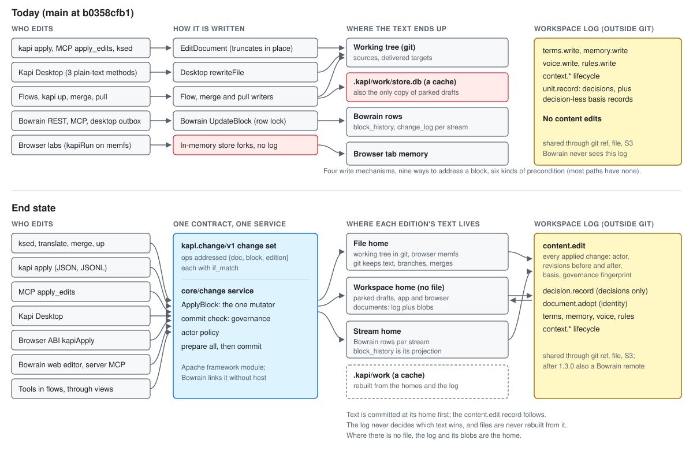

# Edit model: one change contract across neokapi

Status: approved by the founder on 2026-10-02, with one change: the peer-edition model ships
in 1.3.0 (decision D5, work package WP14). Implementation is in progress; the current-state ADs
change as each part lands.
Date: 2026-10-02. Base: `main` at `b0358cfb1` (tagged v1.3.0-rc3).

This note is the plan for one way of changing content in every part of neokapi: the
framework, the `kapi` CLI, MCP, Kapi Desktop, the browser build, flows and tools, and the
Bowrain platform. It also explains how content edits meet the workspace store that main
moved outside git. The current-state ADs change in place as each part lands (a new E-09 for
the contract; C-03, C-04, F-02, F-03, E-02, E-03 and S-01 to S-07 where touched). Until then
this note is the reference.

**Inputs.** Three proposals (**evolve-main**, **engine-first**, **contract-first**), two
judgements (**judge-arch**, **judge-product**), five research reports (**edit-paths**,
**main-model**, **ws-store**, **browser**, **codex-design**), and eight investigation reports
(**r1** to **r8**) with a critic's review (**critic**) of the codex content-engine study. They
were working files of the design session and are not committed; this note cites them by short
name and keeps the evidence it relies on inline. The codex study branches
(`codex/go-architecture-evaluation`, `codex/rust-full-parity`) are kept outside this repository's
history.

**Conventions.** `file:line` cites main at `b0358cfb1`. Inputs are cited by short name:
**evolve-main**, **engine-first**, **contract-first**, **judge-arch**, **judge-product**,
**edit-paths**, **main-model**, **ws-store**, **browser**, **codex-design**, **r1** to **r8**,
**critic**. "(observed)" marks a run, by me or by the cited report. "(inference)" marks
judgement. "(proposal)" marks something that does not exist on main. Every count of lines is
`wc -l` on main unless marked as an estimate.

**How this design was chosen.** The architecture judge preferred evolve-main (55 of 70) and
the product judge preferred contract-first (56 of 70). Each then grafted the other's
strengths onto its winner, and the two grafted designs agree on all but a handful of points.
This note takes its wire contract, proof discipline and sequencing from contract-first, its
commit mechanics and revision semantics from evolve-main, and its end-state content model,
immediate tool application and `Diff` from engine-first. Appendix A lists every disagreement
and how it is settled, with the evidence.

---

## 1. Summary

### The model

1. **One contract.** Every change to content, to a review decision or to a context asset is
   an operation in one change set, `kapi.change/v1`. One service in the Apache framework,
   `core/change`, applies it. The CLI, MCP, Kapi Desktop, the browser build, tools in flows
   and the Bowrain server each turn their input into a change set and call that service.
   Nothing else writes content.
2. **An operation names what it read.** Each operation carries `if_match`, the revision of
   the edition it read: a hash of that edition's runs, inline codes and their attributes
   included. When the edition has moved, the operation is refused with the current content,
   and nothing in the change set is written.
3. **Each edition's text has one home.** The home is a file in a working tree, a stream row
   on a Bowrain server, or, for content with no file, the workspace itself (its log plus
   content-addressed blobs). The home holds the text and decides conflicts.
4. **Every applied change is recorded in the workspace log.** A new operation kind,
   `content.edit`, joins `terms.write`, `memory.write`, `voice.write`, `rules.write` and the
   decision records in the log that main already keeps outside git, written through the
   projector and shared through the same git-ref, file and S3 backends.
5. **Everything else is derived.** `.kapi/work/` and Bowrain's history tables are rebuilt
   from the homes and the log.

"Source" becomes recipe policy. The recipe names the authoritative edition; every other
edition records the revision it was derived from (`basis`). Translation is one kind of
derivation, a same-language channel edition is another, and the engine treats both alike.

### The contract

Nine content operations (`set_content`, `replace_text`, `set_attribute`, `mark`,
`remove_edition`, `annotate`, `unannotate`, `insert_block`, `delete_block`), a `native` family
for format-specific construction, `decide` for review decisions and three asset operations
(`term`, `memory`, `recipe`) share one envelope, one result shape and a closed set of eleven
error codes mapped onto main's exit codes. Every operation is addressed by
`{doc, block, edition}`. A format advertises an operation only when an operations-matrix test
proves it reaches native bytes; every other request is refused with `unsupported`. The schema
is generated from Go and published to the CLI, MCP, TypeScript and a reference page.

### The surfaces

People keep verbs that say what they do (`ksed`, `translate`, `merge`, `up`, Kapi Desktop).
Scripts send JSON to `kapi apply`. Agents use three MCP tools (`read_blocks`, `apply_edits`,
`describe_format`). Every porcelain takes `--print-ops`, which prints the change set it would
apply, so the human path and the agent path share one format. Kapi Desktop, the browser ABI
and the Bowrain web editor call the same service directly, with no compatibility facade.

### What is removed

About 9,600 lines (2,329 of them generated proto code) and these concepts:

- the 26-field `changeEntry` union and the apply-edits tool;
- `EditDocument`'s truncating in-place write;
- Kapi Desktop's three plain-text edit methods and its private `rewriteFile`;
- the loop's decision-less basis records;
- Bowrain's two `PUT` content routes, its review, status and note routes, its MCP
  `update_block` and the 13-kind offline outbox;
- the browser's four in-memory store forks and their injection points;
- `kapi engine serve` with its proto, two example clients, CI job and reference page.

Four write mechanisms become one commit path with three homes; nine addressing schemes
become one; six kinds of precondition become two. About 9,000 lines are added (estimate).
Section 12 has the counts.

### 1.3.0

1.3.0 ships when every first-party write path goes through the service, the contract is frozen
after a paired agent evaluation, `content.edit` is recorded for every applied change, parked
drafts live in the workspace, the browser runs the native stores on sqlite-wasm, and Bowrain's
editor and MCP speak the contract. `model.Block` holds peer editions in 1.3.0 as well (decision D5,
WP14). DOCX native operations, durable browser storage and the Bowrain log remote come after
1.3.0. None of them changes the contract. Section 14 has the bar; section 16 has fifteen decisions, each with a
recommendation.

---

## 2. The edit contract

### 2.1 The envelope

```json
{
  "schema": "kapi.change/v1",
  "mode": "apply",
  "gate": "enforce",
  "require_basis": false,
  "note": "Point the guide link at the handbook and add the Norwegian edition",
  "evidence": [{"kind": "url", "ref": "https://example.com/issue/42"}],
  "ops": []
}
```

| Field | Meaning | Required |
| --- | --- | --- |
| `schema` | Contract version. Decoding is strict: an unknown field or an unknown `op` is refused as `invalid` with its JSON pointer. | on stored records; optional on input |
| `mode` | `apply` (default) or `preview`: compute, check and render, write nothing, and return the same result with a diff per document. `preview` replaces `kapi apply --diff`, which read through a different path from the write (`host/apply.go:376-411`; edit-paths A1). `propose` is reserved for after 1.3.0 (section 5.8). | no |
| `gate` | `enforce` (default) or `report`. Section 8 says who may choose `report`. | no |
| `require_basis` | Refuse a derived-edition write whose authoritative edition has moved since the caller read it. `kapi merge` sets it (section 4.2). | no |
| `note` | One line a person reads in history and review. | no |
| `evidence` | Where the wording behind the change was seen, as `kapi apply` asset entries carry today (`host/apply.go:112-117`). | no |
| `ops` | Ordered operations. | yes |

**There is no actor field.** The transport sets the actor: the CLI stamps a person (or the
agent session a hook names), MCP stamps the calling agent and its session, Kapi Desktop stamps
the person, Bowrain stamps the authenticated principal, and a flow stamps `tool:<flow>`. Main
lets an entry name itself today, and an agent's MCP term edit was recorded as a person's
(edit-paths P1, observed; `host/mcp_edit.go:130` passes the agent actor only to
`noteAgentEdits`, `host/apply_assets.go:72-79` defaults to a person).

**Input forms.** One JSON object; JSONL with the envelope fields on a first line and one
operation per line; or a JSON array of operations under default envelope values. `kapi apply`
reads all three from a file or stdin, as it reads entries today (`host/apply.go:313-374`).

**Order.** Operations apply in order, so operation *n* sees the result of earlier operations
on the same edition. Every `if_match` is checked against the state when the change set began,
so a caller never computes an intermediate revision. Positions in a later operation refer to
the edition after the earlier ones. Porcelain sends one operation per edition and puts all of
an edition's text edits inside one `replace_text`.

### 2.2 Operations

**Content operations.** Each carries `op`, `at` (a reference, section 3) and, when it changes
existing content, `if_match` (section 4).

| Op | Body | Replaces on main | Needs the capability |
| --- | --- | --- | --- |
| `set_content` | exactly one of `text` (placeholder form) or `runs`; optional `path` to a plural form or select case; `basis` on a derived edition; with `if_match: "absent"` it creates the edition | `kapi apply` content entries; desktop `UpdateSourceText` and `UpdateReviewTarget`; Bowrain `PUT …/:bid` and `PUT …/:bid/runs`; server MCP `update_block`; merge and pull output; every tool's target write; Bowrain rollback | every editable format; new codes only of types the writer can synthesize |
| `replace_text` | `edits[]`, each one of `{find, occurrence?}`, `{start, end}` (flat code points) or `{range}` (run positions), with `text`; optional `path` | `ksed`, `kapi exec search-replace`, `case-transform`, desktop `ApplyCheckFix`, voice-rewrite substitutions, `context_correct` from and to | every editable format |
| `set_attribute` | `code` (the run id placeholder text shows), `name`, `value` | nothing on main can do this (main-model §2, P3 observed) | per format, code type and attribute |
| `mark` | a range in any of the three forms above, `type` (a vocabulary type such as `fmt:bold` or `link:hyperlink`), `attrs` | nothing on main can do this (edit-paths §4.7) | per format and type |
| `remove_edition` | none | `kapi exec remove-target`, Bowrain revert-clear | formats that hold editions |
| `annotate` | `type`, `id?`, `anchor?` (a `model.Anchor`), `value` | Bowrain notes and entities routes, desktop notes, tool overlay writes | stand-off always; inline where the format declares it (`core/registry/format.go:133-140`) |
| `unannotate` | `type`, `id` | Bowrain note delete, `RemoveOverlay` | as `annotate` |
| `insert_block` | `doc`, `after` or `before` (a block key), `name?`, `editions` (edition key to `text` or `runs`) | nothing on main can do this | structural, per format |
| `delete_block` | `at` without an edition; `if_match` as a map from edition to revision, naming at least the block's own edition; every edition goes with the block | nothing on main can do this; dropping a Part leaves an empty shell (codex-design D6, observed) | structural, per format |
| `native` | `doc`, `if_match` (the document digest), `name`, `args` validated by the format's JSON Schema | codex's `docx.append_paragraph`, `append_table`, `append_image`, `replace_image` (r1 §1.6) | the format lists the operation and its schema |

**Decision and asset operations** share the envelope and the result.

| Op | Body | Replaces on main | Who may send it |
| --- | --- | --- | --- |
| `decide` | `at` with an edition, `if_match`, `outcome` (`establish`, `reject`, `withdraw`, `advise`), `score?` (0 to 100), `reasons?` | `kapi apply` review entries; desktop Approve and Reject; Bowrain `PUT …/review`, bulk review, approve-passing, `PUT …/status`; MCP `pre_review_unit` (as `advise`) | a person; an agent sends `advise` only (`host/convergereport.go:155-159` already refuses agent decisions) |
| `term` | `action` (`upsert`, `delete`) and today's term fields (`status`, `replacement`, `replaces`, `do_not_translate`, `advisory`, `competitor`) | `kapi apply` term entries | a person; an agent observes or corrects instead (`host/mcp_grow.go:30-37`) |
| `memory` | `action` (`add`, `delete`), `from: {edition, text}`, `to: {edition, text}` | `kapi apply` memory entries | a person |
| `recipe` | `path`, `value`, through the `project.SetField` allowlist | `kapi apply` recipe entries | a person |

**Why each one earns its place.** `set_content` and `replace_text` are the two shapes every
edit path on main already takes: a whole new text, or a partial change that keeps everything
else. `set_attribute` and `mark` are what a rich-text toolbar and an agent fixing a link need,
and no path on main expresses either. `remove_edition` is distinct from an empty edition,
which is a valid translation of an empty source. `annotate` and `unannotate` replace two
Bowrain verb families and the tool overlay setters. `insert_block` and `delete_block` are the
general-editing gap; adding a message key to `en.json` is a common agent task. `native` keeps
construction out of the portable set. `decide` binds a review decision to the revision the
reviewer saw; today a decision binds to whatever is current when it is recorded (edit-paths C1,
inference).

**Left out, and where each need goes.**

- `unmark`: a `set_content` that omits the code, guarded by the code's `deletable` constraint.
- `move_block`: no surface on main or in the proposals needs it; structural formats get it
  later as a native operation.
- codex `edit_embedded`: a subfilter's child block is already an ordinary addressable block
  with a qualified id (`core/model/blockid.go:218-223`; main-model §2).
- a `comment` kind: a code comment is a block of a source file (section 3.6).
- the context lifecycle verbs (`observe`, `correct`, `keep`, `drop`, `withdraw`, `revert`,
  `widen`, `settle`): they act on operations by id, already share one policy
  (`core/contextop/policy.go:58-108`), and keep their commands and MCP tools.

### 2.3 Operations on the wire

All examples edit this HTML document, `docs/guide.html`, whose paragraph has the block key `p`:

```html
<p>Read the <a href="https://old.example/guide">shop guide</a> before you <b>order</b>.</p>
```

Its runs are text `Read the `, pcOpen 1, text `shop guide`, pcClose 1, text ` before you `,
pcOpen 2, text `order`, pcClose 2, text `.`. Placeholder text shows them as
`Read the <x id="1"/>shop guide<x id="/1"/> before you <x id="2"/>order<x id="/2"/>.`
(`core/model/run_placeholder.go:8-23`).

```jsonc
// 1. New wording, codes kept.
{"op": "set_content", "at": {"doc": "docs/guide.html", "block": "p"}, "if_match": "r:3f9a1c0e7b2d4a55",
 "text": "Read the <x id=\"1\"/>handbook<x id=\"/1\"/> before you <x id=\"2\"/>order<x id=\"/2\"/>."}

// 2. A partial edit by match. The result echoes the run positions it resolved.
{"op": "replace_text", "at": {"doc": "docs/guide.html", "block": "p"}, "if_match": "r:3f9a1c0e7b2d4a55",
 "edits": [{"find": "shop guide", "text": "handbook"}]}

// 3. The same edit by flat code points (codes have zero width) and by run position.
{"op": "replace_text", "at": {"doc": "docs/guide.html", "block": "p"}, "if_match": "r:3f9a1c0e7b2d4a55",
 "edits": [{"start": 9, "end": 19, "text": "handbook"}]}
{"op": "replace_text", "at": {"doc": "docs/guide.html", "block": "p"}, "if_match": "r:3f9a1c0e7b2d4a55",
 "edits": [{"range": {"start": {"run": 2, "offset": 0}, "end": {"run": 2, "offset": 10}}, "text": "handbook"}]}

// 4. Change the link target.
{"op": "set_attribute", "at": {"doc": "docs/guide.html", "block": "p"}, "if_match": "r:3f9a1c0e7b2d4a55",
 "code": "1", "name": "href", "value": "https://new.example/handbook"}

// 5. Make "before you" bold. The writer synthesizes <b>…</b> from the vocabulary.
{"op": "mark", "at": {"doc": "docs/guide.html", "block": "p"}, "if_match": "r:3f9a1c0e7b2d4a55",
 "range": {"find": "before you"}, "type": "fmt:bold"}

// 6. Create the Norwegian edition in one operation, codes included, recording what it was made from.
{"op": "set_content", "at": {"doc": "docs/guide.html", "block": "p", "edition": "nb"}, "if_match": "absent",
 "basis": "r:3f9a1c0e7b2d4a55",
 "text": "Les <x id=\"1\"/>håndboka<x id=\"/1\"/> før du <x id=\"2\"/>bestiller<x id=\"/2\"/>."}

// 7. Edit one branch of an ICU plural. The path walks run 1, then its "one" form.
{"op": "replace_text", "at": {"doc": "locales/en.json", "block": "cart.items"}, "if_match": "r:77c0a1d2e3f40516",
 "edits": [{"path": [1, {"plural": "one"}], "find": "item", "text": "article"}]}

// 8. Remove a translation.
{"op": "remove_edition", "at": {"doc": "docs/guide.html", "block": "p", "edition": "de"}, "if_match": "r:0c55e1f2a3b4c5d6"}

// 9. A note on a span, and its removal.
{"op": "annotate", "at": {"doc": "docs/guide.html", "block": "p"}, "type": "note", "id": "n1",
 "anchor": {"kind": "range", "start": {"run": 2, "offset": 0}, "end": {"run": 2, "offset": 10}},
 "value": {"text": "Is it a handbook or a guide?"}}
{"op": "unannotate", "at": {"doc": "docs/guide.html", "block": "p"}, "type": "note", "id": "n1"}

// 10. Add and remove a message key in a key-value catalog (capability-gated).
{"op": "insert_block", "doc": "locales/en.json", "after": "nav.cart", "name": "nav.checkout",
 "editions": {"en": {"text": "Checkout"}}}
{"op": "delete_block", "at": {"doc": "locales/en.json", "block": "nav.legacy"}, "if_match": {"en": "r:5e10a2b3c4d5e6f7"}}

// 11. A person approves the French edition they read; an agent pre-reviews it.
{"op": "decide", "at": {"doc": "docs/guide.md", "block": "install/p", "edition": "fr"},
 "if_match": "r:74dbfac2ed1c9d6e", "outcome": "establish"}
{"op": "decide", "at": {"doc": "docs/guide.md", "block": "install/p", "edition": "fr"},
 "if_match": "r:74dbfac2ed1c9d6e", "outcome": "advise", "score": 80, "reasons": ["terminology"]}

// 12. A term beside the content fix.
{"op": "term", "action": "upsert", "term": "handbook", "status": "preferred", "replaces": "shop guide"}

// 13. A native DOCX operation, guarded by the document digest (after 1.3.0).
{"op": "native", "doc": "report.docx", "if_match": "sha256:9c1e…", "name": "docx.append_paragraph",
 "args": {"runs": [{"text": "Results"}], "style": "Heading2"}}
```

Example 6 is the case codex got wrong: its `create_variant` took plain text and silently
collapsed paired markup (r1 §5.3, critic C7). Example 7 is the case main gets wrong today:
`kapi apply` flattens a plural block to plain text, deletes its variable and reports
`applied` (main-model P1, observed; `core/tools/applyedits.go:101-109`).

Example 10 names the revision of the catalog's own edition only. `if_match` for `delete_block`
must name the own edition (a map without it is `invalid`, as an omitted precondition is, section
4.2), and every edition it names is checked (`stale` when moved or absent). The key leaves every
translation file too, named or not, since those translations have no source left. The new key in
the first operation goes in the object its key path names (`nav`), and with neither `after` nor
`before` it goes last there; a missing object on the path is created.

### 2.4 Rules every content operation obeys

Each rule fixes a defect the research reproduced.

1. **Text is a form of runs.** Placeholder text is parsed against a reference code set: the
   edition's own codes, or the authoritative edition's codes when the operation creates a
   derived edition. Creating `nb` from text therefore keeps the markup of `en`.
2. **Codes keep their constraints.** Removing a code needs `deletable`, cloning needs
   `cloneable`, reordering needs `reorderable` (`core/model/vocabulary.go:53-58`). Otherwise the
   operation is refused `guard` with subcode `codes_changed`.
3. **Structure is kept.** A text-form `set_content` on an edition whose top level holds a
   plural or select is refused `guard`/`structure_lost` unless `path` names a branch; a whole
   structure is replaced only in `runs` form. The in-flight `adopt/framework-fixes` branch
   already makes `kapi apply` refuse (commit `0b2a30086`); the contract adds the route to edit
   a branch.
4. **Run flags survive.** Rebuilt text runs split at flag boundaries and keep
   `TextRun.NoTranslate`. Both edit primitives drop it today (main-model P2, observed;
   `core/model/text_edit.go:157,163,245`, `core/model/run_placeholder.go:103-111`).
5. **Native evidence stays with the format.** A `runs` payload may not carry `data`. A new
   code carries `type` and `attrs`, and the writer synthesizes its bytes from the format's
   vocabulary table (`core/formats/html/semantic.go:44-45`, `core/formats/markdown/writer.go:280-281`).
   Attribute fields are the only way to change what `Data` encodes (codex principle P4).
6. **Edited text is escaped for its native context.** Untouched blocks replay their original
   bytes through `SkeletonOriginal` (`core/format/skeleton.go:36-48`). The HTML source path
   writes text raw today, so an agent's `<script>` reaches the page (codex-design D2, observed);
   the in-flight `main-defects` work fixes the apply path (commit `d08a4ddf5`).
7. **An advertised operation reaches native bytes, or it is refused.** `applied` never means
   "dropped". Today an `href` set through `Attrs` and a new code with no `Data` both report
   success and change nothing (codex-design D5, observed for HTML, Markdown and DOCX).

### 2.5 Results

```json
{
  "schema": "kapi.change-result/v1",
  "status": "refused",
  "record": null,
  "docs": [
    {"doc": "docs/guide.html", "home": "file", "written": false,
     "before": "sha256:5e1c…", "after": null, "findings": []}
  ],
  "ops": [
    {"i": 0, "op": "replace_text", "status": "applied", "at": {"doc": "docs/guide.html", "block": "p"},
     "before": "r:3f9a1c0e7b2d4a55", "after": "r:c41e92d07a8b1f30",
     "resolved": [{"start": {"run": 2, "offset": 0}, "end": {"run": 2, "offset": 10}}],
     "invalidates": [{"edition": "nb", "reason": "basis_moved"}]},
    {"i": 1, "op": "set_attribute", "status": "refused",
     "error": {"code": "stale", "field": "if_match",
               "message": "edition en of block p is at r:0d71f30c75e4a087, not r:3f9a1c0e7b2d4a55"},
     "current": {"rev": "r:0d71f30c75e4a087",
                 "text": "Read the <x id=\"1\"/>store guide<x id=\"/1\"/> before you <x id=\"2\"/>order<x id=\"/2\"/>."}},
    {"i": 2, "op": "mark", "status": "not_applied", "blocked_by": 1}
  ]
}
```

- **Change set status:** `applied`, `refused` (nothing written), `previewed`, or `partial`,
  which happens only when an I/O error interrupts the final renames (section 4.4) and names
  the documents that landed.
- **Operation status:** `applied`, `unchanged` (the edition already says that; idempotent),
  `refused` (with `error`), `not_applied` (a sibling was refused; `blocked_by` names it),
  `previewed`.
- `record` is the id of the `content.edit` operation when something was written.
- `resolved` echoes every position the service resolved, so a caller learns the canonical form.
- `invalidates` lists derived editions whose basis this edit moved (engine-first §1.5), so an
  agent sees which translations its source edit made stale.
- `current` carries the edition's revision and content on `stale`, as Bowrain's 409 does today
  (`bowrain/server/block_changed.go:24-75`).

### 2.6 Errors and exit codes

A closed set, mapped once per transport.

| Code | Meaning | Carries | Caller's next step | CLI exit | HTTP |
| --- | --- | --- | --- | --- | --- |
| `invalid` | the change set does not decode, fails its schema, or contradicts itself | JSON pointer | fix the change set | 2 | 400 |
| `not_found` | the reference resolves to no document, block or edition | up to three candidates (key, revision, first 80 characters) | retarget or re-read | 3 | 404 |
| `ambiguous` | a key or a `find` matches more than one thing | the candidates | narrow it | 3 | 409 |
| `stale` | `if_match` no longer holds, or `require_basis` and the basis moved; `field` says which | current revision and content | re-read, rebase, resend | 3 | 409 |
| `doc_changed` | the document changed under the commit and one retry could not settle it (section 4.3) | new digest | resend | 3 | 409 |
| `guard` | the result would drop, add or unbalance codes, or flatten structure; subcodes `codes_changed`, `structure_lost`, `bad_position`, `overlap` | expected and found | fix the content | 3 | 422 |
| `gate_failed` | a failing rule finds a violation the edit introduces (section 8) | findings | fix the wording, or a person overrides | 3 | 422 |
| `unsupported` | the format, edition or home lacks the capability | the capability name | read `describe_format` | 3 | 422 |
| `not_permitted` | actor policy refuses the operation | the rule | ask a person | 3 | 403 |
| `budget_exceeded` | a `core/safeio` bound was hit | the bound | split the change | 3 | 413 |
| `unreachable` | the home's server or backend did not answer | | retry later | 5 | 503 |

Exit codes keep main's meanings (`host/exitcode.go:11-21`): 2 is a malformed invocation, 3 is
"did not land; re-read and retry or change approach", which is what `kapi apply` already means
by it, and 5 is an unreachable backend. Contract-first mapped `not_found`, `ambiguous` and
`unsupported` to exit 2; both judges asked for 3 because the caller's next step is a re-read
(judge-arch §7, judge-product §3.3). MCP returns `isError` with the same
structured result.

This table follows the rule main's own evaluation found: refusal recovery is what an agent
edit costs (#2227, `docs/internals/evals.md:200-210`, cited in r7 §6.4). Every refusal tells
the caller which of a few things to do next.

### 2.7 Discovery

**The schema of a change set** is generated from the Go payload types with
`github.com/google/jsonschema-go`, which `host` already uses (`host/go.mod:12`). Each operation
is a `oneOf` member with a `const` discriminator and `additionalProperties: false`. The same
schema is the MCP input schema of `apply_edits`, the output of `kapi apply --schema`, the
request schema of the Bowrain route, the source of `@neokapi/contract-types` (through
`scripts/gen-contract-types`, already drift-gated) and a generated reference page. It is
golden-tested. Contract-first's prototype schema for eight kinds is 7,785 bytes compact
(observed), against today's `apply_edits` input schema of 3,287 bytes plus about 2.3 KB of
prose explaining which of 26 fields applies to which kind, plus a 9.1 KB output schema
(r5 §8). Structure replaces the prose at about the same size.

**What a format supports**, from `kapi formats --ops [FORMAT] --json` and the MCP tool
`describe_format`:

```json
{
  "format": "html",
  "editions": "one-per-file",
  "ops": {
    "set_content": {"forms": ["text", "runs"], "new_codes": ["fmt:bold", "fmt:italic", "link:hyperlink"]},
    "replace_text": {},
    "set_attribute": {"link:hyperlink": ["href"], "media:image": ["src"]},
    "mark": {"types": ["fmt:bold", "fmt:italic", "link:hyperlink"]},
    "remove_edition": {},
    "annotate": {"inline": []},
    "unannotate": {},
    "insert_block": null,
    "delete_block": null
  },
  "native": []
}
```

`null` means refused with `unsupported`. `editions` is `one-per-file` for monolingual formats
and `in-file` for PO, XLIFF, TMX and xcstrings.

**What a block supports** comes with every read (section 3.1): the operations it accepts, each
code's writable attributes, and each plural's branches.

**The table is proven.** Writers declare capabilities the way they declare `Generative`,
`RoundTrip` and `InlineAnnotations` today, probed once at registration for built-ins and read
from the cached manifest for plugins (`core/registry/format.go:98-142`, `:270-290`). Four
declarations are new (proposal): `AttrWriter.WritableAttrs()`, `CodeSynthesizer.Synthesizes()`,
`StructuralWriter.Structural()` and `NativeEditor.NativeOps()`. An **operations-matrix test**
extends `core/formats/sourceedit_test.go` (`TestSourceEditSurvivesTheWrite`,
`TestUneditedDocumentStaysByteIdentical`) from one word substitution to every advertised
operation per format: read, apply, write, read back, assert the change, assert every untouched
byte, assert the refusals. A declared capability with no passing cell fails the build. The
fixtures carry inline codes, attributes, plurals and targets; today's are plain text, which is
why D1 (XLIFF 2 code corruption) and D3 (HTML id mismatch) shipped (codex-design §2.5).

---

## 3. Addressing, identity and positions

### 3.1 The reference

```json
{"doc": "docs/guide.md", "block": "install/p#2", "edition": "fr;channel=short"}
```

| Field | Value | Resolution |
| --- | --- | --- |
| `doc` | a project-relative path; `container!entry` for an archive member (`host/toolbox.go:239-246`); an item path inside a Bowrain stream; or a workspace document key `d:…` | inside a project the path resolves to the reconciled document key (`core/reconcile/document.go:69-155`), and the record names the key, so a rename keeps history |
| `block` | the block key: the durable key where reconciliation assigned one (today `Block.Unit`), else the structural name (`core/convergence/convergence.go:356-368`) | matched against a fresh read |
| `edition` | a `VariantKey` in text form (`core/model/target.go:44-53`), canonicalized on decode; empty means the document's own edition | the file's language for a monolingual file; the authoritative edition for a bilingual file |

The reader-local id (`tu3`) never appears on a public surface. It differs between read paths:
the HTML reader numbers attribute blocks in a different order when a skeleton store is wired, so
an inspect-addressed `kapi apply` reports `stale` on a valid edit (codex-design D3, observed;
`core/tools/applyedits.go:72`). Names and keys agree in both readings. A format that advertises
any edit operation must name every block it emits; the operations matrix asserts it.

Every read surface (`kapi inspect`, MCP `read_blocks`, the desktop and browser `Read`) emits
references so callers copy them instead of constructing them:

```json
{"ref": {"doc": "docs/guide.html", "block": "p"}, "rev": "r:3f9a1c0e7b2d4a55",
 "text": "Read the <x id=\"1\"/>shop guide<x id=\"/1\"/> before you <x id=\"2\"/>order<x id=\"/2\"/>.",
 "codes": {"1": {"type": "link:hyperlink", "attrs": {"href": "https://old.example/guide"}, "writable": ["href", "title"]},
           "2": {"type": "fmt:bold"}},
 "editions": {"nb": {"rev": "r:0d4c9e8a7b6c5d4e", "status": "translated", "basis": "r:3f9a1c0e7b2d4a55", "stale": false}},
 "ops": ["set_content", "replace_text", "set_attribute", "mark", "annotate", "unannotate"]}
```

Today `kapi inspect` emits `id` (`core/structrec/record.go:77-88`) and never shows an `href`
(r5 §4.3). Reads are paged with a cursor, so a large document is never read whole into one
response.

### 3.2 Editions that live in other files

In a kapi project the German edition of `docs/guide.md` is `de/guide.md`, read monolingually,
its blocks holding German in `Source` and stamped with the project's source locale
(`apps/kapi-desktop/backend/checks.go:897-899`). The canonical address is
`{"doc": "docs/guide.md", "block": "install/p", "edition": "de"}`. The service finds the
edition's file from the recipe's target template, joins its blocks to the authoritative
document by key, then translation-invariant address, then position (the join
`host/checkservice.go:80` already performs), and writes through that file's skeleton. When the
file does not exist yet, the service materializes it from the authoritative document's skeleton,
as `kapi merge` does today (`host/merge.go:205-262`). Addressing the file directly
(`{"doc": "de/guide.md", "block": "installieren/p"}`) is accepted and echoed in canonical form,
so a person who opens `de/guide.md` in Kapi Desktop and an agent working from the English page
reach the same edition. This retires the desktop's habit of editing a target file's "source
runs" under the wrong locale (`review.go:575-576`; main-model §1.2).

Outside a project, a monolingual document holds one edition. An operation on another edition
of it has no home and is refused `unsupported` unless the caller names an output (the CLI's
`--out`, or a library caller passing its own writer).

### 3.3 Positions

The canonical position is `model.RunPos{run, offset}` under an optional `RunPath`, with offsets
in Unicode code points (`core/model/anchor.go:27-87`). It can name either side of a zero-width
code and reach a plural form or a select case, which a flat offset cannot. Two input forms are
accepted and resolved through `RangeAnchor`'s single attribution rule
(`core/model/anchor.go:160-166`), and the result echoes the run positions:

- flat code-point `start`/`end` over the edition's flattened text (codes have zero width);
- `find` with an optional `occurrence`; an ambiguous `find` without one is refused `ambiguous`.

Edits inside one operation are expressed against its base, sorted and non-overlapping, as
`ApplyTextEdits` already requires (`core/model/text_edit.go:8-10`). `model.TextEdit` moves from
bytes to code points so Go, TypeScript and the wire share one unit; `RangeAnchorForBytes` stays
as the converter for detectors that report bytes. JavaScript callers convert from UTF-16 at the
edge; the TypeScript anchor mirror already uses code points
(`packages/ui/src/components/preview/anchor.ts:19-21`).

### 3.4 Inline codes, attributes and plurals in a read

A code is named by the id placeholder text shows (`PcOpen.ID`, `Ph.ID`). Attributes a reader
already surfaces as their own blocks or text (HTML `alt` and `title`, a Markdown link's title,
`core/formats/html/tokenreader.go:1724-1744`) stay so and are edited with `set_content` or `replace_text`.
Attributes kept inside a code (`href`, `src`) are edited with `set_attribute`. Plurals and
selects are listed with their branches, so their words are visible: `text` shows the `other`
branch in place, and `structures` lists each plural and select, a nested one after the branch
that holds it, with the path an edit names to reach a branch. An ARB message reads so (edit-paths
P5; `core/formats/arb/icu.go`), with `#` and any argument inside a branch as placeholders:

```json
"text": "You have <x id=\"p1/\"/> items in your basket.",
"structures": [{"path": [1], "kind": "plural", "pivot": "count",
                "branches": {"one": "<x id=\"p1/\"/> item", "other": "<x id=\"p1/\"/> items"}}]
```

The writer writes the plural's keyword, branch keys and layout as it read them, and each branch
an edit left alone byte for byte.

`Data` (native bytes) appears in no request and no read.

### 3.5 Durability across edits and external changes

Keys are unequally durable. A message key or JSON path is stable; `p#2` and DOCX `p#N` follow
position (`core/model/block.go:24-44`). The design relies on four things.

1. **The precondition catches a key that moved.** If `p#2` now names a different paragraph, its
   revision differs and the operation is refused `stale` with the current content, so a
   positional key that moved never lands an edit on the wrong block.
2. **Document identity is in the log.** Today the document key is minted from the first path a
   checkout sees and stored per checkout, unlogged (`core/state/workstore.go:1323-1340`; ws-store
   §2). A new `document.adopt` operation records each adoption (path, content digest, key), so
   every checkout and the server agree on one key per document (proposal).
3. **Blocks are reconciled on read.** Today `Block.Unit` is resolved only on the venue push path
   (`host/identity.go:68`, whose sole caller is `host/venue/source/source.go:684`). The service
   runs `reconcile.Blocks` against priors from the history view, cached per document revision, so
   local keys survive a sibling insertion the way pushed keys do. The cost is measured before it
   ships (section 13, WP7).
4. **Records carry identity evidence.** Each recorded transition keeps the block's key, name,
   content hash and context hash, the signals `core/reconcile` uses
   (`core/state/state.go:77-95`), so history re-attaches after a reorder.

External changes need no special path: the next read sees new content, operations written
against the old revision are refused, and the service records an observed transition
(section 5.7).

### 3.6 Code comments

A code comment is a block of a source file, keyed as `core/comment` reports it (`func/Parse`),
and edited with `set_content`. Its revision is the comment digest `kapi check` already reports
(`comment_sha256`, `host/apply.go:49-55`). The file home writes it through `core/comment` with
today's guarantees: re-read compare-and-swap, the per-language write canary, the formatter's
agreement and a check scoped to the diff (`host/apply_comment.go:111-344`). The `lines` field
becomes unnecessary once keys are unique per file; `width` moves to a recipe setting.

Gap after WP2: `kapi apply` routes a change set of comment operations to the comment write path
beside the service (`host/apply_changeset_comment.go`), not through a home. That path runs
neither the commit check nor the recorder. Its gate is the check of the written diff, which exits
3 under `enforce` on a failing finding or a check that read nothing, after the file is written. A
comment home under the service closes the gap: the check then runs before the write, and the
recorder sees the edit.

---

## 4. Preconditions and state

### 4.1 The edition revision

```text
EditionRevision(block, edition) = "r:" + hex(sha256(edition key text ‖ 0x00 ‖ canonical run JSON))[:16]
```

It lives in `core/model` beside `ContentHash` (proposal). The run JSON is `Run.MarshalJSON`,
byte-identical to the TypeScript mirror (`core/model/run.go:370-379`), so codes, their `Data`
and their `Attrs` all count. An absent edition reads as `absent`. Bowrain's `TargetRevision`
(`bowrain/core/store/revision.go:24-46`) delegates to it, which moves the function below the
licence line as CLAUDE.md requires for a type both sides need.

Three choices, each departing from something that exists:

- **Codes count.** `ContentHash`, the precondition `kapi apply` uses today, hashes the trimmed
  plain source and is blind to codes: an `href` change, or removing a link, leaves it equal
  (main-model P4 and contract-first's `TestContentHashIsBlindToCodesButRevisionIsNot`, both
  observed). `ContentHash` keeps its identity role for sync, memory and reconciliation, and
  stops being an edit precondition.
- **The authoritative edition is left out.** Bowrain's revision folds in the source content
  hash, so any source typo fix refuses every concurrent translation save. Here a derived
  edition's revision covers that edition only, and its dependency travels as `basis`
  (evolve-main §3.1; both judges).
- **Status is left out.** All three proposals put status into the revision. This note does not,
  for two reasons found in the code. Locally, status lives in the decision ledger
  (`core/state/state.go:55-70`), so a file home could not compute a status-bearing revision from
  the file. And since `basis` is the authoritative edition's revision, a status-bearing revision
  would make a source approval (`written → established`, `host/sourcereview.go:399-420`) stale
  every derived edition, although no word changed. A status change is a decision; `decide`
  carries its own `if_match` and binds the decision to the content revision.

Because the revision is a function of content alone, the same token is valid in every home: a
revision read from a file matches a Bowrain row holding the same content (contract-first §3.4).
Codex's integer `base_revision` could not do that, and conflicted on any concurrent commit
anywhere in the document (`CODEX:core/document/store.go:153`; main-model §7).

A document digest (`sha256:` over the native bytes in a file home, or the head digest in the
workspace home) guards native operations, which address a whole document.

### 4.2 What a caller sends

| `if_match` | Meaning |
| --- | --- |
| a revision | apply only if the edition is exactly what was read |
| `"absent"` | the edition must not exist yet (create) |
| `"*"` | apply whatever is there; a blind write that porcelain never sends and policy refuses from an agent |
| omitted | refused `invalid`, except from porcelain, which fills it from its own read |

`"absent"` is a word for a reason: Go's `omitempty` drops an empty string, so a create spelled
`""` would decode the same as an omitted precondition (inference from `encoding/json`).

`basis` is the authoritative edition's revision a derived edition was made from. Flow tools fill
it from the block in hand; `kapi merge` fills it from the metadata the interchange file carries
(section 9). It is always recorded. It refuses only when the change set sets `require_basis`,
which `kapi merge` does: that is today's per-block source-text guard (`host/merge.go:845-857`)
as a revision. An agent translating against a source that moved meanwhile lands its translation,
and the edition reads stale until the loop re-derives it, which is what "target-language drift
never blocks" asks for.

### 4.3 How each home commits

| | File home (working tree; also the browser's memfs) | Workspace home (no file) | Stream home (Bowrain rows) |
| --- | --- | --- | --- |
| Read | the recipe-bound reader with a wired skeleton; digest `H0`. One read path serves read, preview and apply (`main-defects` commit `eed207044` moves `inspect`, `--diff` and `extract_content` onto the write's reader) | the head row and blobs | the addressed rows |
| Per-operation check | `EditionRevision` of the block as read | the same function on the stored edition | the same function on the row, inside the transaction |
| Stage | stream reader → `ApplyBlock` → writer into a temporary file beside the target, mode bits kept | stage the `content.edit` operation | apply in memory under `SELECT … FOR UPDATE` (`bowrain/store/blockupdate.go:12-18`) |
| Commit | take the advisory lock; re-hash; if still `H0`, rename; otherwise re-read, re-check every `if_match`, re-apply once if all hold and rename; else refuse those operations `stale`; release | a conditional record: the log append checks the expected head for the subject inside its `BEGIN IMMEDIATE` transaction (`core/workspace/local.go:256-268`) | write rows, `block_history` and `change_log` in the same transaction |
| Concurrent edits to different blocks | commute (the re-apply) | commute (per-edition heads) | commute (per-row revisions) |

**Why the file home takes a lock.** Engine-first and contract-first specified a lock-free
check-then-rename. The architecture judge raced two writers editing different blocks of one
HTML file through contract-first's prototype with a barrier before the rename: in 50 of 50
forced rounds both reported `ok` and one edit was gone (judge-arch F1, observed;
`proto-judge-architecture/cf-copy/change/race_test.go`). That interleaving is the case main
already names as normal: an agent's MCP server, a CLI run and the desktop as separate processes
on one file (`core/storage/filelock.go` header). The lock is main's advisory file lock
(`core/storage/filelock.go:37-102`, today unexported as `newFileLock`), given a small exported
API. The lock file sits under `.kapi/work/locks/` inside a project and under the temp directory
outside one. An external editor saving between the re-hash and the rename remains a real
conflict, narrowed to one `rename(2)`.

**The workspace home across machines.** The conditional record serializes processes on one
machine. Two machines can still advance one document from the same head; after a sync both logs
hold both operations in one id order, with nothing marking the conflict (ws-store §9
`TestConcurrentEditsMergeByUnion`, observed). The projection therefore applies one rule in id
order: an operation advances a head when its base equals the head at that point, otherwise it is
recorded as divergent. Every machine reaches the same head. The service then rebases a divergent
operation as a new `content.edit` naming it as cause when every `if_match` in it still holds,
which is the common case for edits to different blocks; otherwise the divergence shows in
`kapi status` and Kapi Desktop (engine-first §5b.5).

### 4.4 Atomicity

- **Per change set, in two phases.** The service prepares every document (read, apply in
  memory, check, stage), refuses the whole change set if any document refuses, and only then
  commits each. `partial` is reported only when an I/O error interrupts the final renames.
  Contract-first made documents independent, so a two-file change set with one refusal would
  land half; evolve-main and engine-first both prepare first, and both judges preferred it.
  Today nothing is atomic across files, the in-place write truncates first
  (`host/toolbox.go:326-346`; edit-paths §4.4), and S-03 claims a mixed change set "lands
  atomically" (critic §3), which the docs correct when this lands.
- **Content before decisions and assets.** `decide`, `term`, `memory` and `recipe` commit after
  the content they reference, because a decision binds to a result revision. When content is
  refused they are `not_applied`.
- **The record follows the commit.** A file rename and a log append are separate. If the append
  fails, the next read finds a transition no record explains, which is the same state as an edit
  made in an editor (section 5.7). No distributed transaction is attempted.

### 4.5 Status consequences

One function in `core/change` derives what an edit does to status and origin (proposal). It
replaces four behaviours that disagree today: Bowrain's REST edit demotes `established`, its MCP
`update_block` does not, Kapi Desktop records a human origin, and `kapi apply` records nothing
(edit-paths §0 point 9).

| Edit | Consequence |
| --- | --- |
| anyone edits the authoritative edition | its ladder drops to `written` (a source approval binds the source wording, `host/sourcereview.go:399-420`); derived editions read stale through their basis and appear in `invalidates` |
| a person edits a derived edition | `translated`, human origin; `established` drops to `translated` |
| an agent edits a derived edition | `translated`, agent origin; an agent never records a decision |
| a tool in a flow produces a derived edition | `draft`, tool origin with provider, model and config fingerprint, as `StampTargetProvenance` records today |
| `decide` | the outcome, bound to `if_match` |

In a file home these consequences are what the ledger derives on the next read from the recorded
transition; in a stream home they are written to the row in the same transaction. A source edit
is never refused because derived editions lag (CLAUDE.md, "Target-language drift must never
block the build").

### 4.6 What commutes and what conflicts

Edits to different blocks, or to different editions of one block, commute in every home. Two
edits to the same edition conflict; the second is refused with the current content. The service
does not merge text in 1.3.0. A later `rebase: true` on `replace_text` could re-resolve `find`
ranges when the matched span is untouched (`core/edit/diff.go:61` computes the spans).

---

## 5. How content edits and the workspace store converge

### 5.1 The answer

There are two kinds of state: text, and facts about text. Text lives in exactly one home per
edition. In a checkout that home is the file, and git keeps its branches and merges. On a server
it is the stream row. Where there is no file (a browser tab, an application embedding the
engine, a draft of a locale the project has not shipped), the home is the workspace itself.
Facts about text live in the one workspace log main already keeps outside git: who changed which
block, from which revision to which, under which governance, and who approved it, beside the
terms, content memory, voice profiles and rules the log already holds. Every edit, from every
surface, is a change set that the service applies at the text's home and then records as
`content.edit` in that log. Files are never rebuilt from the log, and the log never decides
which text wins. Where there is no file, the log and its blobs are both history and content. The
checkout's `.kapi/work/` becomes a cache that can be deleted at the cost of re-extraction only.

This extends main's direction with one operation kind. Main moved terms, memory, voice, rules
and decisions into a log written only by the projector (C-03; r8 rows #2965, #2966, #2971,
#2972), and content edits join them there. Codex's revision store is not adopted: its
immutable snapshots, revisions and operation history map onto the file in git, the
content-addressed blobs and the log (codex-design §3).

### 5.2 Today and the end state



| Home on main (edit-paths §1) | Holds today | End state |
| --- | --- | --- |
| H1 working tree (git) | sources, delivered targets, `kapi.yaml`, context exports that only an import reads, decision shards | the file home; git authoritative for text, branches and merges; shards stay an import format |
| H2 `.kapi/work/store.db` | block cache, overlays, stamps, **and the only copy of parked drafts** (`host/storedtargets.go:14-27`) | a cache; parked drafts move to the workspace home |
| H3 workspace (`workspace.db`, project stores) | the log; terms, memory, voice, rules and decisions as projections | the same, plus `content.edit`, `document.adopt`, the history view and the workspace home |
| H4 context backends (git ref, file, S3) | the log, exchanged | unchanged; `content.edit` segments travel with the rest |
| H5 browser | in-memory forks, a JSON ledger sidecar, no log (`host/projectstore.go:212-219`) | the same workspace on sqlite-wasm: in memory in 1.3.0, OPFS after |
| H6 KPZ | a portable snapshot | a portable workspace home plus log segments; checkpoints are already `.kpz` (`core/projector/checkpoint.go:21-120`) |
| H7 Bowrain | rows per stream, `block_history`, `change_log`, its own decision ledger | the stream home; history rows written from the same transition shape; after 1.3.0 the log exchanged as a `workspace.Remote` |
| codex `core/document` store | revisions in its own SQLite (not on main) | not adopted; its ideas are the workspace home |

### 5.3 The `content.edit` operation

```jsonc
{
  "kind": "content.edit",
  "address": "sha256:…",              // over the transitions and the actor: one edit recorded twice is one operation
  "payload": {
    "doc": {"key": "d_7f3c…", "path": "docs/guide.html"},
    "home": "file",                   // file | workspace | stream:<id>
    "actor": {"kind": "agent", "name": "claude", "session": "s_01J9Q4"},
    "origin": {"by": "apply"},        // apply | desktop | flow:<name> | merge | pull | observed
    "fingerprint": "gov_4b2…",        // the governance the commit check used
    "note": "Point the guide link at the handbook",
    "doc_before": "sha256:5e1c…", "doc_after": "sha256:a07d…",
    "transitions": [
      {"block": "p", "key": "k1_7Hq2", "edition": "en",
       "before": "r:3f9a1c0e7b2d4a55", "after": "r:c41e92d07a8b1f30", "basis": "",
       "content_hash": "…", "context_hash": "…",
       "runs_before": "blob:sha256:…", "runs_after": "blob:sha256:…"}
    ],
    "overridden": [],                 // findings a person chose to override with gate: report
    "change_set": "blob:sha256:…"     // the operations as sent, for a person's or an agent's edit
  }
}
```

What a record carries depends on who wrote it, because volume is the cost:

| Writer | Runs before and after | Why |
| --- | --- | --- |
| a person or an agent | kept, in a blob | review, revert by session, "who wrote this" |
| a flow writing a file | hashes only | the file has the text; approved wording reaches content memory through the absorber, as today |
| any write to the workspace home | the result, always | the log is that home |

Measured on main's `workspace.Local` (ws-store §9, observed): 75,000 hash-only transitions, a
full loop pass at dogfood scale, record in 2.21 s (0.029 ms each) and take 52.5 MB before
segment compression; with text, 79.9 MB. The context fold slowed about 1.7 times with those
operations in the project, which is why machine transitions stay hash-only. Payloads over
32 KiB move to blobs as every projector payload does (`core/projector/projector.go:93-95`).
Redaction keeps vault values out of every payload (C-10).

The projector projects `content.edit` into a `block_history(doc, block, edition, before, after,
basis, op, actor, origin, at)` table in the context store. The table joins the projection
guard's write list (`scripts/projectionguard/main.go:60-77`) and the rebuild and checkpoint
coverage. Three things fold into it:

- the loop's decision-less basis records (`host/basisrecord.go:13-40`), which a transition with
  a basis replaces;
- Kapi Desktop's human-edit record (`apps/kapi-desktop/backend/review.go:615-645`);
- the "who last wrote this translation" question separation of duties asks (S-07:111-116),
  which locally exists today only for desktop target edits (ws-store §5).

`unit.record` then holds decisions only and is renamed `decision.record` (section 6.5). The
agent `applied` signal (`host/contextusage.go:262-320`) is emitted by the recorder from the
transition it already holds.

### 5.4 Where each question is answered

| Question | Answered by |
| --- | --- |
| What does this edition say now? | its home: the file, the row or the blob |
| Who changed it, when, from what, under which governance, in which change set? | `content.edit` in the log, through `block_history` |
| Is a translation stale? | its `basis` against the authoritative revision now |
| Who approved it, and does the approval still apply? | `decision.record` in the log, bound to the content it saw |
| Which rules govern it? | `context.*`, `terms.write`, `voice.write`, `rules.write` in the log |
| What is in the block cache, the overlays, the graph? | `.kapi/work/`, rebuilt from the homes and the log |
| What happened on the server? | in 1.3.0 `block_history` written from the same transition shape; after 1.3.0 the same `content.edit` operations under the server's writer id |

### 5.5 Why files are never a projection of the log

The research weighed it and rejected it (ws-store §4, option A):

- People, editors and `git checkout`, `merge` and `rebase` all write the working tree. The
  projector's rule "a store never holds a row the log does not explain"
  (`core/projector/projector.go:12-14`) cannot hold for a file an editor saved.
- The log is branch-independent on purpose: the git backend lives on `refs/kapi/context`,
  outside every branch (`core/workspace/gitremote.go:15-31`). Content is per branch, so
  projecting files would rebuild git branches inside the log.
- A union-merged log orders two concurrent edits by id with nothing marking the conflict
  (ws-store §9, observed), so projecting text from it would pick a winner silently.
- Rebuild and `kapi context pull` would rewrite tracked files.

Records keyed by hashes stay true on every branch and apply wherever the content matches, the
property that already makes decisions branch-independent (C-04:123-133). A branch switch moves
no record.

### 5.6 The workspace home

The workspace home is the answer to content that has no file. Its state is two projections of
the log (proposal):

- `edition_head(scope, block, edition, rev, runs, status, origin, op)`: one row per edition the
  workspace holds, runs in a blob above the projector's threshold;
- `document_head(key, rev, format, blob, op)`: a whole native document for the browser, an
  application or a KPZ opened for editing, as a content-addressed blob
  (`workspace.Backend.PutBlob`, up to 64 MiB, `core/workspace/backend.go:188-196`).

A write is a `content.edit` operation that carries the result. Its compare-and-swap is the
conditional record of section 4.3: `workspace.Op` gains an optional, indexed `Subject` (the
edition or document reference), and `Record` accepts an expected head per subject. The check has
to sit in the log's transaction because the projector's lock is per process
(`core/projector/projector.go:265-266`) and the desktop and an MCP agent are different
processes.

The service picks the home from the recipe: a locale with a file template is a file home; a
parked locale under `on-converge` is a workspace home until it ships. A projection guard rule
forbids an `edition_head` row for an edition whose home is a file, so the workspace never
becomes a second copy of file-backed content.

**Parked drafts.** Under `on-converge`, a parked locale's drafts exist only in the `targets/<locale>`
overlays of `.kapi/work/store.db` (`host/storedtargets.go:14-27`): a cache whose deletion costs
provider tokens to rebuild (ws-store §1.9). They move to the workspace home, so they are logged,
shared through the context backend and rebuildable, and `kapi merge` materializes a locale from
there when it ships. This puts draft text on the context backend, which `memory.write` already
does for approved text (ws-store §2), so it adds volume within an exposure class the log already
has. Decision D4.

### 5.7 Edits made outside kapi

A person saving in an editor records nothing at that moment. kapi learns on the next read
(extraction, `kapi up`, the desktop's file watcher, `apps/kapi-desktop/backend/filewatcher.go:10-38`):
the edition's revision ends no recorded chain, so the service records a `content.edit` with
origin `observed` and an unknown actor. That is today's "taken over by a person; basis unknown"
(S-07:204-210). When a branch merges to the default branch, `kapi context settle --merged
<range>` already reads the diff (C-11:204-212); it attributes those transitions to the commit
author (proposal).

### 5.8 Push, pull and Bowrain

- **In 1.3.0.** The sync wire stays state-based. A pushed `SyncBlock`'s per-block `expected_hash`
  (`core/proto/sync/v1/sync.proto:268`) keeps its meaning. The server records the transitions it
  accepts in `block_history`, written by the stream home's recorder. `kapi pull` compiles received
  editions into `set_content` operations with runs and with `if_match` from the local read, so a
  pulled edit never overwrites a local change it did not see. Today pull flattens runs to plain
  text (`host/venue/source/source.go:1376-1391`, written with `SetTargetText` at `:2036-2037`),
  the hand-walked run loop CLAUDE.md forbids.
- **After 1.3.0.** Bowrain serves a per-project copy of the log as a `workspace.Remote`
  (`core/workspace/remote.go:54-80`). `content.edit`, `decision.record`, `terms.write` and
  `memory.write` then reach the server as the same operations every backend carries. The decision
  sidecar, a second last-writer-wins channel (`host/venue/source/decisions.go:13-16`), retires. The
  server's decision key moves from per stream (`bowrain/store/migrations.go:1059-1077`) to the
  pairing, with the stream as context on the record.
- **Proposals after 1.3.0.** `mode: propose` records the change set as a `content.propose`
  operation without writing, and reuses the context lifecycle: a person keeps it (the service
  applies it, checking every `if_match`), drops it, or it goes stale. Whether an agent may skip
  proposing is one rule in the policy function (`core/contextop/policy.go:58-108`), on the same
  code path.

### 5.9 Five edits, end to end

1. **An agent edits a source paragraph through MCP.** `apply_edits` decodes the change set and
   the server fixes the actor to the agent's session. The service resolves `docs/guide.md` to its
   file home and the recipe's reader, checks `if_match`, applies `replace_text`, runs the commit
   check on the changed edition, writes under the lock by rename, and records `content.edit` with
   runs before and after. The source ladder drops to `written`; every derived edition reads stale
   and is listed in `invalidates`; `translate_after` holds or releases re-drafting.
2. **`kapi up` drafts German for a parked locale.** The translate tool's view applies `set_content`
   operations with a basis; the flow commits them to the workspace home as one hash-plus-result
   `content.edit` per document. Nothing is written into the checkout. When the locale ships,
   `kapi merge` materializes `de/guide.md` from the workspace home through the source skeleton.
3. **A reviewer fixes the French in Kapi Desktop.** The review pane sends `set_content` on
   `{doc: "docs/guide.md", block: "install/p", edition: "fr"}` with the revision on screen. The
   service writes `fr/guide.md`, records a human-origin transition, and the block re-enters review
   as `translated`. The person then sends `decide establish` with the revision they approved.
4. **A lab on the docs site edits a pasted document.** The browser engine runs the same service
   against memfs (file home) with the same operations recorded into the in-tab workspace on
   sqlite-wasm. Exporting a `.kpz` carries both.
5. **A translator edits in the Bowrain web editor, and a developer pulls.** The editor sends a
   change set to `POST …/changes`; the server applies it to the row under `FOR UPDATE`, writes
   `block_history` and bumps `change_log`. `kapi pull` receives the edition's runs, compiles them
   into `set_content` operations with the server as origin, applies them to the file home, and
   records the transition under the server's author.

### 5.10 The steps between

Each step lands with main shippable; the work packages in section 13 implement them.

| Step | What changes for the working tree and the workspace log | Package |
| --- | --- | --- |
| 1. One contract and one commit path | four write mechanisms become one; nothing new is recorded yet | WP1, WP2, WP6 |
| 2. Content edits enter the log | `content.edit` and `block_history` land; basis records fold in; `unit.record` holds decisions only | WP7 |
| 3. Identity in the log | `document.adopt` and local reconciliation; records become portable across checkouts | WP7 |
| 4. Nothing costly lives in the cache | parked drafts move to the workspace home; `.kapi/work/` is purely derived | WP8 |
| 5. One stack in every build | the browser runs the native stores and log on sqlite-wasm | WP10 |
| 6. The server applies edits the same way | Bowrain's stream home; `block_history` written from transitions | WP11 |
| 7. After 1.3.0: one channel to the server | the log exchanged with Bowrain; decisions travel as operations | after 1.3.0 |
| 8. Peers in the model | `model.Block` holds editions with no source slot; `Block.Key`; KBF v2 | WP14 |

---

## 6. Content model changes

### 6.1 What changes in 1.3.0

`model.Block` (`core/model/block.go:22-87`) and the seven-kind `Run` union (text, ph, pcOpen,
pcClose, sub, plural, select; `core/model/run.go:193-257`) stay. The founder's preferred word,
Block, is already the type's name. Codex's `Unit`, `Inline` and `Code` types are not adopted:
codex has no carrier for plurals and selects, which ICU, i18next, xcstrings and Android catalogs
need (r1 §2.2). The changes the contract needs:

- `model.EditionRevision` (section 4.1).
- Every `VariantKey` is canonicalized at decode and in the applier; `EditPlan` does not do so
  today, and `nb_NO` created a target no reader could reach (main-model P7, observed).
- Overlays are rebased and bounds-checked on every edition. Today only source overlays are, and a
  target segmentation span survived out of bounds after a target rewrite (main-model P6, observed;
  `core/model/overlay_remap.go:32`).
- A same-language channel edition (`en;channel=short`) routes to `Targets`; today `Text` and
  `SetText` send the source locale to `Source` (`core/model/block.go:125-156`).
- Writers select an edition by key through the applier: it copies the chosen edition into the slot
  the writer reads and calls `SetLocale` with its language, so writers do not change
  (codex-design §2.6 point 6).
- The vocabulary gains attribute declarations per type (`link:hyperlink` has `href` and `title`,
  `media:image` has `src` and `alt`) beside rendering and constraints
  (`core/model/vocabulary.go:13-23`). The vocabulary says what an attribute is; the writer says
  whether it can write it.
- Run flags survive edits and `TextEdit` moves to code points (sections 2.4, 3.3).

The contract and every DTO are edition-shaped from the start, computed from `Source` and
`Targets` until the flip in 6.4, so no consumer changes twice.

### 6.2 The end state: peer editions

```go
type Block struct {
	ID   string // reader-local; used inside a format adapter only
	Name string // the structural address the format reports
	Key  string // durable identity matched by core/reconcile (today: Unit)

	Editions map[EditionKey]*Edition // every edition, as peers; no Source, no Targets
	Native   []EditionKey            // the editions this document's bytes hold
	Overlays []Overlay               // each names its edition; "nil means source" is gone
	// Type, Translatable, Annotations, Properties, Skeleton, Identity, structure
	// and geometry stay as they are (core/model/block.go:56-86).
}

type EditionKey struct { // today VariantKey (core/model/target.go:16-20)
	Locale  LocaleID
	Tone    string
	Channel string
}

type Edition struct { // today Target, plus what Source and SourceStatus held
	Runs    []Run
	Status  Status      // one type; the edition's role picks the ladder
	Origin  Origin
	Score   float64
	Derived *Derivation // nil for an authored edition
}

type Derivation struct {
	From EditionKey // the edition this one was made from
	Rev  string     // that edition's revision when this one was made (the basis)
}
```

Everything here exists on main under another name except `Native` and `Derivation` (engine-first
§4.1). `Native` says which editions a file holds: one for a Markdown file, two for an XLIFF unit,
many for an xcstrings entry. That is how the service knows where an edit can be written.
`Derivation` is the pairing C-04 records per decision, moved onto the edition so staleness can be
read from the content itself.

### 6.3 Source as policy

| Main's source-first mechanism | In the end state |
| --- | --- |
| `source_language` in the recipe | names the authoritative edition per collection (and per coordinate where a recipe declares one) |
| `Block.Source`, `Block.Targets` | `Editions[authoritative]`, every other edition |
| two ladders (#2974): source `written → established`, target `draft → translated → established` | one ladder per role: the authoritative edition climbs the first, a derived edition the second |
| `defaults.translate_after` (#2983; `core/model/sourcestatus.go:52-100`) | a derivation gate: an edition derived from X is produced only once X reaches the level |
| decision pairing `(source hash, target hash)` (C-04:85-102) | `(basis revision, revision)`; the same shape with peer names |
| content memory pairs | `from` edition and `to` edition |
| recipe term rules per target locale (#3000) | per derived edition's language |
| `edit.Classify` against "the source an answer was approved for" (`core/edit/kind.go:52-62`) | against the text at `Derived.Rev` |

| Context | Authoritative edition |
| --- | --- |
| the engine with no project | the first native edition: the file's own language, or the `srcLang` of an XLIFF file |
| a kapi project | the collection's source language in `kapi.yaml` |
| a Bowrain stream | the project's source language, as pushed with the recipe settings (#2990) |

A non-translation peer works the same way. `en;channel=short` derived from `en` is governed by
its channel's voice and gated by `translate_after` if the recipe says so. Two editions with no
derivation (A/B copy in an application) have no basis and no derivation gate. No reader, writer
or tool produces a tone or channel edition today (main-model §2), so this costs nothing until one
does.

### 6.4 How the model flips (WP14, in 1.3.0)

The founder chose to ship this in 1.3.0 (D5). It runs as WP14 beside the other packages: the
accessors land with WP1, so every line of new code uses them; existing callers migrate package by
package alongside WP2 to WP11; the storage flip and the renames land after WP11 and before WP13.

The flip touches 1,248 type-checked non-test uses in 260 files across 84 packages, about 629 test
files, the canonical proto, KBF, about 79 TypeScript files and the Bowrain DTOs (main-model §6.1,
measured with a type-checked scanner). It runs in this order (engine-first phase 3):

1. Add accessors on `Block` (`Edition(k)`, `SetEdition`, `Editions()`, `Authoritative(policy)`)
   implemented over `Source` and `Targets`.
2. Migrate callers package by package, each PR green.
3. Flip the storage to `Editions` and delete the old fields in one PR once no caller remains.
4. Rename `Block.Unit` to `Block.Key` and `tool.Unit` to `tool.Segment` with `gopls rename`. A
   substring replace once produced `NotificaticompliantDrift` on main; this is a type-checked
   rename.
5. KBF moves to a v2 schema with editions (it is read by the npm `@neokapi/i18n-react`);
   `@neokapi/contract-types` is regenerated.

The plugin wire does not move. `BlockMessage.source/targets` has frozen field numbers and the Java
okapi-bridge compiles it in 7 files (main-model §6.1). The plugin host maps `source` to the first
native edition and `targets` to the rest, so okapi-bridge stays off the critical path. No request
or response of `kapi.change/v1` changes.

The decision ledger's pairing moves from text hashes (`core/state/state.go:27-46`) to revisions
with the flip, in the same data reset as `decision.record`. Until the flip lands, `decide`'s
`if_match` closes the time-of-check gap.

### 6.5 Names: Block, Key, Edition, and retiring "unit"

| Today | Becomes | When |
| --- | --- | --- |
| MCP `review_unit` | `review_block` | 1.3.0, in the one deliberate MCP break |
| MCP `pre_review_unit` | `decide` with `outcome: advise` through `apply_edits` | 1.3.0 |
| MCP `extract_content` | `read_blocks` | 1.3.0 |
| operation kind `unit.record` | `decision.record` | 1.3.0, with the data reset |
| "content units" in prose and catalog strings (about 20 pages under `web/docs/kapi/`) | "blocks" | 1.3.0, before the walkthroughs are re-recorded |
| `Block.Unit`, `tool.Unit`, `reconcile.Unit` | `Block.Key`, `tool.Segment`, `reconcile.Prior` | with the flip |
| `VariantKey`, `Target` | `EditionKey`, `Edition` | with the flip |
| C-04 "Unit state and decisions" | "Block state and decisions", slug redirected in `web/docusaurus.config.ts` | with the 1.3.0 docs |

The rule behind the split: names that people and agents see move once, inside the 1.3.0 break
that already changes the MCP golden and resets data; names only Go code sees move with the flip.
Main reinforced "unit" in this window (#2974, `3a4c00180`), so doing it once matters. "Edition"
and "change set" join `docs/internals/brand-communication.md`; "home" stays contributor
vocabulary and appears to users only as a result field.

---

## 7. Native and structural operations

### 7.1 Portable structural operations

`insert_block` and `delete_block` are in the v1 schema so the wire does not churn, and every
format refuses them until it proves them. The skeleton has no tombstone for a deleted block, so
dropping a Part leaves `"key": ""`, `<p></p>` or `alt=""` (codex-design D6, observed), and an
inserted block has no skeleton slot. A format earns them with a structural hook that writes the
native shell. Key-value catalogs are the first and the cheapest: JSON, YAML and ARB, where a key
and its value are the whole shell (inference; the matrix proves or refutes it). Markdown and HTML
paragraphs follow after 1.3.0, with skeleton tombstones. Decision D9.

### 7.2 Native operations

A native operation is document-scoped, guarded by the document digest, and its `args` are
validated against the format's JSON Schema before anything runs. The first set ports codex's four
DOCX operations and `docx_native_schema.json` onto main's `openxml` writer after 1.3.0 (r1 §1.6).
Two codex choices are dropped:

- **No fork.** Codex returned a new document id after a structural edit, which broke agent flow
  (r1 §5.3; codex-design O5). Here a native operation writes a new version of the same document;
  the service re-reads it, `core/reconcile` carries block keys across, and annotations it cannot
  map are reported as invalidated. Agents keep their references.
- **No resource authority in the payload.** An image is named by a project-relative path or a
  blob digest; the transport decides what a caller may read.

### 7.3 When a format gets a native adapter

Every format starts with the wrapper: its reader with a wired skeleton, and its same-format
writer replaying the skeleton (what `EditDocument` does today, `host/toolbox.go:238-361`). 28
built-in formats have a skeleton pair, and 26 of 29 writers reproduce an unedited input byte for
byte (`core/formats/sourceedit_test.go`; codex-design §2.1, observed). A format gets a native
adapter only when one of three tests fails in its matrix or benchmark (engine-first §8.3):

1. **Expressiveness:** an operation it needs cannot compile through skeleton replay (DOCX
   relationship edits for `href`, plural forms with no slot).
2. **Bounds:** the benchmark exceeds its budget. Codex recorded 511 MiB for its retained DOCX
   path against 20.5 MiB patched at 100k records (r7 §3; three samples, not re-run).
3. **Fidelity:** untouched bytes are not kept. DOCX re-serializes `word/document.xml` today
   (codex-design §2.3).

A native adapter builds on main's own parser. `LocateSkeleton` and `AlignSkeleton` already map
blocks to byte extents in the source (`core/format/extent.go:127-167`), so a patch compile writes
changed blocks as byte patches at those extents and copies the rest, which is byte-minimal and
needs memory only for the patches. Its only production caller today is the check diff
(`host/check_diff.go:601`; judge-arch §1.1), so each format's alignment is proven in its matrix
before use. DOCX comes first, after 1.3.0.

### 7.4 Plugins

Format plugins keep the Part protocol. The service reaches their readers and writers through
the same seam (`format.OriginalContentSetter`), so plugin formats get `set_content` and
`replace_text` where their round trip proves them, declared conservatively. A manifest declares
writable attributes, synthesizable types and native operation schemas the way it declares
`generative` today. Native operations for plugin formats need a protocol method, `EditNative`,
offered only by plugins that declare one; that is after 1.3.0.

---

## 8. Governance at commit

### 8.1 One resolution

Before anything is written, the service checks the changed editions through a `CommitCheck` that
the host supplies, with the resolution `kapi check` uses:

- term rules from `gateTermRules` (`host/termrules_gate.go:40`), which the ship gate, `kapi
  status`, `kapi up` and `kapi check --target-lang` already share, and which merges recipe term
  rules with the terms store (#3000);
- the governance point from `ResolveGovernanceAtPoint` (`host/governance.go:69`);
- voice and hygiene analyzers from the check pipeline the desktop calls
  (`host/checkservice.go:12-30`).

`computeCheck` (`host/check.go:341`) is split so its analyzer pass takes blocks as well as files.
`core/change` defines the interface and knows nothing about projects. Bowrain's server supplies a
`CommitCheck` built from the same core check functions and its own rule resolution. Codex's
`guidance` package is not adopted: it reads word rules from voice profiles, which main retired in
#2962, and keeps graph node labels main's graph never produces (r8 §3.2).

### 8.2 What refuses

- **Only what the edit introduces.** Findings are computed on each changed edition before and
  after. An edit is refused only for a **failing** violation it introduces. A violation already
  there is reported and not held against the edit, so a typo fix in a paragraph with an old term
  violation lands (evolve-main §6; both judges).
- **Advisory never refuses.** A rule marked `advisory: true`, an advisory concept and a suggested
  rule nobody confirmed report and never fail. Findings carry `fails` and `suggested` as the check
  report does (CLAUDE.md, term rules).
- **Deterministic analyzers only.** Model-backed analyzers never run at commit; the hook and
  `kapi check` run them (contract-first risk 4; judge-arch graft 7).
- **The edited edition only.** A source edit is never refused because translations lag.

### 8.3 Enforce, report, and who chooses

| Disposition | Effect | Who may choose it |
| --- | --- | --- |
| `enforce` (default) | an introduced failing finding refuses the change set with `gate_failed` and the findings; nothing is written | the default for every actor |
| `report` | the edit lands with its findings; for a person the overridden findings are stored on the record (`overridden`) | a person (a deliberate override, such as Kapi Desktop's "save anyway"); a tool in a flow, whose drafts land as `draft` and meet the ship gates later |

An agent may not choose `report` (`not_permitted`). The three proposals disagreed here:
evolve-main refused introduced violations and let the loop record; engine-first enforced on the
whole edition with a person's override; contract-first enforced for agents and reported for
people. This design keeps engine-first's default and override (the gate stays in front, as kapi's
positioning wants, and a person keeps authority), evolve-main's introduced-only rule (so the
default does not punish old debt) and contract-first's deterministic-only limit. Decision D3.

The commit check returns the governance fingerprint it used, and the record stores it, so a later
reader can tell whether the governance an edit was made under still holds. That is the
fingerprint the staleness gate already recomputes (`profile.TermRuleMap` feeds it).

### 8.4 Actor policy

One function decides what an actor may do, extending `contextop.PersonDecides`
(`core/contextop/policy.go:58-108`) with content transitions. An agent may apply content edits
(decision D2), may `decide` only with `advise`, may not send `term`, `memory` or `recipe`
operations (it observes or corrects instead, which `host/apply.go:96-101` already intends and MCP
failed to enforce), may not send `if_match: "*"`, and may not choose `gate: report`. Bowrain
substitutes its RBAC, ABAC and separation-of-duties checks behind the same signature
(`bowrain/server/handlers_editor_realtime.go:100-127`), so two routes into one store can no
longer disagree.

### 8.5 Cost

Resolution is cached per governance point and log head within one `Apply`, and a flow runs the
check once per document. The cost on a dogfood-scale change set is measured before the defaults
freeze (WP4 acceptance); neither the proposals nor the judges measured it.

---

## 9. Translation and multilingual work under the contract

Every capability below exists today. The table shows what it becomes and how it is proven to keep
working.

| Capability | Under the contract | Proof |
| --- | --- | --- |
| MT and LLM translate (`kapi translate`, `kapi exec translate`, `kapi up`) | the `Produce` tool is unchanged; its view applies `set_content` on the derived edition with `basis` and tool origin; the flow commits per document to the file or workspace home | `core/ai/tools` and `host` flow suites; the translate e2e in `kapi/e2e`; the dogfood loop (`make l10n`) green before and after each package |
| Content memory reuse (`recycle`, `diff-leverage`) | the same, origin `memory`; below the fill threshold an `annotate` with an alternative translation | `memory/leverage` and `core/tools` suites |
| Pseudo-translation | `set_content` on a pseudo edition, origin `pseudo`, status `draft` | pseudo suites; `kpz-wasm-smoke`; the pseudo English docs build |
| Create and remove target tools | `set_content` (a copy of the authoritative runs) and `remove_edition` | tool suites |
| Segmentation | `annotate` on the segmentation layer of an edition; positions are run-relative and the applier rebases them on every edition | segmentation suites, plus a matrix case for target-side rebasing (P6) |
| Plurals and selects | `replace_text` or `set_content` with `path`; refusal instead of flattening; the MT and LLM translate tools translate a structured source a branch at a time (`tool.TranslateStructures`) | the MessageFormat write-back fix (r2: 20 of 24 subtests fail on main; fixes on `adopt/labs` and codex `6d105292a`) and an ICU plural fixture in the matrix |
| XLIFF 2, PO and KPZ extract | a read; each unit carries the target edition's revision (`if_match`) and the authoritative revision (`basis`) as metadata: XLIFF `<mda:meta>`, a PO `#.` extracted comment, a KPZ field | `host/extract` suites extended with the two fields |
| `kapi merge -i` | the interchange file compiles into `set_content` operations with `if_match`, `basis` and `require_basis`, committed atomically; the conflict policy maps to `stale` outcomes; redaction restore runs before compile | merge suites; a new case: a source edited after extract is refused `stale` naming `basis` |
| `kapi merge` (materialize) | commits an edition into its file home, creating the file | merge suites |
| Bilingual files in place (PO, XLIFF, TMX) | any operation with `edition`; today only `ksed --target` reaches a target edition | contract-first `TestBilingualEditions` (observed: `fr` created and replaced in PO, a second creator refused) |
| `kapi pull` | `set_content` with runs per pulled edition | a pull test with an inline code (new) |
| Review | `decide`, bound to the revision read | review queue suites plus a time-of-check case (new) |
| Term check, QA, placeholder and voice checks | unchanged: they annotate; their findings may carry a `fix` operation (section 11.4) | check suites |

Carrying `if_match` and `basis` inside the interchange file means a merge guard survives a vendor
round trip even when the extraction manifest is lost (contract-first §7; judge-arch graft 9).

Before 1.3.0, every translation, merge and pull suite, the parity suite, the okapi-bridge e2e and
the dogfood loop run through the new path (engine-first must-be-true 8; judge-product graft 10).

---

## 10. Tools and flows

### 10.1 One mutation path, applied immediately

Today two mutation paths diverge inside tools. `Transform` returns an `EditPlan` that
`applyEditPlan` applies (`core/tool/editplan.go:105-153`, "the single place a transform mutates a
Block"), while `Produce` and `Annotate` handlers call view setters that write the block directly
(`core/tool/view.go:262-330`, for example `SetTargetRuns` at `:317`). That split is why target
overlays are never rebased (P6) and why a non-canonical key creates an orphan (P7).

In the end state every view mutator builds the matching operation and calls
`change.ApplyBlock` at once (engine-first §8.1). `SetTargetRuns` becomes `set_content` on that
edition with the block in hand as basis; `AddOverlaySpan` becomes `annotate`; `RemoveTarget`
becomes `remove_edition`. `EditPlan` stays as `Transform`'s return type and compiles into
`replace_text` or `set_content` operations, with its secrets handed to the vault sink first,
fail-closed, as today (`core/tool/base.go:97-103`). `StampTargetProvenance` becomes an internal
provenance operation that only tool actors may send and the public schema does not list. Tool
code does not change.

Applying at once keeps read-your-writes. Evolve-main deferred the operations until the handler
returned, and the architecture judge found the defect that causes: pseudo's handler calls
`SetTargetRuns` and then `StampTargetProvenance` (`core/tools/pseudo.go:194-208`), which does
nothing when the target is absent (`core/model/block.go:204-209`), so a new pseudo target would
lose its `draft` stamp (judge-arch F2; I re-read both sites).

**Where the applier lives.** `ApplyBlock` sits in `core/change`, which imports only `core/model`
and `core/format`. `core/tool` already imports `core/format` (observed with `go list -deps`), so
`core/tool` may import `core/change`. Engine-first placed the applier in a package taking a
`*registry.Registry`; since `core/registry` imports `core/tool`, that is the cycle
`core/tool → core/document → core/registry → core/tool` (judge-arch F3). Capabilities sit on
`registry.FormatInfo`, and the registry satisfies `change.Formats`.

### 10.2 `Diff`: one way in for whole blocks

`change.Diff(before, after *model.Block) []Op` turns a pair of blocks into operations
(engine-first §8.4). Every path that arrives with "here is the new block" goes through it and so
through the same guards as a typed operation:

- tool plugins returning modified blocks over gRPC;
- the nine tools that override `Process` and touch blocks directly (`core/ai/tools/translate.go`
  with `applyStored` at `:116`, `entity_extract.go`, `media_refine.go`, `voiceinfer.go`,
  `core/tools/redact.go`, `translateafter.go`, and the flow wrappers in `core/flow` and
  `core/tool/retry.go`), plus pseudo's session path and the script tool, audited in WP1;
- merge and pull;
- an editor that saves a whole block;
- `kapi check` fix suggestions;
- observed external edits.

### 10.3 Flows commit through the one path

The flow runner keeps streaming parts through tools. Its write stage stops calling
`writer.SetOutput(path)` on content files (`host/toolrun.go:651`, non-atomic) and hands each
document to the file or workspace home's commit, the same function a change set reaches. Of the
eleven non-test `.SetOutput(` call sites outside the format packages, four are pflag sets, three
are exports or examples (`host/toolbox_conv.go:209`, `bowrain/connector/file.go:227`,
`examples/go-quickstart/main.go:93`), and four write content: `host/toolbox.go:339`
(`EditDocument`), `host/toolrun.go:651`, `host/merge.go:1189` and
`host/venue/source/source.go:2068` (observed). A guard script beside `scripts/projectionguard`,
`editguard`, fails CI when a writer's `SetOutput` targets a content path outside the homes and
the export list. The judge counted 74 model-setter calls outside the model and tool packages,
including check canary builders that build fixture blocks (judge-arch F4), so the guard sits at
the write boundary, where an allowlist stays short.

### 10.4 Recording from flows

A flow attaches a recorder to its views. For each changed block it keeps edition, before and
after revisions, operation kinds and tool name. At the end of each document the home commits
once and the recorder writes one hash-only `content.edit` with actor `tool:<flow>`, split into
blobs by the projector's batching (`core/projector/projector.go:314-352`).

### 10.5 `--print-ops`

The same recorder, with a home that writes nothing, makes every porcelain print the change set it
would apply:

```sh
ksed 's/shop/store/g' docs/guide.html --print-ops > change.json   # replace_text with ranges and if_match
kapi exec translate docs/guide.md --target-lang fr --print-ops      # set_content with runs, basis, origin
kapi apply change.json                                              # applies exactly what was printed
```

Contract-first's prototype compiled `s/shop/store/g` over an HTML page into two `replace_text`
operations, and applying the printed JSON gave the same bytes as the in-memory change set
(`TestSedPorcelainCompilesToOps`, observed). A person can check what a one-liner will do; an
agent learns the operation shapes by example.

### 10.6 Bounded resources

The service streams each document from the reader through `ApplyBlock` to the writer with the
wired streaming skeleton (`core/format/skeleton.go:621`, which flows already use at
`core/flow/filerunner.go:997`). Addressed operations are indexed by key before the stream starts;
a key seen twice is `ambiguous`; an operation whose key never appears is `not_found` at the end.
Memory is the operations plus the skeleton spool. `EditDocument` buffers every part and the
original bytes today (`host/toolbox.go:301-345`); contract-first's prototype renders the whole
output into one slice. A `safeio.Budget` passes in the apply options, and a hit returns
`budget_exceeded`. Very large change sets never exist as one JSON value, because a loop commits
per document in-process.

---

## 11. Surfaces

### 11.1 The Go library

```go
package change // core/change: imports core/model and core/format only

type Set struct { /* section 2.1 */ }
type Op struct { Kind Kind; At Ref; IfMatch string; Basis string; Body Body } // Body: one struct per kind, strict JSON
type Ref struct { Doc, Block string; Edition model.VariantKey }

func Decode(r io.Reader) (Set, error) // JSON, JSONL or an array; strict
func Schema() []byte
func ApplyBlock(b *model.Block, ops []Op, env BlockEnv) []OpResult // the one mutator
func Diff(before, after *model.Block) []Op
func ApplyDocument(ctx context.Context, d Document, ops []Op, o DocOptions) (DocResult, error) // bytes in, bytes out; no home

// The service: one Apply for every surface.
type Home interface{ Begin(ctx context.Context, doc string) (Session, error) }
type Session interface {
	Doc() DocInfo                               // key, format, head, the editions it holds
	Blocks() iter.Seq2[*model.Block, error]     // streaming read at the head (file homes)
	Lookup(keys []string) ([]*model.Block, error) // random access (row homes)
	Put(b *model.Block) error                   // a changed block
	Prepare(ctx context.Context) error          // stage; a refusal happens here
	Commit(ctx context.Context) (Head, error)   // compare-and-swap against the head Begin read
	Close() error
}
type CommitCheck interface {
	Check(ctx context.Context, changed []Changed) ([]check.Finding, string /* fingerprint */, error)
}
type Policy func(actor Actor, op Op) error
type Recorder interface{ Record(ctx context.Context, e Edit) (opID string, err error) }

func NewService(formats Formats, homes Homes, opts ...Option) *Service
func (s *Service) Read(ctx context.Context, q ReadRequest) (*Page, error)
func (s *Service) Apply(ctx context.Context, set Set, actor Actor) (*Result, error)
func (s *Service) Describe(ctx context.Context, q DescribeRequest) (*Description, error)
```

Packages (proposal):

| Package | Holds | Licence |
| --- | --- | --- |
| `core/change` | contract types, decoding, schema, `ApplyBlock`, `Diff`, `ApplyDocument`, consequences, the service and its interfaces | Apache (framework) |
| `core/change/worktree` | the file home: layout interface, advisory lock, temporary file and rename, comment writing | Apache (framework) |
| `core/change/wshome` | the workspace home over `core/workspace` and `core/projector` | Apache (framework) |
| `core/change/changetest` | the conformance suite, one table of change sets run against every home (the pattern `core/venue/venuetest` follows) | Apache (framework) |
| `host` | builds the service for a project: recipe layout, `CommitCheck`, `Policy`, a projector-backed `Recorder`, home selection; `App.Changes(cmd)` | Apache |
| `bowrain/…` | the stream home over Postgres rows, RBAC/ABAC policy, server commit check, `block_history` recorder | AGPL |

The service lives in the framework so the Bowrain server builds it without importing the `host`
root. Contract-first put it on `host.App`; the product judge verified that `bowrain/` imports only
`host/…` subpackages today and that importing the root adds about 80 indirect dependencies to
`bowrain/go.mod` and fails `make audit-modules` until tidied (judge-product §1). An application
embedding neokapi without kapi calls `ApplyDocument` on bytes, or builds a service with the file or
workspace home and no check or recorder. `core/edit` keeps `Classify` and the word diff, its one
concern today (`core/edit/kind.go`); the contract gets its own package name (main-model §1.1).

### 11.2 CLI: porcelain and the machine path

| Command | End state |
| --- | --- |
| `kapi inspect` | read: emits references, revisions, codes with writable attributes, editions with status and staleness, allowed operations; same read path as apply; `--history` adds the block's transitions; JSONL stops HTML-escaping `<x>` tokens (`main-defects` `90bcca2e4`); loses `--source-lang` |
| `kapi apply [FILE\|-]` | the machine path: `kapi.change/v1` as JSON, JSONL or an array; `--dry-run` (preview mode, one path with the write; replaces `--diff`); `--gate report` for a person's override; `--schema`; `--json`; exit 0, 2, 3, 5; loses `--source-lang` and the `kind`/`id`/`content_hash` entry shape, which is refused with a message naming the new shape, as the retired `voice` kind is today (`host/apply.go:189-190`) |
| `kapi formats --ops [FORMAT]` | describe: per-format operations, attributes and native schemas |
| `ksed` / `kapi ksed` | compiles `s///` into `replace_text` operations with `if_match` from its own read; `--print-ops` |
| `kapi translate`, `pseudo-translate`, `run`, `exec <tool>`, `merge`, `pull`, `up` | unchanged verbs that commit through the one path; `--print-ops` on each |
| `kapi exec search-replace` | leaves `exec`; the tool stays for flows and `ksed` is its CLI |
| `kapi check` | findings may carry a `fix` operation; `kapi check --json \| jq … \| kapi apply -` applies chosen fixes |
| `kapi edit FILE` | after 1.3.0 (decision D10): a readable projection in `$EDITOR` with codes and attributes on their own lines, compiled on save into operations through `Diff` |
| `kapi engine serve` | deleted (section 11.8) |

The founder's concern was that passing complex edits through CLI commands is unintuitive, though
perhaps valuable for agents. The evidence agrees with a split by audience: agents drove codex's CLI
from Python as an RPC transport and never typed payloads by hand (r7 §6.4), and codex's own demo
needed a Python helper to chain commands (r8 §3.6). So people get verbs and the desktop, scripts get
`kapi apply`, agents get MCP, and `--print-ops` shows a person what an agent would send.

### 11.3 MCP

| Tool | End state |
| --- | --- |
| `read_blocks` (replaces `extract_content`) | `{doc, query, cursor}` → a page of read records as in section 3.1 |
| `apply_edits` | `{changeset}` → the result; the actor is fixed to the session's agent |
| `describe_format` (new) | capabilities and schemas for a format or a file |
| `review_block` (replaces `review_unit`) | the review picture of one block; a read |
| `pre_review_unit` | removed; an agent sends `decide` with `outcome: advise` |

`read_blocks`, `apply_edits` and `describe_format` join the default `writing` set. Today `kapi
init` wires `--tools writing,translation` (`host/agentwiring_test.go:367`) while `apply_edits` and
`extract_content` sit in the `content` set (`host/mcp_sets.go:39-48`), so an agent in a fresh
project cannot reach the structured edit path at all (critic G13). The input-schema golden
(`kapi/cmd/kapi/testdata/mcp_tools.golden.json`) changes once, deliberately; its extend-only rule
(`kapi/cmd/kapi/mcp_snapshot_test.go:19-31`) resumes after the freeze. Capabilities are a tool
rather than a resource, because agents find tools more readily (judge-product §2.1, inference).

### 11.4 Kapi Desktop

Four Wails bindings over the host service: `Read`, `Apply`, `Describe` and `History`, taking and
returning the contract JSON (a string, because the operation union marshals itself and Wails'
generated models would describe the Go struct; the TypeScript side uses `@neokapi/contract-types`).
`UpdateSourceText` (`source_review.go:111`), `UpdateReviewTarget` (`review.go:532`),
`ApplyCheckFix` (`checks.go:767`) and the private `rewriteFile` (`checks.go:854`) are deleted. All
three accept a single plain-text run only and carry no precondition (`source_review.go:164`,
`review.go:581`, `checks.go:825`; both judges verified), so formatted blocks and plural forms become
editable. The review pane, source review, check fixes and the visual editor (S-06: today it
"renders and inspects; it does not commit") send operations with the revision they rendered. A
`stale` result shows "changed since you opened it" with the current text and asks before
re-applying. A check fix is the `fix` operation its finding carries. Approve and Reject send
`decide`. A block's history comes from the log. The desktop links `core/change` and `host` and never
cobra (`make audit-modules`).

### 11.5 Browser

The browser build runs the same service and the same stores.

- **No browser ships SQLite to pages.** WebSQL was removed from Chromium in 124 (April 2024) and
  from Safari in 13, and Firefox never shipped it (browser §2). The founder's two options collapse
  into one: SQLite compiled to WebAssembly.
- **Driver.** `core/storage/driver_js.go` registers a `database/sql` driver over the official
  `@sqlite.org/sqlite-wasm` build (Apache-2.0 wrapper, public-domain core) through a small
  `syscall/js` bridge. Main's store suites passed on it under `GOOS=js` apart from failures unrelated
  to SQL (git subprocesses, file artefacts, clock resolution, preemption); FTS5 `unicode61` and
  `trigram`, JSON1, `ATTACH`, `RETURNING`, window functions and UPSERT ran (browser §4.3, observed).
  Cost: +0.04 MB gzip of Go, +0.40 MB `sqlite3.wasm`, +0.17 MB JavaScript against a 19.9 MB engine.
  `ncruces/go-sqlite3` is the measured fallback at +3.8 MB gzip; only the driver file differs.
- **Stage A, in 1.3.0.** `memdb` on the page's main thread, one connection per file. Nothing outlives
  the tab, as today, but every edit is a recorded operation and every store is the native code.
  `memory/inmemory.go` and `terms/inmemory.go` stop serving the browser (they may stay as test
  doubles); `core/blockstore/memory.go`, `core/state/memwork.go`, `wasm_backends.go`,
  `sqlitestore_wasm.go`, `driver_wasm.go`, the `App.MemoryBackend/TermsBackend/BlocksBackend`
  injection points (`host/app.go:73-88`) and about 20 browser branches in `host/` go. Lab fixtures are
  seeded through the projector.
- **Stage B, after 1.3.0.** Go, sqlite-wasm and memfs move into one dedicated Worker with the
  `opfs-sahpool` VFS, which survived reload and browser restart in headless Chromium without
  COOP/COEP headers (browser §4.2, observed); the docs are on GitHub Pages, which cannot set them.
  One tab owns the pool through a Web Locks leader. The browser workspace is a cache of a log that
  should also live elsewhere: export a `.kpz`, or sync through a `workspace.Remote`, because Safari
  evicts script-written data after seven days without interaction (browser §7.4).
- **One storage contract.** `core/storage` stays the only way to open a database. Each driver
  declares a profile (maximum connections, WAL, cross-process lock, durability). Database files get
  a driver-owned namespace (`storage.Exists/Remove/Rename/List`) because the OPFS pool is invisible to
  `os.*`. A store method that needs a transaction takes a `storage.Querier` from its caller or begins
  and commits its own; nothing asks a connection whether it is inside one (codex's
  `(*sqlite3.SQLiteConn).AutoCommit()` probe is the pattern this forbids, r1 §3). The store suites
  run natively with the pool forced to one connection, which finds nested-session offenders without a
  browser. Dialect rules: FTS5 `unicode61` and `trigram` everywhere, `icu` native only through
  `storage.FTSWordTokenizer`, `DQS=0`, and no correctness rule that depends on WAL readers beside a
  writer (browser §7.3).
- **ABI.** `kapiRead`, `kapiApply` and `kapiDescribe` are added (JSON in, a Promise of JSON out).
  Adding functions is additive under the ABI rule, so `engineABIVersion` stays 1
  (`kapi/cmd/kapi-wasm-cli/main.go:49-53`). `kapiRun(argv)` keeps running the porcelain. Labs stop
  passing JSON through argv, which caused the agent evaluation's one transport error (r7 §6.4).

### 11.6 Bowrain

- `POST /:ws/projects/:id/streams/:stream/changes` takes a change set whose `doc` is an item path.
  The handler builds the service with the stream home, the server's policy, commit check and
  recorder, and returns `kapi.change-result/v1` with 409, 404, 422, 403 by error code.
- Deleted: `PUT …/blocks/:ref/:bid` and `PUT …/:bid/runs` (`bowrain/server/handlers_editor.go:590-668`);
  the review, bulk review and status routes (`handlers_editor_realtime.go:128`,
  `handlers_editor_bulk.go:70`, `handlers_abac.go:97`), which become `decide`; the note and entity
  verbs (`server.go:1904-1918`), which become `annotate`; server MCP `update_block`
  (`bowrain/server/mcp/tools_content.go:438-490`), which skipped origin, demotion and the
  editable-status check (edit-paths E5, code read), replaced by `apply_edits` with kapi's schema.
  Approve-passing and bulk review stay as server actions that produce `decide` operations.
- The web editor (`bowrain/packages/ui`, `rest-adapter.ts:1582-1610`) and the Bowrain desktop
  (`editorclient.UpdateBlockTargetRuns`, `bowrain/editorclient/editor.go:526`) send change sets with
  `if_match`; today neither sends a base revision (`src/types/api.ts:884-902`).
- The offline outbox stores change sets instead of 13 operation kinds
  (`bowrain/apps/bowrain/backend/offlineop.go:13-27`) and replays them with their preconditions, so a
  stale offline edit is refused instead of silently winning.
- Jobs that write targets (`ai-translate`, `pseudo-translate`, `tm-translate`, `bulk-apply-memory`,
  the convergence orchestrator) run tools whose views apply operations and commit through the
  service.
- Rollback writes a `set_content` with the runs from history and the current revision, a new edit as
  today (`handlers_rollback.go:95`).
- The generated TypeScript types live in `packages/contract-types` (Apache), which
  `bowrain/packages/ui` (AGPL) imports; nothing flows the other way, so the TypeScript licence check
  stays clean.
- Bowrain's knowledge change-sets (9 operations on concepts, terms and relations,
  `bowrain/knowledge/types.go:131-141`) keep their own vocabulary: they govern terms with relations
  that local terms do not have yet.

### 11.7 Plugins

| Plugin kind | How it meets the contract |
| --- | --- |
| Format plugins (okapi-bridge filters, pdfium, sourcecode) | wrapped through the Part protocol; the host maps `source` to the first native edition and `targets` to the rest, so okapi-bridge does not change; capabilities conservative until declared and proven |
| Tool plugins | blocks in and out over gRPC as today; the host turns the result into operations with `Diff` |
| Comment plugins | behind the comment writing path of the file home, as `kind: "comment"` reaches them today |
| MCP tool proxy (`host/mcp_plugin_proxy.go`) | unchanged |

### 11.8 The engine service

`kapi engine serve` is deleted with `host/engineserve`, `host/engine.go`, `cli/engine.go`,
`core/proto/engine/v1`, `examples/engine-client-{node,python}`, `kapi/e2e/engine_serve_test.go`, the
`engine-examples` CI job (`.github/workflows/ci.yml:647-661`) and `web/docs/reference/engine-service.md`.
It is hidden from help, but it is documented ("field numbers are frozen") and CI-locked, and its
`Merge` RPC (`core/proto/engine/v1/engine.proto:56`) accepts client-authored Part streams with
native `Data`, a write path outside the contract (judge-product §3.2 item 7). The same PR documents
the channels an application uses instead: the Go library, `kapi apply -` reading a change set on
stdin and writing the result on stdout, MCP over stdio, and the browser ABI. Codex's Rust report
reached the same conclusion about the Part-based service (r6 §5.1). Decision D11.

---

## 12. What is removed: the complexity budget

### 12.1 Concepts

| Concept | Today | After 1.3.0 |
| --- | --- | --- |
| Change vocabularies (edit-paths §0.3) | 5: `changeEntry`, Bowrain knowledge change-sets, the Bowrain desktop outbox, the sync push, codex `ChangeSet` | 3: the change set, knowledge change-sets (terms governance), the sync push (state, until the log remote) |
| Write mechanisms (edit-paths §0.1) | 4: `EditDocument`, desktop `rewriteFile`, flow/merge/pull writers, Bowrain `UpdateBlock` | 1 commit path with 3 homes |
| Ways to address a block on public surfaces | 9 (edit-paths §4.1) | 1, `{doc, block, edition}`; the reader id and the Bowrain row id stay internal |
| Precondition kinds | 6, mostly optional (edit-paths §4.2) | 2: edition revision per operation, document digest for native operations |
| Paths that write with no precondition | A4, A5, A7, B1-B3, B6, C1-C3 (edit-paths §4.2) | none: porcelain fills `if_match` from its own read |
| Mutation paths inside tools | 2 (`EditPlan`, view setters) | 1 |
| Shapes that record a content edit | 4: the agent `applied` signal, the desktop `unit.record`, the loop's basis `unit.record`, Bowrain `block_history` | 1: `content.edit`; `block_history` is its server projection |
| Desktop edit bindings | 3 plus a private rewriter | `Apply` (with `Read`, `Describe`, `History`) |
| Bowrain content, review, status and note write routes plus MCP | 2 `PUT` content routes, 4 review and status routes, note routes, `update_block` | 1 route and `apply_edits` |
| Browser store implementations | 4 in-memory forks and a JSON ledger sidecar | 0 |
| Hidden RPC services | 1 (`kapi engine serve`, 7 RPCs including `Merge`) | 0 |
| Content engines | 1 on main (codex would have added a second, 18.5k lines covering 6 of 38 formats and 0 of 34 tools, r1 §1.1, r7 §7) | 1 |
| New words | | edition, change set (user-facing); home, revision (contributor-facing) |

What an agent learns shrinks from 6 kinds across 26 fields with prose rules, block id versus
name, `content_hash` and placeholder tokens, to 14 typed kinds, a three-field reference, `if_match`,
5 operation statuses and 11 error codes.

### 12.2 Code deleted (measured with `wc -l` on main, except where marked)

| Item | Lines | Fate |
| --- | --- | --- |
| `core/tools/applyedits.go` | 125 | deleted |
| `host/apply.go` (26-field `changeEntry`, kinds, the `--diff` read path) | 444 | about 150 remain as decoding and reporting |
| `host/mcp_edit.go` | 147 | about 60 remain |
| `host/apply_comment.go` routing | 458 | the comment write path stays in the file home; about 250 go (estimate) |
| `host/basisrecord.go` | 285 | deleted; `content.edit` replaces it |
| `host/storedtargets.go` sole-copy fallback | 164 | most goes (estimate 130) |
| `App.EditDocument` (`host/toolbox.go:238-361`) | about 125 | deleted |
| `host/toolbox_sed.go` write half | 393 | parsing stays; about 150 go (estimate) |
| `core/model/text_edit.go` byte form | 256 | merged into the `replace_text` applier (estimate 150 go) |
| Desktop `ApplyCheckFix`, `rewriteFile`, `UpdateReviewTarget`, `UpdateSourceText` | about 390 | deleted |
| Browser forks: `memory/inmemory.go` 1,000, `terms/inmemory.go` 563, `core/blockstore/memory.go` 253, `core/state/memwork.go` 247, `wasm_backends.go` 78, `sqlitestore_wasm.go` 57, `driver_wasm.go` 56 | 2,254 | deleted from the browser build; the two in-memory stores may stay as test doubles |
| Browser branches in `host/` (about 20 sites) | about 150 | deleted |
| `kapi engine serve`: `host/engineserve` 1,042 (with its test), `host/engine.go` 159, `cli/engine.go` 60, `engine.proto` 270, generated code 2,329, e2e test 188, reference page 118, example clients 381 | 4,547 | deleted |
| Bowrain `PUT` handlers, review, status and note routes, MCP `update_block`, `editorclient.UpdateBlockTarget*`, outbox kinds (`offlineop.go` 255) | about 700 (estimate) | one route, one client call, one outbox shape |
| **Total** | **about 9,600** | of which 2,329 generated |

### 12.3 Code added (estimates, inference)

| Item | Lines |
| --- | --- |
| `core/change`: types, decoding, schema, `ApplyBlock`, `Diff`, `ApplyDocument`, consequences, service | about 3,000 |
| `core/change/worktree` and `core/change/wshome` | about 1,300 |
| `host` service wiring: layout, commit check adapter, policy, recorder, home selection | about 1,000 |
| projector: `content.edit`, `decision.record`, `document.adopt`, `block_history`, heads, conditional record | about 800 |
| `core/storage` js driver, profile, namespace, JS bridge | about 900 |
| format hooks: attributes (HTML, Markdown, XML family), code synthesis (HTML, Markdown), escaping, key-value structure (JSON, YAML, ARB) | about 1,200 |
| Bowrain stream home, route, policy and recorder | about 800 |
| **Total (non-test)** | **about 9,000** |
| Tests: operations matrix, conformance suite, race test, head property test | about 2,500 |

Lines come out about level. The budget falls in concepts: one contract, one applier, one address,
one record, and one storage stack in every build. No new top-level command arrives in 1.3.0; one
hidden command goes; `kapi apply` and `kapi inspect` each lose a flag; MCP gains `describe_format`,
renames two tools and removes one. The editions flip (WP14) is about level in lines and large in churn.
The DOCX native adapter (2,000 to 3,000 lines; codex's is 3,140, r1 §2.1) is budgeted after
1.3.0.

---

## 13. Migration work packages

Every package is a set of PRs after which `make pre-push` and CI pass. A consumer switches to the
service and its old path is deleted in the same PR, so main never carries two live write paths for
one surface. Each package updates the ADs and docs it touches in the same PRs. No release
candidates are cut until WP13 (the founder's direction).

| # | Package | Depends on |
| --- | --- | --- |
| WP0 | Defects and the matrix harness | none |
| WP1 | `core/change` and one mutation path for tools | none (parallel with WP0) |
| WP2 | The service, the file home and the machine path | WP1 |
| WP3 | Capabilities: attributes, `mark`, escaping, proven discovery | WP2 |
| WP4 | Governance at commit | WP2 |
| WP5 | Paired agent evaluation, then freeze v1 | WP3, WP4 |
| WP6 | Porcelain and flows through the one commit; delete the engine service | WP5 |
| WP7 | Record: `content.edit`, `decision.record`, identity in the log | WP6 |
| WP8 | The workspace home and parked drafts | WP7 |
| WP9 | Kapi Desktop | WP5 (history after WP7) |
| WP10 | Browser stage A | WP5 (log recording after WP7) |
| WP11 | Bowrain | WP5 |
| WP12 | Key-value structure (cut line) | WP3 |
| WP14 | Peer editions in the model, `Block.Key`, KBF v2 | accessors with WP1; caller migration beside WP2 to WP11; the flip after WP11 |
| WP13 | Close-out: docs, recordings, 1.3.0 | all, including WP14 |

WP9, WP10, WP11 and WP12 can run in parallel with WP6 to WP8. WP14's caller migration runs
beside all of them in package-sized PRs.

### WP0. Defects and the matrix harness

- **Moves:** nothing; fixes what every later package inherits.
- **Contents:** land the in-flight branches after review: `adopt/framework-fixes` (13 commits,
  including the plural and select refusal `0b2a30086`), `adopt/cli-surface` (10), `adopt/labs` (26,
  including the MessageFormat write-back fixes), the `main-defects` worktree (8 commits: D2 escaping
  `d08a4ddf5`, D3 one read path `eed207044`, `inspect --jsonl` escaping `90bcca2e4`) and the desktop
  edit commits at `cf0ee6648`. Then fix what remains: D1 (the XLIFF 2 skeleton path flattens `<pc>`,
  `core/formats/xliff2/reader.go:118-119`), P2 (`NoTranslate`), P6 (target overlay rebase), P7
  (canonical keys), edit-paths P3 (an unknown id is an error), P1 (the MCP actor), and the content
  set served by `kapi init` (G13). Build the operations-matrix harness with fixtures carrying inline
  codes, attributes, plurals and targets for the 28 skeleton-pair formats.
- **Acceptance:** each fix has a table-driven regression test that fails on the unfixed code; the
  matrix runs today's one operation (a word substitution) over the new fixtures for every skeleton
  pair and is green; `make pre-push` green.

### WP1. `core/change` and one mutation path for tools

- **Moves:** every built-in tool (through its view), `EditPlan`.
- **Contents:** contract types, strict decoding, schema generation, `model.EditionRevision` (with
  Bowrain's `TargetRevision` delegating; its tokens change, data reset), `ApplyBlock` with the rules
  of section 2.4, status consequences, `Diff`. View mutators apply immediately; `EditPlan` compiles to
  operations. Audit the nine `Process` overrides, pseudo's session path and the script tool, routing
  their block writes through `Diff`. Add `editguard` to lint.
- **Acceptance:** every tool suite passes unchanged; a read-your-writes test (pseudo's new target keeps
  its `draft` stamp); a `Diff` property test (applying `Diff(a, b)` to `a` yields `b` for every matrix
  fixture block); `go list -deps ./core/change` lists only `core/model`, `core/format` and their deps;
  schema golden; `make audit-modules` green.
- **Shippable because:** no public surface changes.

### WP2. The service, the file home and the machine path

- **Moves:** `kapi apply`, `kapi inspect`, `ksed`, MCP `apply_edits`, `extract_content`,
  `review_unit`, `pre_review_unit`.
- **Contents:** `Service` with `Read`, `Apply`, `Describe`; the file home with the exported advisory
  lock, streaming `ApplyDocument`, two-phase commit and mode bits; capabilities declared
  conservatively (`set_content`, `replace_text`, `remove_edition`, `annotate`, `unannotate` where the
  matrix proves them); `kapi apply` on v1 with the old shape refused by name; `kapi inspect` emitting
  references; `ksed` compiling to operations; `--print-ops` and `--dry-run`; MCP `read_blocks`,
  `apply_edits` and `describe_format` in the default `writing` set, and `review_block` replacing
  `review_unit` in the `review` set; the MCP golden regenerated once.
  Delete `ApplyEditsTool`, `changeEntry` and `EditDocument`. Skill references
  (`cli/skills/data/kapi/references/{edit,create,toolbox,translate,project,voice,growing-context}.md`)
  and the docs that show change sets (50 files under `web/docs`, `cli/skills` and `docs` mention `kapi
  apply` or `apply_edits`) change in the same PR. New AD E-09.
- **Acceptance:** a race test with two processes editing different blocks of one file under 50 forced
  interleavings loses no edit (the judge's harness); the conformance suite passes on the file home
  natively; a 100k-block JSON edit stays under a fixed heap ceiling; an HTML `href`-bearing paragraph
  edits by key with `if_match` from `inspect`; replaying a change set returns `stale` with current
  text and writes nothing; file mode bits survive.
- **Shippable because:** one breaking change, documented in the same PR; v1 can still change until
  WP5, and main carries it unreleased.

### WP3. Capabilities

- **Moves:** nothing; widens what formats advertise.
- **Contents:** `AttrWriter` hooks for HTML and Markdown inline links and the XML family;
  `CodeSynthesizer` for HTML and Markdown (`mark`, new codes in `runs`); the escaping contract for every
  writer that renders edited text; `describe_format` and `kapi formats --ops` generated from the proven
  table. Markdown reference links refuse `set_attribute` with a reason.
- **Acceptance:** every advertised (format, operation) has a passing matrix cell, and a declared
  capability without one fails the build; `href` changes reach the bytes for HTML and Markdown;
  a reference link refuses; untouched bytes stay identical.

### WP4. Governance at commit

- **Moves:** the commit path of every surface built so far.
- **Contents:** `computeCheck` split to take blocks; the host `CommitCheck`; introduced-only refusal;
  `enforce` default with a person's `report` override recorded; deterministic analyzers only; the
  fingerprint on the result; actor policy.
- **Acceptance:** a typo fix in a paragraph with an existing failing term violation lands; an agent
  edit that introduces a failing term is refused `gate_failed`; an advisory or suggested rule never
  refuses; an agent's `gate: report` is `not_permitted`; the check's cost on a dogfood-scale change set
  is measured and recorded in `docs/internals/evals.md`.

### WP5. Paired agent evaluation, then freeze v1

- **Moves:** nothing; decides the final shape.
- **Contents:** run `scripts/skilleval` in paired mode (`baseline`, `skill-cli`, `mcp`, plus the
  project-free arm of section 15) on Claude and Codex, n ≥ 3, tokens recorded. Task families: an HTML
  and Markdown wording edit with a link change, a plural branch, a new edition with markup, a
  bilingual PO edit, a key added to `en.json` (if WP12 has landed; otherwise measured as a refusal), a
  stale recovery and a gate refusal recovery. Adjust names and shapes. Freeze.
- **Acceptance:** the report is written to `docs/internals/evals.md`; the schema golden is marked
  frozen and the extend-only rule resumes.
- **Why here:** contract-first runs the evaluation before later steps build on the shape; evolve-main
  ran it last, after every surface migrated, and engine-first listed it only as a mitigation. kapi's
  agent surface once "shipped and was never exercised" (judge-product §2.1).

### WP6. Porcelain and flows through the one commit

- **Moves:** `kapi translate`, `pseudo-translate`, `run`, `exec`, `up`, `merge` (both modes), `pull`,
  `extract`, Desktop `RunFlow` and `BringUpToDate`, MCP `up` and `run_flow`.
- **Contents:** the flow write stage commits through the homes; `merge -i` compiles interchange files
  into change sets with `if_match`, `basis` and `require_basis`; `extract` writes the two fields into
  XLIFF, PO and KPZ; `pull` writes runs; `--print-ops` everywhere; delete `kapi engine serve` and its
  proto, examples, CI job and reference page.
- **Acceptance:** `editguard` finds no content `SetOutput` outside the homes and the export list; every
  translation, merge and pull suite, the parity suite and the okapi-bridge e2e pass; `make l10n` (the
  dogfood loop) is green; a pull with an inline code keeps the code; a merge of a unit whose source
  changed after extract is refused `stale` naming `basis`.

### WP7. Record

- **Moves:** `kapi up` basis records, the desktop's human-edit record, the review queue, separation of
  duties, `kapi status`.
- **Contents:** `content.edit` and `document.adopt` kinds; the `block_history` projection with guard,
  checkpoint and rebuild coverage; basis records and the desktop record fold in; `unit.record`
  becomes `decision.record` with decisions only (data reset, per the standing decision); local block
  reconciliation on read with priors from history, cached per document revision; observed transitions;
  the recorder for flows (hash-only) and for people and agents (with runs).
- **Acceptance:** rebuild reproduces `block_history` exactly; a full dogfood loop pass records within
  the measured budget (52.5 MB hash-only per 75,000 transitions, ws-store §9); separation of duties
  reads "who last wrote this" for every writer; local reconciliation keeps a key across a sibling
  insertion in Markdown and DOCX fixtures; the read-time cost of reconciliation on the dogfood corpus
  is measured, and if it exceeds 10% of read time the package ships records with identity evidence
  and defers reconciliation on read.

### WP8. The workspace home and parked drafts

- **Moves:** `on-converge` parked locales, `kapi merge` materialize, KPZ opened for editing.
- **Contents:** `Op.Subject` and the conditional record; `edition_head` and `document_head`; the
  divergent-head rule with rebase; the guard against shadowing a file home; parked drafts move from
  `targets/<locale>` overlays; `host/storedtargets.go` fallback removed.
- **Acceptance:** a property test merges concurrent edits in both orders and reaches the same head;
  the conformance suite passes on the workspace home; `kapi up` e2e and the dogfood loop green;
  deleting `.kapi/work/` and re-running loses no draft and calls no provider.

### WP9. Kapi Desktop

- **Moves:** source review, the review pane, check fixes, the visual editor, Approve and Reject.
- **Contents:** the four bindings; delete the three methods and `rewriteFile`; frontends send
  operations from the coded-text bridge and `PluralTargetEditor`; history in the review pane; stale UI;
  Storybook stories; re-record the desktop walkthroughs this changes.
- **Acceptance:** a formatted paragraph and a plural branch edit and save; a concurrent change shows
  the stale prompt; `make audit-modules` (no cobra); the conformance suite through the binding.

### WP10. Browser stage A

- **Moves:** every lab, the playground, `kapiRun` stores.
- **Contents:** `driver_js.go` and the bridge; driver profile and namespace; forks and branches
  deleted; fixtures seeded through the projector; `kapiRead`, `kapiApply`, `kapiDescribe`;
  `make test-wasm-stores`; the native one-connection run.
- **Acceptance:** `check-wasm`, `wasm-surface-smoke`, `kpz-wasm-smoke` and the lab smoke stay green; the
  store suites and the conformance suite pass under `GOOS=js`; the engine grows by no more than 0.7 MB
  gzip.

### WP11. Bowrain

- **Moves:** the web editor, server MCP, Bowrain desktop and its outbox, jobs, rollback, notes and
  entities, review routes.
- **Contents:** the stream home, policy, commit check and recorder; `POST …/changes`; delete the old
  routes and `update_block`; clients send `if_match`; outbox of change sets.
- **Acceptance:** the conformance suite passes against real PostgreSQL; Bowrain e2e with real Keycloak
  (CLAUDE.md: never mock the auth flow or the API); the TypeScript licence check; `make audit-modules`
  shows no `host` root import in `bowrain/`.

### WP12. Key-value structure (cut line)

- **Moves:** nothing existing; adds `insert_block` and `delete_block` for JSON, YAML and ARB.
- **Acceptance:** matrix cells for both operations on all three formats, including ordering, comments
  in YAML, and ARB `@key` metadata following its key; otherwise the operations stay refused and 1.3.0
  ships without them (decision D9).

### WP14. Peer editions in the model

- **Moves:** every consumer of `Block.Source`, `Block.Targets`, `Target` and `VariantKey`: 1,248
  type-checked non-test uses in 260 files across 84 packages, about 629 test files, the canonical
  proto, KBF, about 79 TypeScript files and the Bowrain DTOs (main-model §6.1).
- **Contents:** the steps of section 6.4: accessors (`Edition`, `SetEdition`, `Editions`,
  `Authoritative`) with WP1; callers migrated package by package, each PR green; `Editions`,
  `Native` and `Derivation` replace `Source` and `Targets` in one PR once no caller remains;
  `Block.Unit` to `Block.Key`, `tool.Unit` to `tool.Segment`, `reconcile.Unit` to `reconcile.Prior`,
  `VariantKey` to `EditionKey`, `Target` to `Edition` by `gopls rename`; KBF v2 with
  `@neokapi/i18n-react` and `@neokapi/contract-types` regenerated; the decision pairing on
  revisions (data reset). The plugin wire keeps its field numbers; the plugin host maps `source` to
  the first native edition and `targets` to the rest.
- **Acceptance:** no reference to `Block.Source` or `Block.Targets` remains outside the plugin-wire
  mapping; every suite of every module passes; the content-parity round trip (model, proto, store)
  holds; okapi-bridge parity passes through the mapping; a same-language channel edition
  (`en;channel=short`) round-trips; `make l10n` and the KBF consumers in `packages/` pass.

### WP13. Close-out

- **Contents:** E-09 final; C-03, C-04, F-02, F-03, E-02, E-03, S-01 to S-07 checked against what
  shipped; the generated reference page; `brand-communication.md` gains edition and change set; the
  walkthroughs whose CLI or desktop surface changed are re-recorded per
  `docs/internals/rerecord-1.3.md` (contract-first names `09-toolbox-find-replace`,
  `10-cli-points-and-voice`, `11-cli-terms-and-queue`, `s0-northsea-checks` and
  `s1-compass-ship-gate`, plus the desktop review demos).
- **Acceptance:** section 14's list holds; release.

---

## 14. What 1.3.0 needs

All of these hold before the 1.3.0 tag:

1. No first-party surface changes content except through `core/change`: CLI, MCP, Kapi Desktop, flows,
   merge, pull, `up`, the browser, and Bowrain's REST, MCP and desktop. `editguard` is in CI.
2. `kapi.change/v1` is frozen after the paired evaluation, its schema generated, its TypeScript types
   generated and drift-gated, its golden marked frozen.
3. The conformance suite passes on the file home (natively and under `GOOS=js`), the workspace home
   and the stream home on PostgreSQL.
4. The race test passes on the file home with zero lost edits.
5. Every advertised (format, operation) has a passing matrix cell; everything else is refused
   `unsupported`. D1 to D6 and P1 to P7 are fixed with regression tests.
6. Every applied edit in a project produces a `content.edit` record, and rebuild reproduces the history
   view. Basis records are gone.
7. Parked drafts live in the workspace home, and `.kapi/work/` is a cache.
8. The commit check uses the `kapi check` resolution, refuses only introduced failing findings, and
   its cost is measured.
9. Every translation, merge and pull suite, the parity suite, the okapi-bridge e2e and the dogfood loop
   pass through the new path.
10. The browser runs on sqlite-wasm (stage A) with the forks deleted.
11. User and agent surfaces say block and edition; "unit" is gone from them.
12. ADs describe the result, and the affected walkthroughs are re-recorded.
13. `model.Block` holds peer editions (`Editions`, `Native`, `Derivation`), `Block.Key` replaces
    `Block.Unit`, KBF is v2, and the decision pairing uses revisions (WP14).

**Cut lines**, in the order they would be cut if 1.3.0 runs late: WP12 (key-value structure), then
`mark` (keep `set_attribute`), then local reconciliation on read (ship identity evidence only). None of
them changes the schema.

**After 1.3.0, in order:** DOCX native operations; browser stage B;
proposals (`mode: propose`); the Bowrain log remote with decisions keyed by pairing; `EditNative` for
plugins; `kapi edit` if decided; structural operations for Markdown and HTML with skeleton tombstones;
revert by session for content.

---

## 15. The neo/kapi question

### 15.1 What the design implies

The engine boundary is a package and an interface. `core/change` with a file home, no
commit check and no recorder is the project-free engine codex's `neo` describes: read, apply, describe
and export over files, with no workspace, providers or network (r6 §1.2). `kapi` is the host that adds
the recipe layout, the commit check, the actor policy and the projector-backed recorder. The module
graph enforces the line: `core/change` imports no host package.

So, for edits, a split removes nothing: there is one contract either way, and a second binary could not
remove a duplicated write path because none remains. The commands that sit on the seam stay in kapi
because each needs something only the host has: single-file translate needs providers and credentials,
single-file check needs context, and MCP needs project resolution (critic G6). The critic's question of
how a project-free tool enforces governance has the answer this design gives: it does not, because
governance is what the host adds.

### 15.2 How to run the remaining evaluation

The decision turns on whether any audience needs the engine without kapi's project model badly enough
to justify a third name beside kapi and neokapi (critic G7). Three measurements answer it:

1. **Agents.** Add one arm to the WP5 paired run: the same binary under a busybox name exposing only
   `inspect`, `apply`, `formats` and the toolbox with discovery off (one `case` in
   `cli.BusyboxRoot`, `cli/toolbox.go:17`; r5 §9), against `kapi` with and without a project. Same task
   families, same hosts, n ≥ 3. Record success by byte diff, turns, tokens, refusals and recovery.
2. **Embedders.** Build a small Go program on `core/change` with the file home, outside kapi. Record
   the dependency closure (`go list -deps`), whether it needs cgo or ICU, and its binary size. The WASM
   build is already the project-free engine for the web.
3. **Distribution.** Cost the second artifact against the alias using r5 §9's list: release matrix,
   notarization, cosign, nfpm, brew, winget, the self-update index, setup-kapi, Docker and docs. Check
   name availability on npm, PyPI, apt and winget (critic G7 checked only Homebrew).

A split is worth it only if the project-free arm beats `kapi` materially on success or cost for agents,
or if an audience needs a native binary without cgo or ICU that the WASM build does not serve. The
critic's G9 asks whether "edit, content, project" means three parts; under this design content and
edit operations are one service, so the reading has two parts.

### 15.3 Recommendation

No split for 1.3.0. Run the three measurements with WP5. If a project-free name proves useful, make it
a busybox alias of the same binary; a separately built artifact pays off only for a no-cgo native
audience. Decision D14.

---

## 16. Decisions for the founder

The founder approved every recommendation below on 2026-10-02 except D5, where the model flip
moves into 1.3.0 as WP14. The guided lab learning path from the codex study is not adopted.

| # | Decision | Recommendation | Why | If decided the other way |
| --- | --- | --- | --- | --- |
| D1 | Adopt this model and contract as the one way to change content across neokapi | Approve | It meets "one way of doing edits" with one service, one record and one storage stack; it reuses main's model, formats, tools and log; it keeps the module and licence lines | Each alternative keeps at least two write paths or adds a second engine (Appendix A) |
| D2 | May an agent apply content edits directly, or only propose? | Apply directly, with the commit check enforced; `propose` after 1.3.0 | Today agents apply directly; propose is one policy rule on the same path later | Propose-only needs the `content.propose` lifecycle and desktop review of proposals in 1.3.0 |
| D3 | Commit check defaults | `enforce` for every actor; refuse only introduced failing findings; a person may override with `report`, recorded; deterministic analyzers only | Keeps the gate in front without punishing old debt; a person keeps authority | Report-for-people (contract-first) lets a person's edit introduce a failing term silently until `kapi check` |
| D4 | Move parked drafts into the workspace home in 1.3.0 (draft text goes to the context backend) | Yes | Removes the only state in the cache that costs provider tokens to rebuild; same exposure class as `memory.write` | Drafts stay in `.kapi/work/`; deleting it re-runs providers; teammates re-pay for drafts |
| D5 | Peer editions inside `model.Block`: 1.3.0 or after | Recommended after 1.3.0; **decided: in 1.3.0** (WP14) | The wire does not change when the model flips; 1,248 uses and about 629 test files stay out of the 1.3.0 risk | In 1.3.0: the largest change runs under every other package (engine-first's plan, judged highest schedule risk) |
| D6 | Retire "unit" from user and agent surfaces in the 1.3.0 break; Go names follow with the flip | Yes | One MCP break and one data reset already happen in 1.3.0; renaming later would break agents twice | Keep "unit" for state; the contract still says block |
| D7 | Edition key dimensions | Locale, channel, tone; product and brand stay coordinates | Matches `core/project` axes; freezing a fourth dimension later would need v2 | Adding product or brand to the edition key now widens every address |
| D8 | Revision semantics | Content only, per edition, codes counted, status and source excluded, `basis` separate; Bowrain's revision changes with it | A source typo fix stops refusing a translator's save; a source approval stops staling translations; one token works in every home | Keep Bowrain's semantics: concurrent source and target editing conflicts, and staleness is thrown |
| D9 | `insert_block` and `delete_block` for JSON, YAML and ARB in 1.3.0 | Yes, as WP12, first on the cut list | Adding a message key is a top agent task; the schema already carries the operations | Agents keep editing catalogs as text files outside the contract until after 1.3.0 |
| D10 | `kapi edit FILE` in 1.3.0 | After 1.3.0 | Kapi Desktop, `ksed` and `--print-ops` cover 1.3.0; it adds a command and about 400 lines to an already large release | In 1.3.0 it gives a terminal path for rich edits (evolve-main, judge-product) |
| D11 | Delete `kapi engine serve`, its reference page and CI job | Delete in WP6, documenting the application channels in the same PR | Its `Merge` RPC is a write path outside the contract; nothing first-party uses it | Re-point it at `Read`, `Apply`, `Describe` and keep a polyglot RPC to maintain |
| D12 | Browser storage | sqlite-wasm: memory in 1.3.0, OPFS in a Worker after | No browser ships SQLite; the official build is measured, small and passes main's store suites | ncruces (+3.8 MB gzip, slower) behind the same driver contract |
| D13 | Bowrain log remote and decisions keyed by pairing | After 1.3.0 | 1.3.0 already moves every Bowrain write route; the sync wire keeps working | In 1.3.0 the server's decision key and the sidecar retire at once |
| D14 | neo/kapi | No split for 1.3.0; run the section 15 measurements with WP5 | One contract either way; a split removes no write path | A second name or artifact now, before the evaluation |
| D15 | Vocabulary | "Edition" and "change set" enter `brand-communication.md`; "home" stays contributor vocabulary; "venue" keeps its meaning | "Venue" already means where the loop runs (`web/docs/kapi/convergence.mdx:471-484`, the recipe's venue binding), and "store" is overloaded | Using "venue" for the text's home teaches it two meanings inside the explanation the founder asked for |

---

## 17. Risks

| Risk | Evidence | Mitigation |
| --- | --- | --- |
| The wire freezes before the model flips, and the flip finds an edition concept the wire lacks | main-model §6.2 | Freeze after WP5; keep product and brand as coordinates (D7) |
| One breaking change hits every agent integration at once | MCP golden, `kapi apply`, the skill | The refusal names the new shape; skill and golden change in the same PR; WP5 measures before the freeze |
| All-or-nothing change sets raise refusal recovery cost | #2227 found recovery dominates agent cost | The result names the failing operation and its `current` content; WP5 measures recovery turns |
| The commit check slows every apply | not measured by anyone | Deterministic analyzers only; cache per point and log head; WP4 measures |
| Log volume and the context fold | 52.5 MB per 75,000 hash-only transitions; fold 1.7 times slower (ws-store §9) | Hash-only machine records; checkpoints; log compaction still needs a design |
| The workspace home shadows a file-backed edition | inference | Home chosen from the recipe; projection guard rule |
| Attribute hooks are subtly wrong per format | contract-first's own HTML hook mishandled an escaped value (its §1.7) | Matrix cells; refuse by default |
| Bowrain tokens and refusal semantics change (D8) | `bowrain/core/store/revision.go:24-46` | Data reset; Bowrain e2e on real PostgreSQL |
| The 1.3.0 ledger pairs on text hashes while `basis` is code-aware, so an `href`-only source change stales a merge basis and leaves an approval in place | `core/state/state.go:27-46` | Accept for 1.3.0; the pairing moves to revisions with the flip |
| An external editor races the rename | the advisory lock covers kapi processes only | Narrowed to one `rename(2)`; the next read records it as observed |
| Head determinism after merged logs in the workspace home | `TestConcurrentEditsMergeByUnion` shows no conflict marker | The id-order head rule plus rebase; a property test in WP8 |
| Local reconciliation on read is too slow | not measured | Cached per document revision; WP7 measures and has a fallback |
| Immediate application costs time in the translate hot loop | inference: one small struct and call per mutation | Benchmark the translate flow before and after WP1 |
| okapi-bridge write-back is untested under the contract | codex-design §5; r2 C4 completion | Conservative manifests; the bridge parity suite in the matrix run |
| sqlite-wasm limits: the sahpool caveat before 3.54, one connection, `memdb` out of memory under load, no ICU tokenizer | browser §8, §4.3 | One connection per file; OPFS in stage B; `unicode61` in the browser |
| 1.3.0 scope: fifteen packages | this note | Packages run in parallel after WP5; three cut lines that leave the schema intact |
| The model flip runs under every other package (D5) | 1,248 uses in 260 files; engine-first's plan was judged the highest schedule risk | Accessors first so new code never touches the old fields; package-sized PRs, each green; the flip and renames in one late PR; the wire unchanged by it |

---

## Appendix A. Disagreements between the proposals, and how this design settles them

| Question | evolve-main | engine-first | contract-first | Settled as | Evidence |
| --- | --- | --- | --- | --- | --- |
| Base design | (judge-arch winner) | | (judge-product winner) | contract from contract-first; commit mechanics and revision from evolve-main; model end state, immediate application and `Diff` from engine-first | the judges' graft lists converge on this combination |
| Operation names | `set`, `replace`, `set_attr`, `remove`, `delete` | `set`, `edit`, `remove` | `set_content`, `replace_text`, `set_attribute`, `remove_edition` | contract-first's names | `remove` versus `delete` is a trap and `edit` is vague inside an edit contract (judge-product §2.1) |
| `mark` and `unmark` | both | neither | neither | `mark` only | adding a code has no text form; removing one is `set_content` without it |
| Structural operations | defined, refused until proven | key-value in 1.3.0 | native only | in the schema; key-value in 1.3.0 behind the matrix (D9) | adding a key is a top agent task (judge-product graft 8); D6 shows deletion needs a hook |
| Where the applier lives | `core/edit` | `core/document` with a registry | `core/change` plus a host service | leaf `core/change` with the service in the framework | F3 cycle (judge-arch); the host-root trap for Bowrain (judge-product §1) |
| Tool writes | deferred op list | immediate through the applier | unchanged in-process | immediate | F2: `core/tools/pseudo.go:194-208` with `core/model/block.go:204-209` |
| File commit | lock, re-check, rename | lock-free | lock-free | advisory lock | F1: 50 of 50 forced rounds lost an edit without it (judge-arch, observed) |
| Cross-document atomicity | two-phase | two-phase | per document | two-phase | a half-landed change set; S-03's own claim |
| Memory | streaming | streaming with a budget | whole document | streaming with a budget | `EditDocument` buffers every part (`host/toolbox.go:301-345`); 511 MiB versus 20.5 MiB (r7 §3) |
| What the revision covers | edition plus status | plus the derivation hash | plus the authoritative hash | edition content only | the source-typo refusal; status lives in the ledger (`core/state/state.go:55-70`); a source approval would stale every translation (`host/sourcereview.go:399-420`) |
| Create sentinel | `"absent"` | `"none"` | `""` | `"absent"` | `omitempty` drops `""` |
| Basis mismatch | refuses with `require_basis` | reported in `invalidates` | always refuses | recorded always; refuses with `require_basis` (merge) | "target-language drift must never block" |
| Commit check | introduced-only; refuse or record | whole edition; person overrides | agents enforce, people report | introduced-only, enforce for all, person overrides, deterministic only (D3) | the typo-fix case; #2227 recovery cost |
| Exit code for `not_found`, `ambiguous`, `unsupported` | 3 | 3 | 2 | 3 | `host/exitcode.go:13-16` |
| Peer editions in the model | optional | 1.3.0, may slip | after 1.3.0, committed | in 1.3.0, WP14 (founder decision D5) | founder direction; 1,248 uses (main-model §6.1) |
| "Unit" | open | retire with the data reset | keep for state | user-facing in 1.3.0, Go with the flip (D6) | founder preference; #2974 |
| The word for where text lives | venue | Store | home | home (D15) | `web/docs/kapi/convergence.mdx:471-484` |
| `kapi edit` | in 1.3.0 | if asked | after 1.3.0 | after 1.3.0 (D10) | scope; the desktop covers rich edits |
| `kapi engine serve` | not addressed | delete | delete | delete with documented replacements (D11) | its `Merge` RPC (`engine.proto:56`) |
| When agents are measured | last | as a risk only | before the freeze | before the freeze, after capabilities and the check | refusal shapes depend on both |
| Capability discovery | MCP tool | MCP tool | MCP resource | MCP tool `describe_format` | discoverability (judge-product §2.1) |
| Read tool name | `extract_content` | `read_blocks` | `read_content` | `read_blocks` | Block is the founder's word |
| A "Bytes" home | | | yes | no; `ApplyDocument` serves bytes without a home | judge-arch: four homes is one more than needed |
| Parked drafts | 1.3.0 | 1.3.0 | after, or 1.3.0 if wanted | 1.3.0 (D4) | ws-store §1.9 |
| Local reconciliation on read | after 1.3.0 | 1.3.0 | 1.3.0 | 1.3.0 with a measured fallback | `host/identity.go:68` has one caller |
| Sync wire in 1.3.0 | unchanged | unchanged | `expected_hash` becomes the revision | unchanged | fewer moving parts; the log remote changes it later |
| Pre-review | separate `pre_review` op | `decision.pre_review` | `decide` with `advise` | `decide` with `advise` | one decision operation |
| Context lifecycle in the envelope | no | namespaced ops | no | no | they act on operations by id (`core/contextop/policy.go:58-108`) |

## Appendix B. Evidence used

| Claim | Source |
| --- | --- |
| About 60 edit entry points, 4 write mechanisms, 5 change vocabularies, 9 addressing schemes, 6 precondition kinds | edit-paths §0, probes P1 to P5 (observed) |
| 28 skeleton-pair formats; typed operations through main's readers and writers for JSON, HTML, Markdown, PO, XLIFF 2, MessageFormat and DOCX; D1 to D6 | codex-design §2 (observed) |
| P1 to P7; 1,248 uses in 260 files | main-model §3, §6 (observed) |
| Recording cost and union-merge behaviour of a content operation | ws-store §9 (observed) |
| sqlite-wasm and ncruces under `GOOS=js`; OPFS persistence without COOP/COEP | browser §4, §5 (observed) |
| Lost update without a lock (F1); deferred op list breaks read-after-write (F2); applier cycle (F3); guard counts (F4) | judge-arch §1.2 (F1 observed; F2 and F3 code, re-checked here) |
| Contract prototype: schema size, href, bilingual editions, sed compilation | contract-first Appendix A (observed, re-run green by both judges) |
| `bowrain/` imports only `host/…` subpackages; the host-root trap | judge-product §1 |
| `kapi engine serve` footprint: 4,166 lines plus 381 in examples; 7 RPCs | `wc -l` and `grep rpc` on main (observed here) |
| Content `SetOutput` sites: 4 of 11 | `git grep` on main (observed here) |
| In-flight branches and their commits | `git log main..<branch>` (observed here) |
| Codex engine scope, cgo dependency, API surface | r1 §1 to §5; critic §3 |
| Agents use the CLI as an RPC transport | r7 §6.4; r6 §4.5 |
