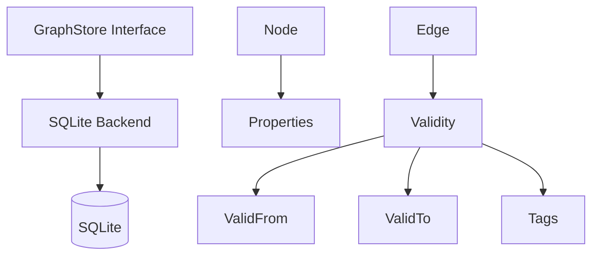

# Graph Store Library

The graph store library (`core/graph/`) provides a backend-agnostic graph database abstraction for concept management. The framework includes a SQLite backend (adjacency tables) for local and CLI use. The interface is designed for extension, so server deployments can add their own backend behind the same interface.

## Architecture



## GraphStore Interface

```go
type GraphStore interface {
    // Node CRUD
    CreateNode(ctx context.Context, node *Node) error
    GetNode(ctx context.Context, id string) (*Node, error)
    UpdateNode(ctx context.Context, node *Node) error
    DeleteNode(ctx context.Context, id string) error

    // Node queries
    FindNodes(ctx context.Context, label string, properties map[string]string) ([]*Node, error)
    FindNodesScoped(ctx context.Context, label string, properties map[string]string, scope Scope) ([]*Node, error)

    // Edge CRUD + queries
    CreateEdge(ctx context.Context, edge *Edge) error
    GetEdge(ctx context.Context, id string) (*Edge, error)
    UpdateEdge(ctx context.Context, edge *Edge) error
    DeleteEdge(ctx context.Context, id string) error
    FindEdges(ctx context.Context, label string, properties map[string]string) ([]*Edge, error)

    // Traversal
    Neighbors(ctx context.Context, nodeID string, direction Direction, labels ...string) ([]*Node, error)
    NeighborsScoped(ctx context.Context, nodeID string, direction Direction, scope Scope, labels ...string) ([]*Node, error)
    EdgesOf(ctx context.Context, nodeID string, direction Direction, labels ...string) ([]*Edge, error)
    ShortestPath(ctx context.Context, fromID, toID string, maxDepth int) (*Path, error)

    // Bulk operations
    BulkCreateNodes(ctx context.Context, nodes []*Node) error
    BulkCreateEdges(ctx context.Context, edges []*Edge) error

    // Cypher escape hatch (AGE backend only; SQLite returns ErrCypherNotSupported)
    CypherQuery(ctx context.Context, query string, params map[string]any) ([]*Node, error)
    CypherExec(ctx context.Context, query string, params map[string]any) error

    // Lifecycle
    Close() error
}
```

## Key Types

### Node

```go
type Node struct {
    ID         string            `json:"id"`
    Label      string            `json:"label"`
    Properties map[string]string `json:"properties"`
    CreatedAt  time.Time         `json:"created_at"`
    UpdatedAt  time.Time         `json:"updated_at"`
}
```

### Edge

```go
type Edge struct {
    ID         string            `json:"id"`
    Source     string            `json:"source"`
    Target     string            `json:"target"`
    Label      string            `json:"label"`
    Properties map[string]string `json:"properties"`
    Validity   *Validity         `json:"validity,omitempty"`
    CreatedAt  time.Time         `json:"created_at"`
    UpdatedAt  time.Time         `json:"updated_at"`
}
```

### Direction

```go
type Direction int
const (
    Outgoing Direction = iota  // source -> target
    Incoming                    // source <- target
    Both                        // either direction
)
```

### Path

```go
type Path struct {
    Nodes []Node `json:"nodes"`
    Edges []Edge `json:"edges"`
}
```

## Temporal Validity

Edges can carry temporal bounds and tag-based scoping:

```go
type Validity struct {
    ValidFrom *time.Time        `json:"valid_from,omitempty"`
    ValidTo   *time.Time        `json:"valid_to,omitempty"`
    Tags      map[string]string `json:"tags,omitempty"`
}
```

### Scope Matching

A `Scope` represents an evaluation point:

```go
type Scope struct {
    At   time.Time         `json:"at"`
    Tags map[string]string `json:"tags,omitempty"`
}
```

Matching rules:

- Nil validity always matches (unbounded edge)
- Time: half-open interval `[ValidFrom, ValidTo)`
- Tags: all scope tags must be present in validity tags with matching values
- Extra validity tags not in scope are ignored (open-world assumption)

```go
import "github.com/neokapi/neokapi/core/graph"

// Query with current time, no tag constraints
scope := graph.Now()

// Query at a specific point in time
scope := graph.ScopeAt(time.Date(2024, 6, 1, 0, 0, 0, 0, time.UTC))

// Query with tag constraints
scope := graph.ScopeWithTags(map[string]string{"market": "us", "product": "enterprise"})

// Check if validity is currently active
edge.Validity.IsActive()

// Check if validity has expired
edge.Validity.IsExpired()
```

## Edge Labels

Labels are aligned with W3C SKOS vocabulary for terminology interoperability:

```go
// Hierarchical (SKOS)
graph.LabelBroader   // "BROADER"  — parent concept
graph.LabelNarrower  // "NARROWER" — child concept

// Associative (SKOS)
graph.LabelRelated   // "RELATED"  — associative link

// Compositional
graph.LabelPartOf    // "PART_OF"  — component of
graph.LabelHasPart   // "HAS_PART" — contains component

// Terminological
graph.LabelHasTerm     // "HAS_TERM"     — concept → term
graph.LabelUseInstead  // "USE_INSTEAD"  — deprecated → preferred
graph.LabelReplacedBy  // "REPLACED_BY"  — superseded → replacement

// Equivalence (SKOS)
graph.LabelExactMatch  // "EXACT_MATCH" — cross-scheme equivalence
graph.LabelCloseMatch  // "CLOSE_MATCH" — approximate equivalence

// Brand voice
graph.LabelForbidden   // "FORBIDDEN"  — brand → forbidden term
graph.LabelPreferred   // "PREFERRED"  — brand → preferred term
graph.LabelCompetitor  // "COMPETITOR" — brand → competitor term
```

`InverseLabel()` returns the inverse of directional labels (e.g., `BROADER` -> `NARROWER`).

## SQLite Backend

```go
import (
    "github.com/neokapi/neokapi/core/storage"
    graphstore "github.com/neokapi/neokapi/cli/storage/graph"
)

db, _ := storage.Open("graph.db")
store, _ := graphstore.NewSQLiteGraphStore(db)
defer store.Close()
```

Uses adjacency tables (`graph_nodes`, `graph_edges`) with JSON properties. Shortest path uses recursive CTE with BFS. Scoped queries filter edges in Go after retrieval.

The SQLite backend has no native Cypher support, so `CypherQuery` and `CypherExec` return the sentinel `graph.ErrCypherNotSupported`. The server-side Apache AGE backend (`bowrain/graph/`) implements both natively.

The `GraphStore` interface is designed for extension — server deployments can add their own backend behind the same interface.

## Usage Examples

### Building a Concept Hierarchy

```go
store, _ := graphstore.NewSQLiteGraphStore(db)

// Create concept nodes
store.CreateNode(ctx, &graph.Node{ID: "animal", Label: "Concept", Properties: map[string]string{"name": "Animal"}})
store.CreateNode(ctx, &graph.Node{ID: "mammal", Label: "Concept", Properties: map[string]string{"name": "Mammal"}})
store.CreateNode(ctx, &graph.Node{ID: "dog", Label: "Concept", Properties: map[string]string{"name": "Dog"}})

// Create hierarchy edges
store.CreateEdge(ctx, &graph.Edge{ID: "e1", Source: "mammal", Target: "animal", Label: graph.LabelBroader})
store.CreateEdge(ctx, &graph.Edge{ID: "e2", Source: "dog", Target: "mammal", Label: graph.LabelBroader})

// Navigate: what is broader than "dog"?
parents, _ := store.Neighbors(ctx, "dog", graph.Outgoing, graph.LabelBroader)
// parents = [mammal]

// Navigate: what is narrower than "animal"?
children, _ := store.Neighbors(ctx, "animal", graph.Incoming, graph.LabelBroader)
// children = [mammal]

// Find path from dog to animal
path, _ := store.ShortestPath(ctx, "dog", "animal", 10)
// path.Nodes = [dog, mammal, animal]
// path.Edges = [e2, e1]
```

### Temporal Edges

```go
start := time.Date(2024, 1, 1, 0, 0, 0, 0, time.UTC)
end := time.Date(2025, 1, 1, 0, 0, 0, 0, time.UTC)

store.CreateEdge(ctx, &graph.Edge{
    ID: "e3", Source: "old-term", Target: "new-term", Label: graph.LabelReplacedBy,
    Validity: &graph.Validity{
        ValidFrom: &start,
        ValidTo:   &end,
        Tags:      map[string]string{"market": "us"},
    },
})

// Query with scope — only returns edges active at the given time with matching tags
scope := graph.Scope{At: time.Date(2024, 6, 1, 0, 0, 0, 0, time.UTC), Tags: map[string]string{"market": "us"}}
neighbors, _ := store.NeighborsScoped(ctx, "old-term", graph.Outgoing, scope, graph.LabelReplacedBy)
```

Use `FindNodes`, `Neighbors`, and `ShortestPath` for portable queries that work across all backends.
