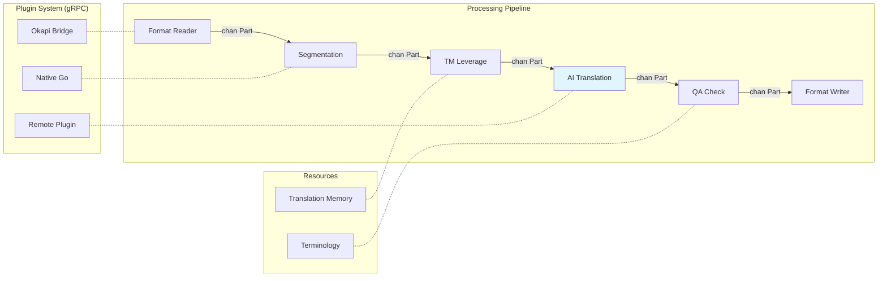
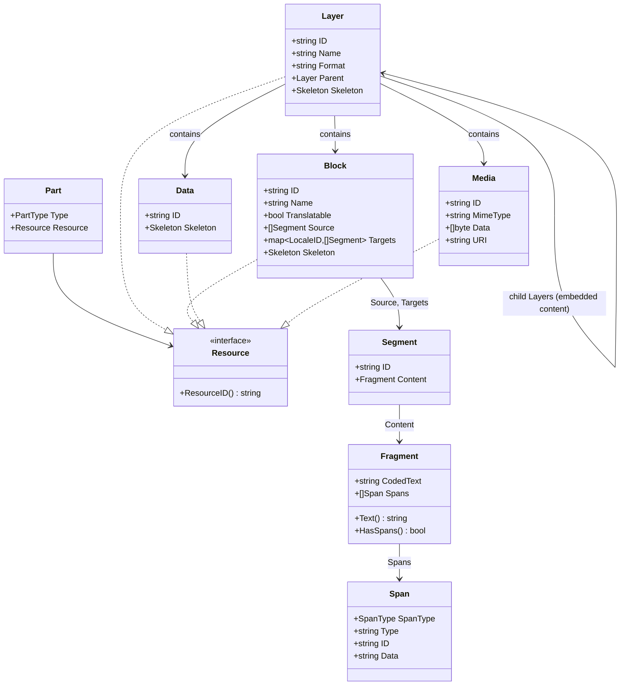

# neokapi: Architecture

neokapi is an open-source localization framework built in Go. It provides
format-aware document parsing, composable processing tools, and a concurrent
streaming pipeline for translation workflows. For the reasoning behind each
major design choice, see the [Architecture Decisions](/contribute/architecture/001-vision-and-modules).

## Processing Pipeline



The processing pipeline runs each tool in its own goroutine, connected by
buffered channels with automatic backpressure. Context cancellation propagates
to all stages. See [AD-001](/contribute/architecture/001-vision-and-modules) and
[AD-004](/contribute/architecture/004-processing-engine).

## Package Layout

```
neokapi/
├── go.mod                           # module github.com/neokapi/neokapi
├── go.work                          # coordinates the framework + CLI + app modules
│
├── core/                            # Platform-agnostic framework packages
│   ├── model/                       # Part, Block, Layer, Fragment, Span, Data, Media
│   ├── format/                      # DataFormatReader/Writer interfaces, detection
│   ├── tool/                        # Tool interface, BaseTool dispatch
│   ├── flow/                        # Executor, Builder, FlowDefinition
│   ├── registry/                    # FormatRegistry, ToolRegistry
│   ├── encoding/                    # Text encoding utilities
│   ├── locale/                      # BCP-47 locale handling
│   ├── editor/                      # Block index serialization and preview generation
│   ├── version/                     # Build version info
│   ├── formats/                     # Built-in format implementations
│   │   └── …                        # one package each (reader.go, writer.go, config.go)
│   ├── ai/                          # AI pipeline tools, NER, prompt assembly
│   ├── mt/                          # Machine-translation pipeline tools
│   ├── brand/                       # Brand voice profiles, scoring, starter packs
│   ├── tools/                       # Utility tools (wordcount, pseudo, segmentation, …)
│   ├── storage/                     # Shared SQLite infrastructure (Open, Migrate)
│   ├── project/                     # .kapi project file format (Load, Save, Validate)
│   ├── plugin/                      # Plugin system (gRPC, loader, bridge, registry)
│   └── testutil/                    # Shared test helpers
│
├── sievepen/                        # Translation memory (interface, in-memory, SQLite)
├── termbase/                        # Terminology (interface, in-memory, SQLite)
├── providers/
│   ├── ai/                          # package aiprovider — LLM backends
│   └── mt/                          # package mtprovider — MT backends
│
├── cli/                             # Shared CLI base (module: …/cli)
├── kapi/                            # Kapi standalone CLI (module: …/kapi)
├── apps/desktop/               # Kapi Desktop (Wails v3; module: …/kapi-desktop)
├── packages/
│   ├── ui/                          # @neokapi/ui-primitives — shared shadcn/ui primitives
│   └── flow-editor/                 # @neokapi/flow-editor — shared React flow editor
└── docs/                            # Architecture decisions, notes
```

The framework module (repo root) stays platform-agnostic. `sievepen/`,
`termbase/`, and `providers/` are top-level framework packages — not nested
under `core/` — and the CLI, desktop, and bowrain modules attach via the plugin
registries rather than direct imports.

## Content Model



Embedded content (HTML inside JSON, CDATA in XML) is modeled as nested
Layers, each with its own DataFormat. See
[AD-002](/contribute/architecture/002-content-model).

### Inline Span Encoding

Fragments use coded text: inline markup is replaced by Unicode PUA markers
(U+E000-U+E0FF), with the actual markup stored in the Spans slice. This
allows string operations on text without corrupting markup.

```
Source HTML: "Click <b>here</b> for info"

Fragment:
    CodedText: "Click \uE001here\uE002 for info"
    Spans: [
        {SpanType: SpanOpening, Type: "bold", Data: "<b>"},
        {SpanType: SpanClosing, Type: "bold", Data: "</b>"},
    ]
```

### Part Stream

```
DataFormatReader.Read(ctx) -> chan PartResult
    -> PartLayerStart  (format="json")
    -> PartBlock        (key: "title")
    -> PartLayerStart  (format="html")        <- embedded child
    -> PartBlock        ("Hello <b>world</b>") <- inside child
    -> PartLayerEnd    (format="html")
    -> PartBlock        (key: "footer")
    -> PartLayerEnd    (format="json")
    -> (channel closed)
```

## Terminology Mapping from Okapi

| Okapi (Java)               | neokapi (Go)               |
| -------------------------- | -------------------------- |
| Filter                     | DataFormat (Reader/Writer) |
| Step                       | Tool                       |
| Pipeline                   | Flow                       |
| PipelineDriver             | Executor                   |
| Event                      | Part                       |
| TextUnit                   | Block                      |
| TextFragment               | Fragment                   |
| Code                       | Span                       |
| StartSubDocument/SubFilter | Child Layer                |
| Tikal                      | kapi (CLI)                 |

## Key Interfaces

```go
// Format layer
type DataFormatReader interface {
    Open(ctx context.Context, doc *RawDocument) error
    Read(ctx context.Context) <-chan PartResult
    Close() error
}

type DataFormatWriter interface {
    SetOutput(path string) error
    Write(ctx context.Context, parts <-chan *Part) error
}

// Tool layer
type Tool interface {
    Process(ctx context.Context, in <-chan *Part, out chan<- *Part) error
}

// Flow execution
type Executor interface {
    Execute(ctx context.Context, items []Item) error
}

// AI providers
type LLMProvider interface {
    Translate(ctx context.Context, req TranslateRequest) (*TranslateResponse, error)
    Chat(ctx context.Context, messages []Message) (*Message, error)
}

// Streaming AI providers (optional extension)
type StreamingLLMProvider interface {
    LLMProvider
    ChatStream(ctx context.Context, messages []Message) (<-chan StreamEvent, error)
}
```

## Build and Distribution

| Channel          | Target        | Command                                                      |
| ---------------- | ------------- | ------------------------------------------------------------ |
| Homebrew formula | kapi CLI      | `brew install neokapi/tap/kapi`                              |
| GitHub Releases  | All platforms | Direct download                                              |
| Go install       | Go developers | `go install github.com/neokapi/neokapi/kapi/cmd/kapi@latest` |

CI/CD runs via GitHub Actions: `ci.yml` (test, vet, lint, build on every
push) and `release.yml` (GoReleaser on tag push).
