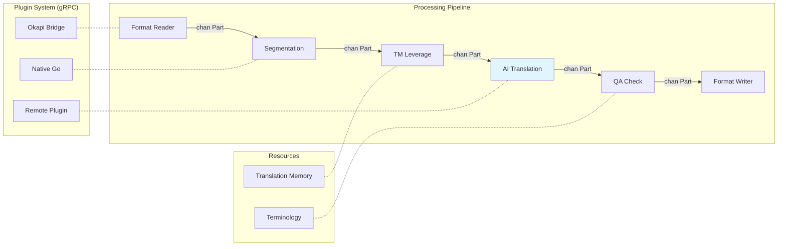

# neokapi: Architecture

neokapi is an open-source localization framework built in Go. It provides
format-aware document parsing, composable processing tools, and a concurrent
streaming pipeline for translation workflows. For the reasoning behind each
major design choice, see the [Architecture Decisions](/contribute/architecture/001-vision-and-modules).

## Processing Pipeline



The processing pipeline runs each tool in its own goroutine, connected by
buffered channels with automatic backpressure. Context cancellation propagates
to all stages. See [AD-001](/contribute/architecture/001-vision-and-modules) and
[AD-004](/contribute/architecture/004-processing-engine).

## Package Layout

```
neokapi/
├── go.mod                           # module github.com/neokapi/neokapi
├── go.work                          # coordinates the framework + CLI + app modules
│
├── core/                            # Platform-agnostic framework packages
│   ├── model/                       # Part, Block, Layer, Fragment, Span, Data, Media
│   ├── format/                      # DataFormatReader/Writer interfaces, detection
│   ├── tool/                        # Tool interface, BaseTool dispatch
│   ├── flow/                        # Executor, Builder, FlowDefinition
│   ├── registry/                    # FormatRegistry, ToolRegistry
│   ├── encoding/                    # Text encoding utilities
│   ├── locale/                      # BCP-47 locale handling
│   ├── editor/                      # Block index serialization and preview generation
│   ├── version/                     # Build version info
│   ├── formats/                     # Built-in format implementations
│   │   └── …                        # one package each (reader.go, writer.go, config.go)
│   ├── ai/                          # AI pipeline tools, NER, prompt assembly
│   ├── mt/                          # Machine-translation pipeline tools
│   ├── brand/                       # Brand voice profiles, scoring, starter packs
│   ├── tools/                       # Utility tools (wordcount, pseudo, segmentation, …)
│   ├── storage/                     # Shared SQLite infrastructure (Open, Migrate)
│   ├── project/                     # .kapi project file format (Load, Save, Validate)
│   ├── plugin/                      # Plugin system (gRPC, loader, bridge, registry)
│   └── testutil/                    # Shared test helpers
│
├── sievepen/                        # Translation memory (interface, in-memory, SQLite)
├── termbase/                        # Terminology (interface, in-memory, SQLite)
├── providers/
│   ├── ai/                          # package aiprovider — LLM backends
│   └── mt/                          # package mtprovider — MT backends
│
├── cli/                             # Shared CLI base (module: …/cli)
├── kapi/                            # Kapi standalone CLI (module: …/kapi)
├── apps/kapi-desktop/          # Kapi Desktop (Wails v3; module: …/kapi-desktop)
├── packages/
│   ├── ui/                          # @neokapi/ui-primitives — shared shadcn/ui primitives
│   └── flow-editor/                 # @neokapi/flow-editor — shared React flow editor
└── docs/                            # Architecture decisions, notes
```

The framework module (repo root) stays platform-agnostic. `sievepen/`,
`termbase/`, and `providers/` are top-level framework packages — not nested
under `core/`. Front-ends such as the CLI and the desktop app, and any other
consumer, attach through the plugin and extension registries rather than by
direct imports, so the framework never depends on a particular platform.

## The framework concepts

The framework rests on a few concepts, each with its own page:

- **[Content Model](/framework/content-model)** \u2014 the format-independent
  representation. A document becomes a stream of `Part`s carrying layers, blocks,
  fragments, spans, data, and media. Embedded content (HTML inside JSON, CDATA in
  XML) is modeled as nested layers, each with its own format.
- **[Formats](/framework/formats)** \u2014 paired readers and writers that produce and
  consume the content model. The neokapi analogue of an Okapi _filter_.
- **[Tools](/framework/tools)** \u2014 the processing units. Each reads Parts from a
  channel, transforms them, and writes them out. The analogue of an Okapi _step_.
- **[Flows](/framework/flows)** \u2014 named, ordered compositions of tools. The
  analogue of an Okapi _pipeline_.
- **[Pipeline](/framework/pipeline)** \u2014 the concurrent executor that runs a flow:
  goroutines, buffered channels, and context-driven cancellation. The analogue of
  the Okapi _PipelineDriver_.

For the concrete Go interfaces and method signatures behind these concepts, see
the [Interface Reference](/contribute/interfaces). For the design rationale, see
the [Architecture Decisions](/contribute/architecture/001-vision-and-modules).

## Build and Distribution

| Channel          | Target        | Command                                                      |
| ---------------- | ------------- | ------------------------------------------------------------ |
| Homebrew formula | kapi CLI      | `brew install neokapi/tap/kapi`                              |
| GitHub Releases  | All platforms | Direct download                                              |
| Go install       | Go developers | `go install github.com/neokapi/neokapi/kapi/cmd/kapi@latest` |

CI/CD runs via GitHub Actions: `ci.yml` (test, vet, lint, build on every
push) and `release.yml` (GoReleaser on tag push).
