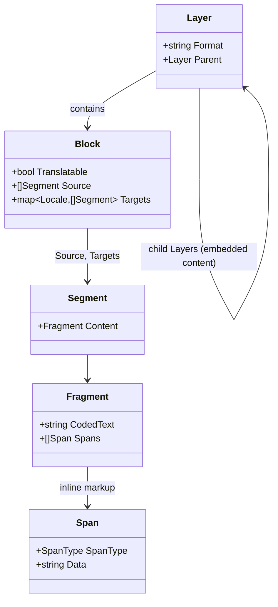

import { BlockPreview } from "@site/src/components/curated";

# Content Model

The content model is the vocabulary every part of neokapi shares. Whatever the
input format — JSON, XLIFF, HTML, DOCX — a [reader](/framework/formats) turns it
into the same handful of types, so [tools](/framework/tools),
[flows](/framework/flows), [translation memory](/framework/translation-memory),
and editors all work against one representation rather than against each format's
quirks. It is a deliberate, format-independent abstraction over localizable
content, modeled on the Okapi Framework's resource hierarchy.

## The Part is the streaming unit

A document is not loaded as a tree and handed around whole. It flows through the
[pipeline](/framework/pipeline) as a stream of **Parts**, the indivisible unit
that travels over the channels between stages. Each Part carries a type
discriminator and a resource payload: a layer start or end, a translatable block,
non-translatable structural data, or media. A reader emits Parts as it parses;
tools transform the Parts they care about and relay the rest; a writer
reconstructs the document from the stream.

A typical small JSON document with one embedded HTML value produces a stream like
this:

```
Read(ctx) ─▶ PartLayerStart  (format = "json")
          ─▶ PartBlock        ("title")
          ─▶ PartLayerStart  (format = "html")   ← embedded child layer
          ─▶ PartBlock        ("Hello <b>world</b>")
          ─▶ PartLayerEnd    (format = "html")
          ─▶ PartBlock        ("footer")
          ─▶ PartLayerEnd    (format = "json")
          ─▶ (channel closed)
```

Streaming is why the model is shaped around a Part rather than a document tree:
it keeps memory bounded and lets stages run concurrently. The mechanics are
covered in [Pipeline](/framework/pipeline).

## The resource types

The payload a Part carries is one of a few resource types. Together they describe
both the content a translator works on and the structure that surrounds it.



- **Layer** — a structural grouping: a whole document, a section, or embedded
  content. Layers nest. Embedded content — HTML inside a JSON value, CDATA inside
  XML — becomes a **child layer** with its own format, so the right reader handles
  it and inline markup is preserved at every level rather than being flattened.
- **Block** — the primary translatable unit (Okapi's _TextUnit_). A block holds a
  source and, per target locale, a translation. It carries a `Translatable` flag,
  arbitrary properties, and **annotations** — the shared channel through which
  [TM matches](/framework/translation-memory),
  [terminology](/framework/terminology), [brand-voice](/framework/brand-voice)
  findings, and [QA](/framework/qa-checks) results all attach to content without
  colliding.
- **Segment** — a block's source or target is a list of segments (typically
  sentences after [segmentation](/framework/tools)), each wrapping a fragment.
- **Fragment** — text plus its inline markup, stored as coded text (see below).
- **Span** — a single inline element (a bold tag, a link, a variable) lifted out
  of the text.
- **Data** and **Media** — non-translatable document structure and binary
  content, which flow through so the writer can reconstruct a faithful output.

## Coded text keeps inline markup out of the way

The Fragment is where neokapi solves a hard problem: how to let a tool, a
translation engine, or a TM operate on plain text without corrupting inline
markup like `<b>`, `**`, or `{count}`. The answer is **coded text**. Inline
markup is removed from the text and replaced by a positional marker character;
the original markup is stored alongside, in the fragment's spans:

```
Source HTML: Click <b>here</b> for info

Fragment.CodedText: "Click ⟪here⟫ for info"   (⟪ ⟫ are span markers)
Fragment.Spans:     [ {opening, "<b>"}, {closing, "</b>"} ]
```

A tool sees clean text with markers it can skip over; a translation engine gets
text it can translate freely; and the writer replays each span's original markup
at the marker positions to reconstruct the source faithfully — attributes and
all. Because the same `<b>`, Markdown `**`, and DOCX `<w:b/>` all reduce to a
span of the same semantic type, the representation is format-independent.
[Inline Formatting](/framework/inline-formatting) and
[Vocabularies](/framework/vocabularies) cover how spans are classified and what
metadata they carry.

## See it on a real file

The clearest way to understand the content model is to watch a reader produce it.
Below, kapi parses a small JSON localization file into blocks — each with an
identifier and its source text:

<BlockPreview
  sample="messages.json"
  caption="A JSON file parsed into the content model: blocks, ids, and source text."
/>

The same parser run against an HTML page shows fragments with inline spans (the
chips mark where inline markup was lifted out of the text):

<BlockPreview
  sample="page.html"
  caption="An HTML page — note the span markers where inline elements were extracted."
/>

## Reconstruction with skeletons

Translatable blocks are only part of a document; the rest is structure —
surrounding tags, whitespace, keys, attributes. A **skeleton** captures that
non-translatable structure interleaved with references to block content, so the
writer can rebuild the document exactly, substituting translated content where a
target exists and falling back to source where it does not. This is what gives
neokapi roundtrip fidelity: read a file and write it back unchanged, or write it
back with only the translated text differing.

## Mapping from Okapi

For readers familiar with the Okapi Framework, the model maps directly:

| Okapi (Java)                    | neokapi (Go)  |
| ------------------------------- | ------------- |
| Filter                          | DataFormat    |
| TextUnit                        | Block         |
| TextFragment                    | Fragment      |
| Code                            | Span          |
| StartSubDocument/StartSubFilter | Child Layer   |
| Event                           | Part          |

## Related reading

- [Formats](/framework/formats) — the readers and writers that produce and consume the model.
- [Inline Formatting](/framework/inline-formatting) and [Vocabularies](/framework/vocabularies) — how spans are represented and classified.
- [Pipeline](/framework/pipeline) — how Parts stream through the executor.
- [Interface Reference](/contribute/interfaces) — the concrete Go types and method signatures.
- [AD-002: Content Model](/contribute/architecture/002-content-model) — the design rationale.
