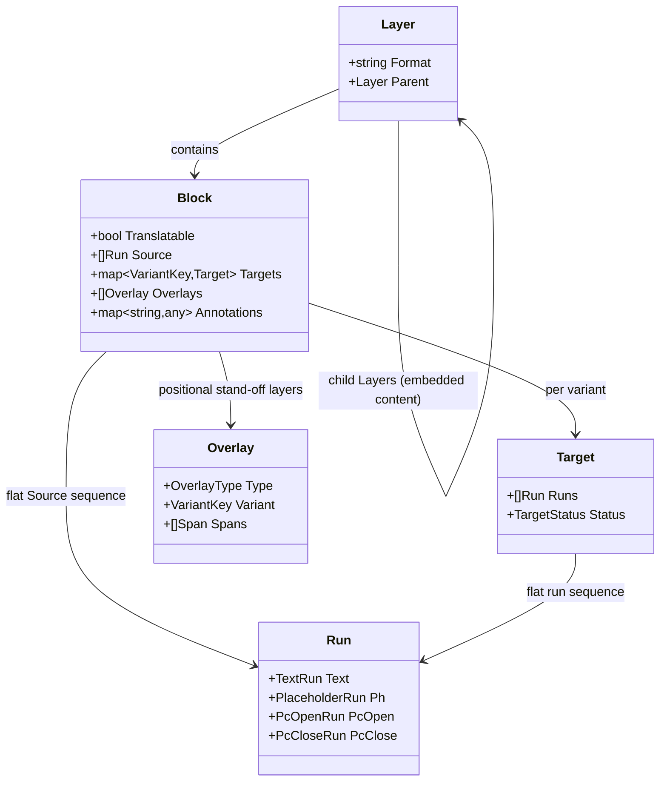

import { BlockPreview } from "@site/src/components/curated";
import { AnatomyExplorer } from "@site/src/components/Lab";
import { StreamDiagram } from "@neokapi/docs-shared";

# Content Model

The content model is the vocabulary every part of neokapi shares. Whatever the
input format — JSON, XLIFF, HTML, DOCX — a [reader](/framework/formats) turns it
into the same handful of types, so [tools](/framework/tools),
[flows](/framework/flows), [translation memory](/framework/translation-memory),
and editors all work against one representation rather than against each format's
quirks. It is a deliberate, format-independent abstraction over localizable
content, modeled on the Okapi Framework's resource hierarchy.

:::tip Try it — anatomy of a file
Pick a sample or drop in your own file and see exactly how a reader decomposes it
into Layers, Groups, Blocks, and **Runs**. Notice that an HTML `<strong>` becomes
a paired inline code inside a block's run sequence, while a JSON `{name}` stays
literal text — that is format-awareness in action. This runs the real `kapi`
reader in your browser via WebAssembly.
:::

<AnatomyExplorer defaultSampleId="page-html" />

## The Part is the streaming unit

A document is not loaded as a tree and handed around whole. It flows through the
[pipeline](/framework/pipeline) as a stream of **Parts**, the indivisible unit
that travels over the channels between stages. Each Part carries a type
discriminator and a resource payload: a layer start or end, a translatable block,
non-translatable structural data, or media. A reader emits Parts as it parses;
tools transform the Parts they care about and relay the rest; a writer
reconstructs the document from the stream.

A typical small JSON document with one embedded HTML value produces a stream like
this:

<StreamDiagram
  title="Read(ctx)"
  animated
  items={[
    { kind: "PartLayerStart", detail: 'format = "json"', role: "layer" },
    { kind: "PartBlock", detail: '"title"', depth: 1, role: "block" },
    {
      kind: "PartLayerStart",
      detail: 'format = "html"',
      depth: 1,
      role: "layer",
      note: "embedded child layer",
    },
    { kind: "PartBlock", detail: '"Hello <b>world</b>"', depth: 2, role: "block" },
    { kind: "PartLayerEnd", detail: 'format = "html"', depth: 1, role: "end" },
    { kind: "PartBlock", detail: '"footer"', depth: 1, role: "block" },
    { kind: "PartLayerEnd", detail: 'format = "json"', role: "end" },
    { kind: "(channel closed)", role: "meta" },
  ]}
/>

Streaming is why the model is shaped around a Part rather than a document tree:
it keeps memory bounded and lets stages run concurrently. The mechanics are
covered in [Pipeline](/framework/pipeline).

## The resource types

The payload a Part carries is one of a few resource types. Together they describe
both the content a translator works on and the structure that surrounds it.



- **Layer** — a structural grouping: a whole document, a section, or embedded
  content. Layers nest. Embedded content — HTML inside a JSON value, CDATA inside
  XML — becomes a **child layer** with its own format, so the right reader handles
  it and inline markup is preserved at every level rather than being flattened.
- **Block** — the primary translatable unit (Okapi's _TextUnit_). Its `Source` is
  a single flat `[]Run`; its translations are first-class `Target` records keyed
  by a **VariantKey** (locale plus optional tone and channel). It carries a
  `Translatable` flag, opaque pass-through `Properties`, and the two stand-off
  carriers described in [Two ways to annotate a block](#two-ways-to-annotate-a-block)
  — positional `Overlays` and block-scoped `Annotations`.
- **Overlay** — a typed, run-anchored interpretation _of_ a block's runs:
  sentence segmentation, terminology, entities, QA findings, source↔target
  alignment. Each overlay is a **positional stand-off layer** over one side of the
  block, layered over the runs rather than baked into the structure. There is no
  structural `Segment` type: a segment is just a span in the segmentation overlay,
  so segmentation is opt-in, multi-layer, and reversible (drop the overlay to get
  the unsegmented content back). The `segmentation` tool writes that overlay from
  a pluggable engine chosen with `--engine` — `srx` (the default SRX 2.0 rule
  engine), `uax29` (the ICU Unicode baseline), `llm` (semantic chunks), or `sat`
  (the wtpsplit ML model, run via the `kapi-sat` plugin). See
  [Segmentation](/framework/segmentation) and
  [AD-002](/contribute/architecture/002-content-model).
- **Run** — one element of a block's inline content: a chunk of text, an opening
  or closing inline tag, a self-closing placeholder, or a structured plural/select
  construct (see below).
- **Data** and **Media** — non-translatable document structure and binary
  content, which flow through so the writer can reconstruct a faithful output.

## Two ways to annotate a block

A block's content is just its `Source []Run` and its variant-keyed `Targets`.
Every typed interpretation _of_ that content is **stand-off** — kept separate
from the runs — so the same content can carry segmentation, terminology, QA
findings, notes, and analysis results at once without rewriting it. A block
holds stand-off interpretations in two carriers, chosen by whether the
interpretation has a position:

- **Overlays** (`Block.Overlays`) are **positional**: each overlay anchors to run
  ranges. An overlay has a `Type`, an optional `Variant` (nil = the source side;
  set = a target variant), an optional `Layer` (segmentation granularity; `""` =
  the primary sentence segmentation), and a list of `Spans`. A `Span` carries a
  run `Range` (its position), an `ID`, optional `Props`, and a typed payload
  `Value`. Because spans anchor to runs, a source rewrite moves them — when a
  transformer rewrites the runs, the framework applier rebases surviving spans
  onto the new runs and drops any span that overlaps a rewritten range.
- **Annotations** (`Block.Annotations`) are **block-scoped**: typed metadata keyed
  by type name, with no position. A source rewrite does not invalidate them.
  Multiplicity lives inside the value, never in numbered keys — every alternative
  translation is one `AltTranslations` collection under the single
  `alt-translation` key, not `alt-translation-1`, `-2`, and so on.

The built-in stand-off types:

| Carrier        | Type                | Anchored to | Description                                       |
| -------------- | ------------------- | ----------- | ------------------------------------------------- |
| Overlay        | `segmentation`      | run ranges  | sentence / chunk boundaries (per `Layer`)         |
| Overlay        | `term`              | run ranges  | matched terminology spans                         |
| Overlay        | `term-candidate`    | run ranges  | proposed terminology awaiting review              |
| Overlay        | `entity`            | run ranges  | recognized named-entity spans                     |
| Overlay        | `qa`                | run ranges  | quality-check findings                            |
| Overlay        | `alignment`         | run ranges  | links source spans to target spans                |
| Annotation     | `structure`         | whole block | logical role (heading, table cell, form field, …), layout layer, level, table-cell spans |
| Annotation     | `geometry`          | whole block | page + bounding box + (per-axis) resolution for content from a rendered medium |
| Annotation     | `timing`            | whole block | time span for content from timed media (audio, video) |
| Annotation     | `relations`         | whole block | typed cross-block edges (caption-of, footnote-of, continues, …) |
| Annotation     | `note`              | whole block | translator / reviewer note                        |
| Annotation     | `alt-translation`   | whole block | alternative-translation candidates                |
| Annotation     | `tm-match`          | whole block | translation-memory match metadata                 |
| Annotation     | `word-count`        | whole block | word-count analysis result                        |
| Annotation     | `char-count`        | whole block | character-count analysis result                   |
| Annotation     | `seg-count`         | whole block | segment-count analysis result                     |
| Annotation     | `comparison`        | whole block | source/target comparison result                   |
| Annotation     | `repetition`        | whole block | repetition / leverage analysis                    |
| Annotation     | `brand-voice`       | whole block | brand-voice check result                          |

Both overlay span `Value`s and annotation values are typed payloads registered
with one payload registry (`RegisterPayload` / `NewPayload`) keyed by type name,
so the plugin gRPC bridge and store layers can rehydrate the concrete type on the
far side of the wire.

`Properties` is a separate map for opaque pass-through metadata only — connector
keys, format round-trip hints. Analytic or interpretive results are overlays or
annotations, never properties. A few round-trip hints follow a **normalized
convention** so writers and the editor read them the same way across formats —
e.g. `code.language` (a code block's language key), `picture.subclass` (a chart
kind), `table.header-kind` (an OTSL header's column/row/corner/section role), and
the `checkbox.checked` / `field.fillable` form-state flags. These are fine
structural subtypes that have no typed home on the structure annotation; the
canonical keys live in `core/model/structure.go`.

## Runs keep inline markup out of the way

The Run sequence is where neokapi solves a hard problem: how to let a tool, a
translation engine, or a TM operate on the words while keeping inline markup like
`<b>`, `**`, or `{count}` intact. A block's source (and each target) is a flat
`[]Run` — a discriminated union where each run is exactly one of:

| Run kind        | Field      | Represents                                     |
| --------------- | ---------- | ---------------------------------------------- |
| Text            | `Text`     | a plain text chunk                             |
| Placeholder     | `Ph`       | a self-closing token (`<br/>`, ``, `{n}`) |
| Paired open     | `PcOpen`   | the opening half of a paired code (`<b>`, `<a>`) |
| Paired close    | `PcClose`  | the closing half of a paired code (`</b>`, `</a>`) |
| Sub             | `Sub`      | a reference to a nested sub-block (subfilter output) |
| Plural / Select | `Plural` / `Select` | a structured ICU construct with per-form runs |

Bold text becomes a `PcOpen` / text / `PcClose` triple; a `<br/>` or a variable
becomes a single `Ph`. The original markup is carried in the run's `Data` field,
so the writer can replay it verbatim:

```
Source HTML: Click <b>here</b> for info

Source runs:
  - {Text: "Click "}
  - {PcOpen:  {ID: "1", Type: "fmt:bold", Data: "<b>"}}
  - {Text: "here"}
  - {PcClose: {ID: "1", Type: "fmt:bold", Data: "</b>"}}
  - {Text: " for info"}
```

A tool can project the runs to plain text (`block.SourceText()` returns
`"Click here for info"`); a translation engine sees text with opaque tokens it
must preserve; and the writer re-emits each run's `Data` at its position to
reconstruct the source faithfully — attributes and all. Because the same `<b>`,
Markdown `**`, and DOCX `<w:b/>` all reduce to a `PcOpen`/`PcClose` pair of the
same semantic `Type`, the representation is format-independent.
[Inline Formatting](/framework/inline-formatting) and
[Vocabularies](/framework/vocabularies) cover how runs are classified and what
metadata they carry.

## See it on a real file

The clearest way to understand the content model is to watch a reader produce it.
Below, kapi parses a small JSON localization file into blocks — each with an
identifier and its source text:

<BlockPreview
  sample="messages.json"
  caption="A JSON file parsed into the content model: blocks, ids, and source text."
/>

The same parser run against an HTML page shows runs with inline codes (the
chips mark the `PcOpen`/`PcClose`/`Ph` runs lifted out of the text):

<BlockPreview
  sample="page.html"
  caption="An HTML page — note the span markers where inline elements were extracted."
/>

## Reconstruction with skeletons

Translatable blocks are only part of a document; the rest is structure —
surrounding tags, whitespace, keys, attributes. A **skeleton** captures that
non-translatable structure interleaved with references to block content, so the
writer can rebuild the document exactly, substituting translated content where a
target exists and falling back to source where it does not. This is what gives
neokapi roundtrip fidelity: read a file and write it back unchanged, or write it
back with only the translated text differing.

## Mapping from Okapi

The content-model types correspond directly to the Okapi Framework's resource
hierarchy — `TextUnit` → `Block`, `Code` → `Run`, `StartSubDocument` → child
`Layer`, and so on. See [Okapi comparison](/framework/okapi-comparison) for the
full term-by-term map.

## Related reading

- [Formats](/framework/formats) — the readers and writers that produce and consume the model.
- [Inline Formatting](/framework/inline-formatting) and [Vocabularies](/framework/vocabularies) — how inline-code runs are represented and classified.
- [Pipeline](/framework/pipeline) — how Parts stream through the executor.
- [Interface Reference](/contribute/interfaces) — the concrete Go types and method signatures.
- [AD-002: Content Model](/contribute/architecture/002-content-model) — the design rationale.
