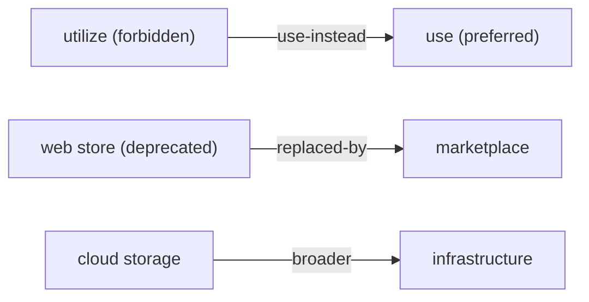

# Terminology

neokapi manages terminology with a concept-oriented model inspired by the TBX
(TermBase eXchange) standard: language-neutral concepts group multi-locale
terms, each carrying a lifecycle status and optional grammatical metadata. The
same model backs the `kapi termbase` commands, the `term-lookup` and
`term-enforce` pipeline tools, and the `termbase/` Go library.

## Concept-oriented model

A **concept** is a language-neutral knowledge unit. It carries a domain and a
definition, and groups **terms** across locales. Each term has a lifecycle
status, and a locale may hold several terms (a preferred form plus admitted
variants).

```
Concept (e.g., "cloud storage")
├── Domain: "infrastructure"
├── Definition: "Remote file storage accessed via internet"
├── Term: "cloud storage"     (en, preferred)
├── Term: "stockage cloud"    (fr, preferred)
├── Term: "stockage en nuage" (fr, admitted)
├── Term: "Cloud-Speicher"    (de, preferred)
└── Term: "クラウドストレージ"   (ja, preferred)
```

This differs from a flat glossary (source→target pairs) and is what enables
multiple terms per locale, status-driven enforcement, and rich metadata
attached to a single language-neutral concept.

### Term lifecycle statuses

| Status       | Meaning                       | Usage                           |
| ------------ | ----------------------------- | ------------------------------- |
| `preferred`  | The recommended term          | Always suggest to translators   |
| `approved`   | Accepted for use              | Valid alternative               |
| `admitted`   | Allowed but not recommended   | Show with lower priority        |
| `deprecated` | Being phased out              | Warn when found in translations |
| `proposed`   | Under review, not yet approved | Show as suggestion with caveat |
| `forbidden`  | Must not be used              | Flag as error in QA             |

## Concept relations

Concepts are not islands. A termbase persists typed, directed **relations**
between concepts, so a renamed product points at its replacement and a
deprecated term points at the one to use instead. The relation vocabulary is
aligned with [SKOS](https://www.w3.org/2004/02/skos/):

| Category        | Labels                          | Meaning                              |
| --------------- | ------------------------------- | ------------------------------------ |
| Hierarchy       | `broader`, `narrower`           | A parent/child concept relationship  |
| Composition     | `part-of`, `has-part`           | A whole/component relationship       |
| Association     | `related`                       | A non-hierarchical association       |
| Succession      | `replaced-by`                   | A concept superseded by another      |
| Guidance        | `use-instead`                   | A discouraged term points at a preferred one |
| Cross-scheme    | `exact-match`, `close-match`    | Equivalence across schemes           |
| Stance          | `competitor`                    | A competitor's term                  |



A relation is a first-class record with an ID, a source and target concept, a
type from the vocabulary above, an optional note, and an optional validity
(below). The termbase validates that the type is known and that both concepts
exist before persisting an edge.

### Relation and term validity

A relation, and an individual term, may carry a **validity**: a half-open time
interval `[valid-from, valid-to)` plus a set of free-form tags. A query supplies
a **scope** — a point in time and a set of tags — and only edges and terms whose
validity matches the scope are returned. A nil validity is unbounded (it matches
every scope); a nil scope applies no filtering.

This makes the same termbase answer scope-dependent questions: which terms were
preferred *as of* last quarter, or which relations hold *within* a given market.
Tags are open-ended (the framework assigns them no meaning); a caller chooses a
tag vocabulary — for example a `market` key — and uses it consistently. A nil
validity matches every scope; a nil scope filters nothing.

### Status transitions

A term's status changes over its lifetime. `ValidateTransition(from, to)`
accepts any transition between known statuses — history is the guard, not a
trap — while `IsGovernedTransition(from, to)` reports whether a change is
consequential enough to deserve review: any transition **to** `forbidden` or
`preferred`, or any transition **from** `forbidden`. The framework only
classifies; a platform built on it decides what governance a governed transition
requires.

## Storage backends

Two backends ship in the `termbase/` package, both thread-safe
(RWMutex-protected) and implementing the full `TermBase` interface:

1. **In-memory** (`termbase.NewInMemoryTermBase`) — fast and ephemeral, used
   for session-scoped batch processing.
2. **SQLite** (`termbase.NewSQLiteTermBase`) — persistent file-based storage
   for CLI workflows, with fuzzy matching via SQL-based Levenshtein distance.

The `TermBase` interface also accommodates server-side backends for multi-user
deployments with project scoping, terminology streams, and workspace isolation.

## CLI usage

### Resource location

All termbase commands (except `list`) accept these mutually exclusive flags:

| Flag            | Resolves to                         | Example                      |
| --------------- | ----------------------------------- | ---------------------------- |
| `--name <n>`    | `~/.config/kapi/termbases/<n>.db`   | `--name project-terms`       |
| `--local`       | `./termbase.db` (current directory) | `--local`                    |
| `--file <path>` | Explicit file path                  | `--file /shared/glossary.db` |
| _(no flag)_     | Same as `--local`                   |                              |

Databases are created on demand if they don't exist.

```bash
# Import terms (CSV or JSON)
kapi termbase import terms.csv --name project-terms --format csv -s en -t fr
kapi termbase import terms.json --format json

# Export terms
kapi termbase export --name project-terms --format csv -o terms.csv -s en -t fr

# Look up a term (exact, or --fuzzy)
kapi termbase lookup "encryption" --name project-terms -s en -t fr
kapi termbase lookup "authenticating users" -s en -t fr --fuzzy

# Search concepts, view statistics, list named termbases
kapi termbase search "auth" -s en --limit 50
kapi termbase stats --name project-terms
kapi termbase list

# Relate two concepts; --tag scopes the edge, --valid-from/--valid-to bound it
kapi termbase relate old-name replaced-by new-name --note "renamed at launch"
kapi termbase relate c1 use-instead c2 --tag market=dach

# List a concept's relations (both directions), filtered by --as-of / --tag
kapi termbase relations c1 --as-of 2026-01-01

# Show a concept in full: terms by locale, statuses, and its relations
kapi termbase show c1 -s en

# Remove a relation by its ID
kapi termbase unrelate rel-abc123
```

## Pipeline integration

Two pipeline tools bring terminology into the translation flow:

- **`term-lookup`** scans each Block's source text and attaches matched
  terminology as `TermAnnotation` entries (source term, target suggestions,
  positions, status). It can also power per-block suggestions in an editor.
- **`term-enforce`** checks that translated blocks use the expected
  terminology. Violations are reported as block properties
  (`term-enforce-errors`, `term-enforce-violations`) and as annotations with
  expected-vs-actual detail.

## Go library

### Interface

```go
type TermBase interface {
    AddConcept(concept Concept) error
    GetConcept(id string) (Concept, bool)
    DeleteConcept(id string) error
    Lookup(sourceText string, opts LookupOptions) []TermMatch
    LookupAll(sourceText string, opts LookupOptions) []TermMatch
    Search(query string, sourceLocale, targetLocale model.LocaleID, offset, limit int) ([]Concept, int)

    // Relations between concepts, optionally validity-scoped.
    AddRelation(rel ConceptRelation) error
    DeleteRelation(id string) error
    RelationsOf(conceptID string, scope *graph.Scope) []ConceptRelation // both directions
    ListRelations(scope *graph.Scope) []ConceptRelation

    Count() int
    Concepts() []Concept
    Close() error
}
```

(Methods take a `context.Context` in the real interface; it is elided here for
readability.)

`Lookup` finds the best match for a single term. `LookupAll` scans running text
and returns every term occurrence with positions — this is what powers the
`term-lookup` tool and editor suggestions. By default `LookupAll` matches
case-insensitively (terminology should be recognized regardless of
capitalization); set `CaseSensitive` to override.

### Key types

```go
type Concept struct {
    ID         string
    Domain     string            // subject area (security, ui, marketing)
    Definition string            // language-neutral description
    Terms      []Term
    Properties map[string]string // extensible metadata
    CreatedAt  time.Time
    UpdatedAt  time.Time
}

type Term struct {
    Text         string
    Locale       model.LocaleID
    Status       model.TermStatus // preferred, approved, admitted, deprecated, proposed, forbidden
    PartOfSpeech string
    Gender       string
    Note         string
    Validity     *graph.Validity // optional time + tag scope (nil = unbounded)
}

type ConceptRelation struct {
    ID           string
    SourceID     string
    TargetID     string
    RelationType string          // a SKOS-aligned label: broader, use-instead, replaced-by, …
    Note         string
    Validity     *graph.Validity // optional time + tag scope (nil = unbounded)
    CreatedAt    time.Time
}

type TermMatch struct {
    Concept   Concept
    Term      Term                // the matched source term
    Score     float64             // 0.0-1.0
    MatchType model.MatchStrategy // exact, normalized, fuzzy
    Position  model.TextRange     // position in source text
}

type LookupOptions struct {
    SourceLocale  model.LocaleID
    TargetLocale  model.LocaleID
    CaseSensitive bool
    MinScore      float64             // minimum fuzzy score (default 0.8)
    MatchModes    []model.MatchStrategy
    Domains       []string            // restrict to specific domains
    StatusFilter  []model.TermStatus  // only return terms with these statuses
}
```

`Concept` helpers: `SourceTerm(locale)`, `TargetTerms(locale)`,
`PreferredTerm(locale)`.

### Example

```go
package main

import (
    "fmt"

    "github.com/neokapi/neokapi/core/model"
    "github.com/neokapi/neokapi/termbase"
)

func main() {
    tb := termbase.NewInMemoryTermBase()
    defer tb.Close()

    tb.AddConcept(termbase.Concept{
        ID:         "c1",
        Domain:     "security",
        Definition: "Process of encoding information",
        Terms: []termbase.Term{
            {Text: "encryption", Locale: "en", Status: model.TermPreferred},
            {Text: "chiffrement", Locale: "fr", Status: model.TermPreferred},
        },
    })

    matches := tb.LookupAll(
        "The encryption module handles end-to-end encryption",
        termbase.LookupOptions{SourceLocale: "en", TargetLocale: "fr"},
    )
    for _, m := range matches {
        fmt.Printf("Found %q at [%d:%d] → %s (%s)\n",
            m.Term.Text, m.Position.Start, m.Position.End,
            m.Concept.TargetTerms("fr")[0].Text, m.Term.Status)
    }
}
```

### Import / export

```go
// JSON preserves the full concept-oriented structure
count, err := termbase.ImportJSON(tb, reader)
err = termbase.ExportJSON(tb, writer, "My Termbase")

// CSV is a flat source/target form with optional metadata
opts := termbase.CSVImportOptions{
    SourceLocale: "en", TargetLocale: "fr", Domain: "general", HasHeader: true,
}
count, err = termbase.ImportCSV(tb, reader, opts)
err = termbase.ExportCSV(tb, writer, "en", "fr", true)
```

CSV columns are `source,target,domain` (domain optional). JSON carries the full
concept structure:

```json
{
  "name": "Project Terms",
  "version": "1.0",
  "concepts": [
    {
      "id": "c1",
      "domain": "security",
      "definition": "Encryption where only endpoints can decrypt",
      "terms": [
        { "text": "end-to-end encryption", "locale": "en", "status": "preferred" },
        { "text": "chiffrement de bout en bout", "locale": "fr", "status": "preferred" }
      ]
    }
  ]
}
```

## Terminology and translation memory

Terminology and [translation memory](/framework/translation-memory) are
deliberately separate systems because they answer different questions:

- **TM** — "How was this sentence translated before?" (segment pairs).
- **Terminology** — "What is the correct term for this concept?" (multi-locale
  knowledge units).

They share the `Block` annotation system as their integration point, so both
TM matches and term matches are available to any downstream tool or editor.

Terminology and [segmentation](/framework/segmentation) are run-anchored overlays
produced in the [content-preparation](/framework/content-preparation) pass that
readies a source before translation.
