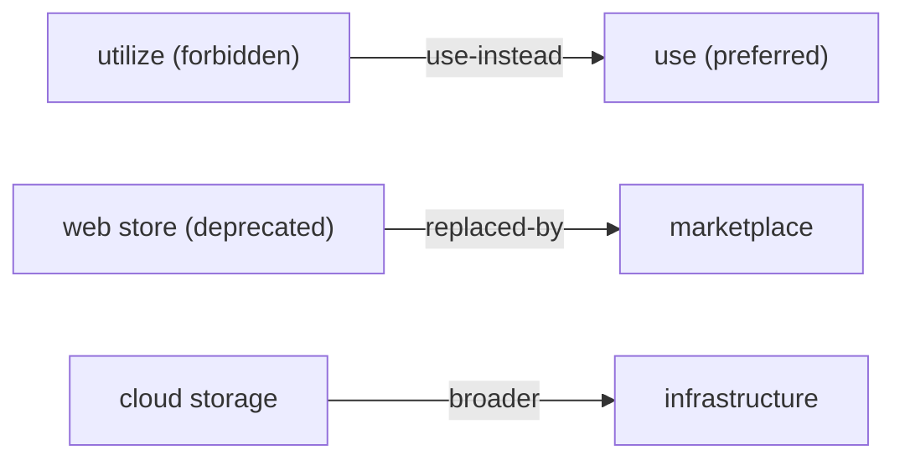

# Terminology

neokapi manages terminology with a concept-oriented model inspired by the TBX
(TermBase eXchange) standard: language-neutral concepts group multi-locale
terms, each carrying a lifecycle status and optional grammatical metadata. The
same model backs the `kapi terms` commands, the `term-lookup` and
`term-enforce` pipeline tools, and the `terms/` Go library.

## Concept-oriented model

A **concept** is a language-neutral knowledge unit. It carries a domain and a
definition, and groups **terms** across locales. Each term has a lifecycle
status, and a locale may hold several terms (a preferred form plus admitted
variants).

```
Concept (e.g., "cloud storage")
├── Domain: "infrastructure"
├── Definition: "Remote file storage accessed via internet"
├── Term: "cloud storage"     (en, preferred)
├── Term: "stockage cloud"    (fr, preferred)
├── Term: "stockage en nuage" (fr, admitted)
├── Term: "Cloud-Speicher"    (de, preferred)
└── Term: "クラウドストレージ"   (ja, preferred)
```

This differs from a flat list of source→target pairs and is what enables
multiple terms per locale, status-driven enforcement, and rich metadata
attached to a single language-neutral concept.

### Term lifecycle statuses

| Status       | Meaning                       | Usage                           |
| ------------ | ----------------------------- | ------------------------------- |
| `preferred`  | The recommended term          | Always suggest to translators   |
| `approved`   | Accepted for use              | Valid alternative               |
| `admitted`   | Allowed but not recommended   | Show with lower priority        |
| `deprecated` | Being phased out              | Warn when found in translations |
| `proposed`   | Under review, not yet approved | Show as suggestion with caveat |
| `forbidden`  | Must not be used              | Flag as error in QA             |

## Concept relations

Concepts are not islands. A terms store persists typed, directed **relations**
between concepts, so a renamed product points at its replacement and a
deprecated term points at the one to use instead. The relation vocabulary is
aligned with [SKOS](https://www.w3.org/2004/02/skos/):

| Category        | Labels                          | Meaning                              |
| --------------- | ------------------------------- | ------------------------------------ |
| Hierarchy       | `broader`, `narrower`           | A parent/child concept relationship  |
| Composition     | `part-of`, `has-part`           | A whole/component relationship       |
| Association     | `related`                       | A non-hierarchical association       |
| Succession      | `replaced-by`                   | A concept superseded by another      |
| Guidance        | `use-instead`                   | A discouraged term points at a preferred one |
| Cross-scheme    | `exact-match`, `close-match`    | Equivalence across schemes           |
| Stance          | `competitor`                    | A competitor's term                  |


```mermaid
graph LR
  utilize["utilize (forbidden)"] -->|use-instead| use["use (preferred)"]
  webstore["web store (deprecated)"] -->|replaced-by| marketplace["marketplace"]
  storage["cloud storage"] -->|broader| infra["infrastructure"]
```

A relation is a first-class record with an ID, a source and target concept, a
type from the vocabulary above, an optional note, and an optional validity
(below). The terms store validates that the type is known and that both concepts
exist before persisting an edge.

### Relation and term validity

A relation, and an individual term, may carry a **validity**: a half-open time
interval `[valid-from, valid-to)` plus a set of free-form tags. A query supplies
a **scope** — a point in time and a set of tags — and only edges and terms whose
validity matches the scope are returned. A nil validity is unbounded (it matches
every scope); a nil scope applies no filtering.

This makes the same terms store answer scope-dependent questions: which terms were
preferred *as of* last quarter, or which relations hold *within* a given market.
Tags are open-ended (the framework assigns them no meaning); a caller chooses a
tag vocabulary — for example a `market` key — and uses it consistently. A nil
validity matches every scope; a nil scope filters nothing.

### Status transitions

A term's status changes over its lifetime. `ValidateTransition(from, to)`
accepts any transition between known statuses — history is the guard, not a
trap — while `IsGovernedTransition(from, to)` reports whether a change is
consequential enough to deserve review: any transition **to** `forbidden` or
`preferred`, or any transition **from** `forbidden`. The framework only
classifies; a platform built on it decides what governance a governed transition
requires.

## Storage backends

Two backends ship in the `terms/` package, both thread-safe
(RWMutex-protected) and implementing the full `Terminology` interface:

1. **In-memory** (`terms.NewInMemoryStore`) — fast and ephemeral, used
   for session-scoped batch processing.
2. **SQLite** (`terms.NewSQLiteStore`) — persistent file-based storage
   for CLI workflows, with fuzzy matching via SQL-based Levenshtein distance.

The `Terminology` interface also accommodates server-side backends for multi-user
deployments with project scoping, terminology streams, and workspace isolation.

## CLI usage

### Resource location

All `kapi terms` commands (except `list`) accept these mutually exclusive flags:

| Flag            | Resolves to                         | Example                      |
| --------------- | ----------------------------------- | ---------------------------- |
| `--name <n>`    | `~/.config/kapi/terms/<n>.db`   | `--name project-terms`       |
| `--local`       | `./terms.db` (current directory) | `--local`                    |
| `--file <path>` | Explicit file path                  | `--file /shared/terms.db`    |
| _(no flag)_     | Same as `--local`                   |                              |

Databases are created on demand if they don't exist. `terms/` and `terms.db`
are the on-disk names for a named or loose terms store. `~/.config/kapi` is the
user config directory on Linux, and resolves to
`~/Library/Application Support/kapi` on macOS. `kapi config path` prints the
resolved location.

With no flag inside a project, the terms store is instead a set of tables in the
project's `.kapi/store.db`, compiled from the committed bundle the recipe binds
with `defaults.terms_source` — see
[Memory & terms storage](/kapi/recipes/memory-and-terms-storage).

```bash
# Import terms
kapi terms import terms.json --name project-terms

# Export terms
kapi terms export --name project-terms --format bundle -o terms.json

# Look up a term (exact, or --fuzzy)
kapi terms lookup "encryption" --name project-terms -s en -t fr
kapi terms lookup "authenticating users" -s en -t fr --fuzzy

# Search concepts, view statistics, list named terms stores
kapi terms search "auth" -s en --limit 50
kapi terms stats --name project-terms
kapi terms list
```

The `kapi terms` commands cover import, export, lookup, search,
statistics, and listing. Concept **relations** are not edited from the
command line: they are authored visually. Kapi Desktop opens a per-concept
dashboard — the `@neokapi/concept-ui` component, which shows a concept's
terms, geography, constraints, a local relations widget, and a timeline —
over a local terms store, where an editor adds, retypes, scopes, and removes
edges directly. The relation data this produces is the same
`ConceptRelation` records persisted by the terms store and read through the [Go
API](#go-library) below.

## Pipeline integration

Two pipeline tools bring terminology into the translation flow:

- **`term-lookup`** scans each Block's source text and attaches matched
  terminology as `TermAnnotation` entries (source term, target suggestions,
  positions, status). It can also power per-block suggestions in an editor.
- **`term-enforce`** checks that translated blocks use the expected
  terminology. Violations are reported as block properties
  (`term-enforce-errors`, `term-enforce-violations`) and as annotations with
  expected-vs-actual detail.

## Go library

### Interface

```go
type Terminology interface {
    AddConcept(concept Concept) error
    GetConcept(id string) (Concept, bool)
    DeleteConcept(id string) error
    Lookup(sourceText string, opts LookupOptions) []TermMatch
    LookupAll(sourceText string, opts LookupOptions) []TermMatch
    Search(query string, sourceLocale, targetLocale model.LocaleID, offset, limit int) ([]Concept, int)

    // Relations between concepts, optionally validity-scoped.
    AddRelation(rel ConceptRelation) error
    DeleteRelation(id string) error
    RelationsOf(conceptID string, scope *graph.Scope) []ConceptRelation // both directions
    ListRelations(scope *graph.Scope) []ConceptRelation

    Count() int
    Concepts() []Concept
    Close() error
}
```

(Methods, and the import/export helpers below, take a `context.Context` as their
first argument in the real API; it is elided here for readability.)

`Lookup` finds the best match for a single term. `LookupAll` scans running text
and returns every term occurrence with positions — this is what powers the
`term-lookup` tool and editor suggestions. By default `LookupAll` matches
case-insensitively (terminology should be recognized regardless of
capitalization); set `CaseSensitive` to override.

### Key types

```go
type Concept struct {
    ID         string
    Domain     string            // subject area (security, ui, marketing)
    Definition string            // language-neutral description
    Terms      []Term
    Properties map[string]string // extensible metadata
    CreatedAt  time.Time
    UpdatedAt  time.Time
}

type Term struct {
    Text         string
    Locale       model.LocaleID
    Status       model.TermStatus // preferred, approved, admitted, deprecated, proposed, forbidden
    PartOfSpeech string
    Gender       string
    Note         string
    Validity     *graph.Validity // optional time + tag scope (nil = unbounded)
}

type ConceptRelation struct {
    ID           string
    SourceID     string
    TargetID     string
    RelationType string          // a SKOS-aligned label: broader, use-instead, replaced-by, …
    Note         string
    Validity     *graph.Validity // optional time + tag scope (nil = unbounded)
    CreatedAt    time.Time
}

type TermMatch struct {
    Concept   Concept
    Term      Term                // the matched source term
    Score     float64             // 0.0-1.0
    MatchType model.MatchStrategy // exact, normalized, fuzzy
    Position  model.TextRange     // position in source text
}

type LookupOptions struct {
    SourceLocale  model.LocaleID
    TargetLocale  model.LocaleID
    CaseSensitive bool
    MinScore      float64             // minimum fuzzy score (default 0.8)
    MatchModes    []model.MatchStrategy
    Domains       []string            // restrict to specific domains
    StatusFilter  []model.TermStatus  // only return terms with these statuses
}
```

`Concept` helpers: `SourceTerm(locale)`, `TargetTerms(locale)`,
`PreferredTerm(locale)`.

### Example

```go
package main

import (
    "fmt"

    "github.com/neokapi/neokapi/core/model"
    "github.com/neokapi/neokapi/terms"
)

func main() {
    tb := terms.NewInMemoryStore()
    defer tb.Close()

    tb.AddConcept(terms.Concept{
        ID:         "c1",
        Domain:     "security",
        Definition: "Process of encoding information",
        Terms: []terms.Term{
            {Text: "encryption", Locale: "en", Status: model.TermPreferred},
            {Text: "chiffrement", Locale: "fr", Status: model.TermPreferred},
        },
    })

    matches := tb.LookupAll(
        "The encryption module handles end-to-end encryption",
        terms.LookupOptions{SourceLocale: "en", TargetLocale: "fr"},
    )
    for _, m := range matches {
        fmt.Printf("Found %q at [%d:%d] → %s (%s)\n",
            m.Term.Text, m.Position.Start, m.Position.End,
            m.Concept.TargetTerms("fr")[0].Text, m.Term.Status)
    }
}
```

### Import / export

```go
// JSON preserves the full concept-oriented structure
count, err := terms.ImportJSON(tb, reader)
err = terms.ExportJSON(tb, writer, "Project Terms")

// CSV is a flat source/target form with optional metadata
opts := terms.CSVImportOptions{
    SourceLocale: "en", TargetLocale: "fr", Domain: "general", HasHeader: true,
}
count, err = terms.ImportCSV(tb, reader, opts)
err = terms.ExportCSV(tb, writer, "en", "fr", true)
```

CSV columns are `source,target,domain` (domain optional). JSON carries the full
concept structure:

```json
{
  "name": "Project Terms",
  "version": "1.0",
  "concepts": [
    {
      "id": "c1",
      "domain": "security",
      "definition": "Encryption where only endpoints can decrypt",
      "terms": [
        { "text": "end-to-end encryption", "locale": "en", "status": "preferred" },
        { "text": "chiffrement de bout en bout", "locale": "fr", "status": "preferred" }
      ]
    }
  ]
}
```

## Terminology and content memory

Terminology and [content memory](/framework/content-memory) are
deliberately separate systems because they answer different questions:

- **Content memory** — "How was this sentence rendered before?" (segment pairs).
- **Terminology** — "What is the correct term for this concept?" (multi-locale
  knowledge units).

They share the `Block` annotation system as their integration point, so both
memory matches and term matches are available to any downstream tool or editor.

Terminology and [segmentation](/framework/segmentation) are run-anchored overlays
produced in the [content-preparation](/framework/content-preparation) pass that
readies a source before translation.
