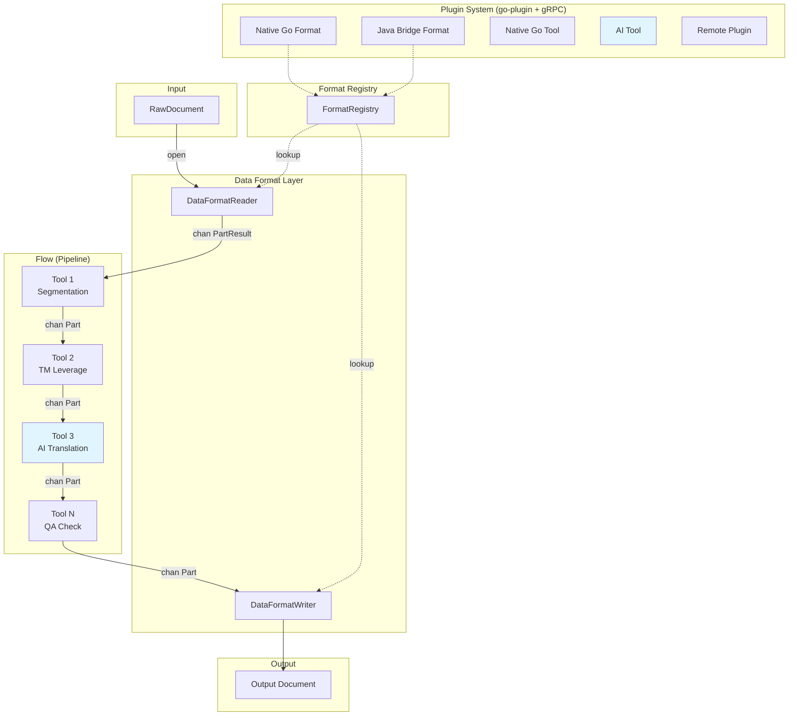
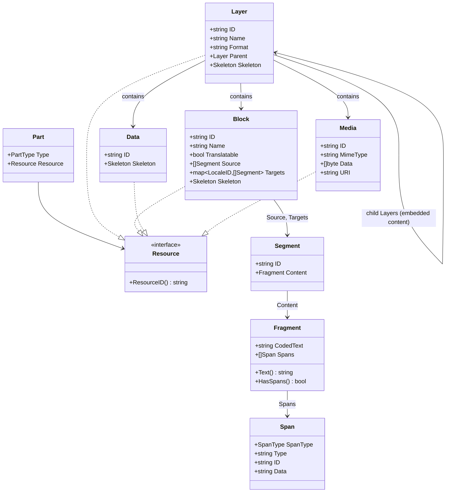

# gokapi: Architecture

gokapi is an AI-native reimagining of the [Okapi Framework](https://okapiframework.org/)
in Go. For the reasoning behind each major design choice, see the
[Architecture Decision Records](/docs/adr/index).

## Architecture Diagram



Documents flow through a channel-based concurrent pipeline. Each tool runs in
its own goroutine. Buffered channels provide backpressure. See
[ADR-003](/docs/adr/004-processing-engine).

## Package Layout

```
gokapi/
├── core/                       # Model types, interfaces, registries
│   ├── model/                  # Part, Block, Layer, Fragment, Span, Data, Media
│   ├── format/                 # DataFormatReader/Writer interfaces, detection
│   ├── tool/                   # Tool interface, BaseTool dispatch
│   ├── flow/                   # FlowExecutor, FlowBuilder, FlowDefinition, FlowStore
│   ├── registry/               # FormatRegistry, ToolRegistry
│   ├── config/                 # Viper-based AppConfig
│   ├── encoding/               # Text encoding utilities
│   └── kaz/                    # KAZ archive format
│
├── formats/                    # 15 built-in format implementations
│   ├── html/                   # Each has reader.go, writer.go, config.go
│   ├── xml/
│   ├── xliff/
│   ├── xliff2/
│   ├── json/
│   ├── yaml/
│   ├── po/
│   ├── properties/
│   ├── plaintext/
│   ├── markdown/
│   ├── csv/
│   ├── srt/
│   ├── vtt/
│   ├── tmx/
│   └── register.go            # init() registration
│
├── ai/                         # AI/LLM integration
│   ├── provider/               # LLMProvider: Anthropic, OpenAI, Ollama
│   ├── tools/                  # AI translate, QA, terminology, review
│   └── prompt/                 # Prompt templates
│
├── mt/                         # Machine translation
│   ├── provider/               # MTProvider: DeepL, Google, Microsoft, ModernMT, MyMemory
│   └── tools/                  # MT translate tool
│
├── lib/
│   ├── sievepen/               # Translation memory (in-memory + SQLite)
│   ├── termbase/               # Terminology management (in-memory + SQLite, TBX-inspired)
│   └── tools/                  # Utility tools (wordcount, pseudo-translate, segmentation, qa-check, tm-leverage, term-lookup, term-enforce, etc.)
│
├── plugin/
│   ├── host/                   # PluginManager, gRPC clients
│   ├── server/                 # gRPC server helpers (plugin side)
│   ├── bridge/                 # Java bridge: protocol, pool, format adapters
│   ├── loader/                 # Plugin discovery and loading
│   ├── registry/               # Multi-version plugin registry
│   ├── shared/                 # DTO types shared between host and bridge
│   └── proto/                  # Protobuf service definitions
│
├── cmd/
│   ├── kapi/                   # Cobra CLI
│   └── gokapi-server/          # Echo v4 REST API server
│
├── apps/
│   └── bowrain/                # Wails v3 desktop app (Go + React/TypeScript)
│
├── internal/testutil/          # Shared test helpers
└── docs/                       # Documentation and ADRs
```

## Content Model



Embedded content (HTML inside JSON, CDATA in XML) is modeled as nested
Layers, each with its own DataFormat. See
[ADR-002](/docs/adr/002-content-model).

### Inline Span Encoding

Fragments use coded text: inline markup is replaced by Unicode PUA markers
(U+E000-U+E0FF), with the actual markup stored in the Spans slice. This
allows string operations on text without corrupting markup.

```
Source HTML: "Click <b>here</b> for info"

Fragment:
    CodedText: "Click \uE001here\uE002 for info"
    Spans: [
        {SpanType: SpanOpening, Type: "bold", Data: "<b>"},
        {SpanType: SpanClosing, Type: "bold", Data: "</b>"},
    ]
```

### Part Stream

```
DataFormatReader.Read(ctx) -> chan PartResult
    -> PartLayerStart  (format="json")
    -> PartBlock        (key: "title")
    -> PartLayerStart  (format="html")        <- embedded child
    -> PartBlock        ("Hello <b>world</b>") <- inside child
    -> PartLayerEnd    (format="html")
    -> PartBlock        (key: "footer")
    -> PartLayerEnd    (format="json")
    -> (channel closed)
```

## Terminology Mapping from Okapi

| Okapi (Java)               | gokapi (Go)                |
|----------------------------|----------------------------|
| Filter                     | DataFormat (Reader/Writer)  |
| Step                       | Tool                       |
| Pipeline                   | Flow                       |
| PipelineDriver             | FlowExecutor               |
| Event                      | Part                       |
| TextUnit                   | Block                      |
| TextFragment               | Fragment                   |
| Code                       | Span                       |
| StartSubDocument/SubFilter | Child Layer                |
| Tikal                      | kapi (CLI)                 |
| Rainbow                    | Bowrain (desktop app)      |

## Key Interfaces

```go
// Format layer
type DataFormatReader interface {
    Open(ctx context.Context, doc *RawDocument) error
    Read(ctx context.Context) <-chan PartResult
    Close() error
}

type DataFormatWriter interface {
    SetOutput(path string) error
    Write(ctx context.Context, parts <-chan *Part) error
}

// Tool layer
type Tool interface {
    Process(ctx context.Context, in <-chan *Part, out chan<- *Part) error
}

// Flow execution
type FlowExecutor interface {
    Execute(ctx context.Context, items []FlowItem) error
}

// AI providers
type LLMProvider interface {
    Translate(ctx context.Context, req TranslateRequest) (*TranslateResponse, error)
    Chat(ctx context.Context, messages []Message) (*Message, error)
}
```

## Build and Distribution

| Channel | Target | Command |
|---------|--------|---------|
| Homebrew formula | kapi CLI | `brew install gokapi/tap/kapi` |
| Homebrew Cask | Bowrain GUI (macOS) | `brew install --cask gokapi/tap/bowrain` |
| GitHub Releases | All platforms | Direct download |
| Go install | Go developers | `go install github.com/gokapi/gokapi/cmd/kapi@latest` |

CI/CD runs via GitHub Actions: `ci.yml` (test, vet, lint, build on every
push) and `release.yml` (GoReleaser on tag push). See
[Release Process](/docs/developer/release) for details.
