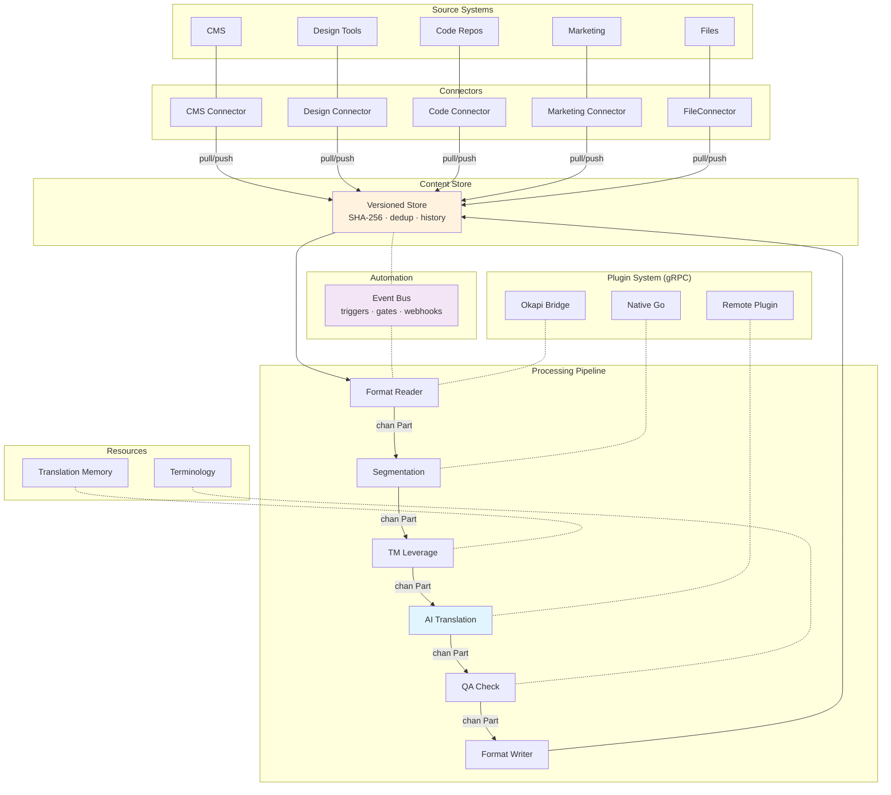
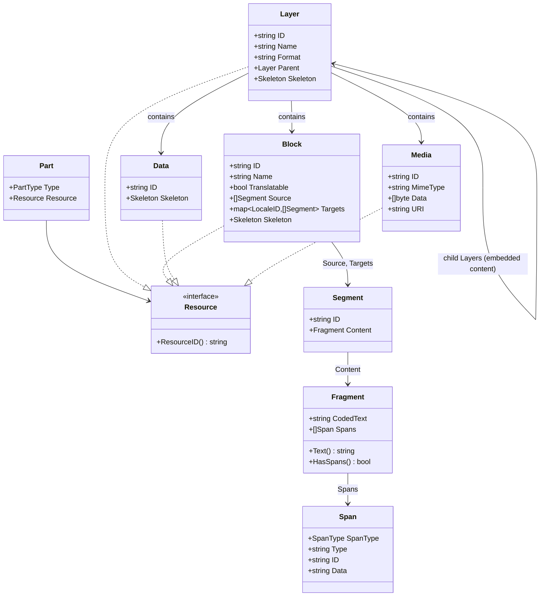

# gokapi: Architecture

gokapi is an open localization platform built in Go. Bidirectional connectors
sync content from live systems into a versioned store, composable tools process
content through a concurrent pipeline, and automation drives the workflow. For
the reasoning behind each major design choice, see the
[Architecture Decisions](/docs/ad/001-vision).

## Platform Architecture



Content flows from source systems through bidirectional connectors into a
versioned content store. The processing pipeline runs each tool in its own
goroutine, connected by buffered channels with automatic backpressure.
Event-driven automation triggers flows, enforces quality gates, and sends
notifications. See [AD-001](/docs/ad/001-vision) and
[AD-004](/docs/ad/004-processing-engine).

## Package Layout

```
gokapi/                              ── Framework Module ──
├── go.mod                           # module github.com/gokapi/gokapi
├── go.work                          # workspace: use . ./cli ./platform ./kapi ./bowrain-cli ./bowrain
│
├── core/                            # All framework Go packages
│   ├── model/                       # Part, Block, Layer, Fragment, Span, Data, Media
│   ├── format/                      # DataFormatReader/Writer interfaces, detection
│   ├── tool/                        # Tool interface, BaseTool dispatch
│   ├── flow/                        # FlowExecutor, FlowBuilder, FlowDefinition
│   ├── registry/                    # FormatRegistry, ToolRegistry
│   ├── encoding/                    # Text encoding utilities
│   ├── locale/                      # BCP-47 locale handling
│   ├── editor/                      # Block index serialization and preview generation
│   ├── version/                     # Build version info
│   │
│   ├── formats/                     # 15 built-in format implementations
│   │   ├── html/                    # Each has reader.go, writer.go, config.go
│   │   ├── xml/, xliff/, xliff2/, json/, yaml/, po/
│   │   ├── properties/, plaintext/, markdown/, csv/
│   │   ├── srt/, vtt/, tmx/
│   │   └── register.go              # init() registration
│   │
│   ├── ai/                          # AI/LLM integration (providers + tools)
│   ├── mt/                          # Machine translation (providers + tools)
│   ├── sievepen/                    # Translation memory (interface + in-memory)
│   ├── termbase/                    # Terminology management (interface + in-memory)
│   ├── tools/                       # Utility tools (wordcount, pseudo, segmentation, etc.)
│   ├── plugin/                      # Plugin system (gRPC, loader, bridge, registry)
│   └── testutil/                    # Shared test helpers
│
│                                    ── CLI Module ──
├── cli/
│   ├── go.mod                       # module github.com/gokapi/gokapi/cli (framework only)
│   ├── config/                      # Viper-based app configuration (~/.config/kapi/)
│   └── output/                      # Shared output formatting + types
│
│                                    ── Platform Module ──
├── platform/
│   ├── go.mod                       # module github.com/gokapi/gokapi/platform (framework only)
│   ├── project/                     # .bowrain/ project model (types, config, sync cache)
│   ├── auth/                        # Auth types, JWT, device flow client
│   ├── connector/                   # Connector interfaces + base types
│   ├── client/                      # REST client for bowrain API
│   ├── config/                      # Auth persistence (StoredAuth, LoadAuth, SaveAuth)
│   ├── store/                       # ContentStore interface + domain types
│   ├── event/                       # Event types + bus interface
│   └── credentials/                 # Provider credential management
│
│                                    ── Kapi Module ──
├── kapi/
│   ├── go.mod                       # module github.com/gokapi/gokapi/kapi (framework + cli)
│   └── cmd/kapi/                    # Thin root cmd wiring shared CLI commands
│
│                                    ── Bowrain CLI Module ──
├── bowrain-cli/
│   ├── go.mod                       # module github.com/gokapi/gokapi/bowrain-cli (framework + cli + platform)
│   └── cmd/bowrain/                 # Bowrain CLI (project cmds + shared CLI base)
│       └── output/                  # Bowrain CLI-specific output types
│
│                                    ── Bowrain Module ──
├── bowrain/
│   ├── go.mod                       # module github.com/gokapi/gokapi/bowrain (framework + platform)
│   ├── auth/                        # OIDC, AuthStore, SQLite auth
│   ├── connector/                   # Concrete connector implementations
│   ├── store/                       # SQLite ContentStore implementation
│   ├── server/                      # HTTP/gRPC server handlers
│   ├── service/                     # Auth, project, connector, flow services
│   ├── event/                       # Event bus implementation + automation
│   ├── sievepen/                    # SQLite TM implementation
│   ├── termbase/                    # SQLite TermBase implementation
│   ├── cmd/bowrain-server/          # Echo v4 REST API server
│   └── apps/
│       ├── bowrain/                 # Wails v3 desktop app (Go + React/TypeScript)
│       └── web/                     # SaaS web UI
│
│   ── Non-Go Assets ──
├── packages/ui/                     # Shared React component library (@gokapi/ui)
├── docs/                            # Architecture decisions, notes
└── website/                         # Docusaurus 3 documentation site
```

## Content Model



Embedded content (HTML inside JSON, CDATA in XML) is modeled as nested
Layers, each with its own DataFormat. See
[AD-002](/docs/ad/002-content-model).

### Inline Span Encoding

Fragments use coded text: inline markup is replaced by Unicode PUA markers
(U+E000-U+E0FF), with the actual markup stored in the Spans slice. This
allows string operations on text without corrupting markup.

```
Source HTML: "Click <b>here</b> for info"

Fragment:
    CodedText: "Click \uE001here\uE002 for info"
    Spans: [
        {SpanType: SpanOpening, Type: "bold", Data: "<b>"},
        {SpanType: SpanClosing, Type: "bold", Data: "</b>"},
    ]
```

### Part Stream

```
DataFormatReader.Read(ctx) -> chan PartResult
    -> PartLayerStart  (format="json")
    -> PartBlock        (key: "title")
    -> PartLayerStart  (format="html")        <- embedded child
    -> PartBlock        ("Hello <b>world</b>") <- inside child
    -> PartLayerEnd    (format="html")
    -> PartBlock        (key: "footer")
    -> PartLayerEnd    (format="json")
    -> (channel closed)
```

## Terminology Mapping from Okapi

| Okapi (Java)               | gokapi (Go)                |
|----------------------------|----------------------------|
| Filter                     | DataFormat (Reader/Writer)  |
| Step                       | Tool                       |
| Pipeline                   | Flow                       |
| PipelineDriver             | FlowExecutor               |
| Event                      | Part                       |
| TextUnit                   | Block                      |
| TextFragment               | Fragment                   |
| Code                       | Span                       |
| StartSubDocument/SubFilter | Child Layer                |
| Tikal                      | kapi (CLI)                 |
| Rainbow                    | Bowrain (desktop app)      |

## Key Interfaces

```go
// Format layer
type DataFormatReader interface {
    Open(ctx context.Context, doc *RawDocument) error
    Read(ctx context.Context) <-chan PartResult
    Close() error
}

type DataFormatWriter interface {
    SetOutput(path string) error
    Write(ctx context.Context, parts <-chan *Part) error
}

// Tool layer
type Tool interface {
    Process(ctx context.Context, in <-chan *Part, out chan<- *Part) error
}

// Flow execution
type FlowExecutor interface {
    Execute(ctx context.Context, items []FlowItem) error
}

// AI providers
type LLMProvider interface {
    Translate(ctx context.Context, req TranslateRequest) (*TranslateResponse, error)
    Chat(ctx context.Context, messages []Message) (*Message, error)
}
```

## Build and Distribution

| Channel | Target | Command |
|---------|--------|---------|
| Homebrew formula | kapi CLI | `brew install gokapi/tap/kapi` |
| Homebrew Cask | Bowrain GUI (macOS) | `brew install --cask gokapi/tap/bowrain` |
| GitHub Releases | All platforms | Direct download |
| Go install | Go developers | `go install github.com/gokapi/gokapi/bowrain/cmd/kapi@latest` |

CI/CD runs via GitHub Actions: `ci.yml` (test, vet, lint, build on every
push) and `release.yml` (GoReleaser on tag push). See
[Release Process](/docs/developer/release) for details.
