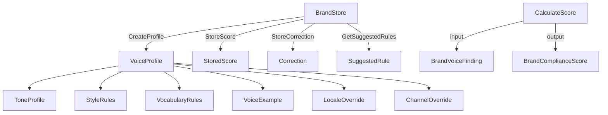

# Brand Voice Library

The brand voice library (`core/brand/`) provides brand voice governance with structured profiles, MQM-inspired compliance scoring, and AI-powered content checking.

## Architecture



## BrandStore Interface

```go
type BrandStore interface {
    // Profile CRUD
    CreateProfile(ctx context.Context, profile *VoiceProfile) error
    GetProfile(ctx context.Context, id string) (*VoiceProfile, error)
    UpdateProfile(ctx context.Context, profile *VoiceProfile) error
    DeleteProfile(ctx context.Context, id string) error
    ListProfiles(ctx context.Context, workspaceID string) ([]*VoiceProfile, error)

    // Score storage
    StoreScore(ctx context.Context, score *StoredScore) error
    GetScores(ctx context.Context, projectID, locale string) ([]*StoredScore, error)
    GetScoreTrends(ctx context.Context, projectID string, days int) ([]*ScoreTrend, error)

    // Correction feedback loop
    StoreCorrection(ctx context.Context, correction *Correction) error
    GetSuggestedRules(ctx context.Context, workspaceID string, minCount int) ([]*SuggestedRule, error)

    Close() error
}
```

### Backends

The framework ships with one storage backend:

- **SQLite** (`cli/storage/brand/sqlite.go`) — file-based storage for CLI tools. JSON columns for complex types (tone, style, vocabulary). Uses the shared `core/storage` migration system.

The `BrandStore` interface is designed for extension — server deployments can provide a PostgreSQL backend for workspace-scoped multi-user storage.

## Implementing a Custom BrandStore

To implement `BrandStore` for a new backend:

```go
package mybrand

import (
    "context"
    "github.com/neokapi/neokapi/core/brand"
)

type MyBrandStore struct {
    // your storage layer
}

func (s *MyBrandStore) CreateProfile(ctx context.Context, profile *brand.VoiceProfile) error {
    // Serialize VoiceProfile fields.
    // Tone, Style, Vocabulary, Examples, Locales, Channels should be JSON-encoded.
    // Set CreatedAt/UpdatedAt if zero.
    // Set Version to 1 if zero.
    return nil
}

func (s *MyBrandStore) GetProfile(ctx context.Context, id string) (*brand.VoiceProfile, error) {
    // Fetch and deserialize.
    // JSON-decode Tone, Style, Vocabulary, Examples, Locales, Channels.
    return nil, nil
}

// ... implement remaining methods
```

Key implementation notes:
- `UpdateProfile` should increment `Version` and set `UpdatedAt`
- `ListProfiles` filters by `WorkspaceID`
- `GetScoreTrends` aggregates by date with AVG(score) and COUNT(*)
- `GetSuggestedRules` groups corrections by original/corrected text and filters by minimum count

## Scoring

### CalculateScore

```go
import "github.com/neokapi/neokapi/core/brand"

findings := []brand.BrandVoiceFinding{
    {
        Dimension: brand.DimensionVocabulary,
        Severity:  brand.SeverityMajor,
        Message:   "Forbidden term: leverage",
        Suggestion: "use",
    },
    {
        Dimension: brand.DimensionTone,
        Severity:  brand.SeverityMinor,
        Message:   "Tone is too formal for this profile",
    },
}

score := brand.CalculateScore(findings)
// score.Overall = 94 (100 - 5 - 1)
// score.Dimensions[0] (tone) = {Score: 99, Penalty: 1, Issues: 1}
// score.Dimensions[2] (vocabulary) = {Score: 95, Penalty: 5, Issues: 1}
```

### Severity Weights

| Severity | Weight | Use case |
|----------|--------|----------|
| `SeverityNeutral` | 0 | Informational findings |
| `SeverityMinor` | 1 | Slight inconsistencies |
| `SeverityMajor` | 5 | Clear violations |
| `SeverityCritical` | 25 | Competitor terms, critical brand issues |

## Profile Resolution

`ResolveProfile` applies locale and channel overrides to a base profile:

```go
import "github.com/neokapi/neokapi/core/brand"

base := &brand.VoiceProfile{
    Tone: brand.ToneProfile{Formality: "neutral", Humor: "light"},
    Style: brand.StyleRules{PersonPOV: "second"},
    Locales: map[string]brand.LocaleOverride{
        "ja": {Formality: "formal", PersonPOV: "third"},
    },
}

// Resolve for Japanese locale
resolved := brand.ResolveProfile(base, "ja", "")
// resolved.Tone.Formality = "formal"  (overridden)
// resolved.Tone.Humor = "light"       (inherited)
// resolved.Style.PersonPOV = "third"  (overridden)
```

Override priority: channel overrides replace entire Tone/Style sections, while locale overrides merge individual fields.

## Pipeline Tools

### brand-voice-check (AI)

```go
import (
    aitool "github.com/neokapi/neokapi/core/ai/tools"
    "github.com/neokapi/neokapi/core/brand"
)

tool := aitool.NewBrandVoiceCheckTool(llmProvider, profile)
```

Uses `ChatStructured` to get structured findings from the LLM. The prompt includes the profile's tone, style, and examples as context. Results are scored via `CalculateScore` and attached as:
- `BrandVoiceAnnotation` on the Block (implements `model.Annotation`)
- `brand-voice-score` block property (JSON-encoded `BrandComplianceScore`)
- `brand-voice-findings` block property (JSON-encoded findings array)

### brand-vocab-filter (Rule-based)

```go
import "github.com/neokapi/neokapi/core/tools"

tool := tools.NewBrandVocabFilterTool(profile)
```

Fast rule-based checking of forbidden and competitor terms without LLM calls. Use this when you only need vocabulary enforcement, not full brand voice analysis.

## Starter Packs

```go
import "github.com/neokapi/neokapi/core/brand/packs"

// List available packs
names, _ := packs.List()
// ["customer-support", "friendly-dtc", "marketing-blog", "professional-b2b", "technical-docs"]

// Load a specific pack
profile, _ := packs.Load("professional-b2b")

// Load all packs
all, _ := packs.LoadAll()
```

Packs are YAML files embedded via `go:embed`. Each returns a `*brand.VoiceProfile` ready to use or customize.

## Content Model Integration

The `BrandVoiceAnnotation` type implements `model.Annotation`:

```go
type BrandVoiceAnnotation struct {
    ProfileID string              `json:"profile_id"`
    Score     int                 `json:"score"` // 0-100 overall
    Findings  []BrandVoiceFinding `json:"findings"`
    Position  model.TextRange     `json:"position"`
}

func (a *BrandVoiceAnnotation) AnnotationType() string { return "brand-voice" }
```

This integrates with the Block annotation system alongside `TermAnnotation` and `EntityAnnotation`, enabling inline highlighting in editors.

## Extending Profiles

Profiles are serializable as both JSON and YAML. To create custom profiles programmatically:

```go
profile := &brand.VoiceProfile{
    ID:   "my-brand",
    Name: "My Brand Voice",
    Tone: brand.ToneProfile{
        Personality: []string{"friendly", "expert"},
        Formality:   "neutral",
        Emotion:     "warm",
        Humor:       "light",
    },
    Style: brand.StyleRules{
        ActiveVoice:    true,
        SentenceLength: "medium",
        PersonPOV:      "second",
        Contractions:   "sometimes",
        ProhibitedPatterns: []brand.Pattern{
            {Regex: `(?i)\bplease note\b`, Description: "Avoid 'please note'", Severity: "minor"},
        },
    },
    Vocabulary: brand.VocabularyRules{
        PreferredTerms: []brand.TermRule{
            {Term: "workspace", Note: "Not 'account'"},
        },
        ForbiddenTerms: []brand.TermRule{
            {Term: "leverage", Replacement: "use", Severity: "minor"},
        },
    },
    Examples: []brand.VoiceExample{
        {
            Before:      "Please note that users can leverage this feature.",
            After:       "You can use this feature to...",
            Explanation: "Direct address, active voice, plain language",
            Category:    "style",
        },
    },
}
```
