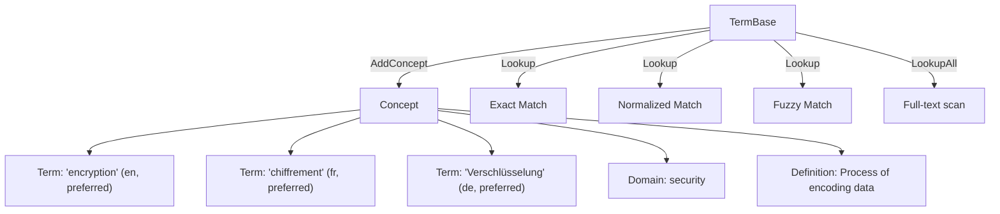

# Terminology Library (Termbase)

The termbase library (`lib/termbase/`) provides concept-oriented terminology management inspired by the TBX (TermBase eXchange) standard. It supports multi-locale terms with lifecycle statuses, domain classification, and both in-text discovery and single-term lookup.

## Architecture



### Concept-Oriented Model

Unlike flat glossaries (source→target pairs), the termbase uses a concept-oriented model:

- A **Concept** is a language-neutral knowledge unit with a domain and definition
- Each concept has multiple **Terms** across locales
- Each term has a **lifecycle status** controlling its usage
- Multiple terms per locale are supported (preferred + admitted variants)

## Interface

```go
type TermBase interface {
    AddConcept(concept Concept) error
    GetConcept(id string) (Concept, bool)
    DeleteConcept(id string) error
    Lookup(sourceText string, opts LookupOptions) []TermMatch
    LookupAll(sourceText string, opts LookupOptions) []TermMatch
    Search(query string, sourceLocale, targetLocale string, offset, limit int) ([]Concept, int)
    Count() int
    Concepts() []Concept
    Close() error
}
```

`Lookup` finds the best match for a single term. `LookupAll` scans running text and returns all term occurrences with positions — this powers the editor's Context panel and the `term-lookup` pipeline tool.

## Key Types

### Concept

```go
type Concept struct {
    ID         string
    Domain     string               // subject area (security, ui, marketing)
    Definition string               // language-neutral description
    Terms      []Term
    Properties map[string]string    // extensible metadata
    CreatedAt  time.Time
    UpdatedAt  time.Time
}
```

Helper methods: `SourceTerm(locale)`, `TargetTerms(locale)`, `PreferredTerm(locale)`.

### Term

```go
type Term struct {
    Text         string
    Locale       model.LocaleID
    Status       model.TermStatus   // preferred, approved, admitted, deprecated, proposed, forbidden
    PartOfSpeech string             // noun, verb, adjective, etc.
    Gender       string             // grammatical gender
    Note         string             // usage note
}
```

### Term Lifecycle Statuses

| Status | Meaning | Usage |
|--------|---------|-------|
| `preferred` | The recommended term | Always suggest to translators |
| `approved` | Accepted for use | Valid alternative |
| `admitted` | Allowed but not ideal | Show with lower priority |
| `deprecated` | Being phased out | Warn when found in translations |
| `proposed` | Under review | Show as suggestion with caveat |
| `forbidden` | Must not be used | Flag as error in QA |

### TermMatch

```go
type TermMatch struct {
    Concept   Concept
    Term      Term                    // the matched source term
    Score     float64                 // 0.0-1.0
    MatchType model.MatchStrategy     // exact, normalized, fuzzy
    Position  model.TextRange         // position in source text
}
```

### LookupOptions

```go
type LookupOptions struct {
    SourceLocale  model.LocaleID
    TargetLocale  model.LocaleID
    CaseSensitive bool
    MinScore      float64               // minimum fuzzy score (default 0.8)
    MatchModes    []model.MatchStrategy  // exact, normalized, fuzzy
    Domains       []string               // restrict to specific domains
    StatusFilter  []model.TermStatus     // only return terms with these statuses
}
```

## Backends

### In-Memory

```go
tb := termbase.NewInMemoryTermBase()
defer tb.Close()
```

Fast, ephemeral. Used in Bowrain for per-project termbases.

### SQLite

```go
tb, err := termbase.NewSQLiteTermBase("/path/to/termbase.db")
defer tb.Close()
```

Persistent. Supports fuzzy matching via SQL-based Levenshtein calculation.

Both backends are thread-safe (RWMutex-protected) and implement the full `TermBase` interface.

## Import/Export

### JSON Format

Full concept-oriented format preserving all metadata:

```go
// Import
count, err := termbase.ImportJSON(tb, reader)

// Export
err := termbase.ExportJSON(tb, writer, "My Termbase")
```

JSON format:

```json
{
  "name": "Project Terms",
  "version": "1.0",
  "concepts": [
    {
      "id": "c1",
      "domain": "security",
      "definition": "Encryption where only endpoints can decrypt",
      "terms": [
        {"text": "end-to-end encryption", "locale": "en", "status": "preferred"},
        {"text": "chiffrement de bout en bout", "locale": "fr", "status": "preferred"}
      ]
    }
  ]
}
```

### CSV Format

Flat source/target pairs with optional metadata:

```go
opts := termbase.CSVImportOptions{
    SourceLocale: "en",
    TargetLocale: "fr",
    Domain:       "general",
    HasHeader:    true,
}
count, err := termbase.ImportCSV(tb, reader, opts)

// Export
err := termbase.ExportCSV(tb, writer, "en", "fr", true)
```

CSV format: `source,target,domain` (domain column optional).

## Usage Example

```go
package main

import (
    "fmt"
    "github.com/gokapi/gokapi/core/model"
    "github.com/gokapi/gokapi/lib/termbase"
)

func main() {
    tb := termbase.NewInMemoryTermBase()
    defer tb.Close()

    // Add a concept with terms in two locales
    tb.AddConcept(termbase.Concept{
        ID:         "c1",
        Domain:     "security",
        Definition: "Process of encoding information",
        Terms: []termbase.Term{
            {Text: "encryption", Locale: "en", Status: model.TermPreferred},
            {Text: "chiffrement", Locale: "fr", Status: model.TermPreferred},
        },
    })

    // Look up all terms in running text
    matches := tb.LookupAll(
        "The encryption module handles end-to-end encryption",
        termbase.LookupOptions{
            SourceLocale: "en",
            TargetLocale: "fr",
        },
    )

    for _, m := range matches {
        fmt.Printf("Found '%s' at [%d:%d] → %s (%s)\n",
            m.Term.Text, m.Position.Start, m.Position.End,
            m.Concept.TargetTerms("fr")[0].Text, m.Term.Status)
    }
    // Output: Found 'encryption' at [4:14] → chiffrement (preferred)
    //         Found 'encryption' at [40:50] → chiffrement (preferred)
}
```

## In-Text Discovery (LookupAll)

`LookupAll` scans running text to find all term occurrences. It:

1. Iterates over all concepts with terms in the source locale
2. Performs case-insensitive substring matching (by default)
3. Returns matches with positions in the original text
4. Deduplicates overlapping matches (longest match wins)

This powers:
- The **term-lookup** pipeline tool — annotates blocks with matched terms
- The **Bowrain Context panel** — shows per-block terminology suggestions
- The **term-enforce** tool — validates that translations use correct terms

## Pipeline Integration

### Term Lookup Tool

```go
tool := tools.NewTermLookupTool(&tools.TermLookupConfig{
    SourceLocale: "en",
    TargetLocale: "fr",
    TB:           tb,
})
```

Scans each Block's source text and attaches `TermAnnotation` entries with source term, target suggestions, positions, and status.

### Term Enforce Tool

```go
tool := tools.NewTermEnforceTool(&tools.TermEnforceConfig{
    SourceLocale: "en",
    TargetLocale: "fr",
    TB:           tb,
})
```

Checks translations for correct terminology usage. For each source term found, verifies that the target contains an expected target term. Violations are reported as block properties and annotations.

## Design Decisions

### Concept-Oriented vs. Flat Glossary

A concept-oriented model (inspired by TBX) was chosen over flat source→target pairs because:
- **Multiple terms per locale**: A concept can have preferred and admitted terms in the same language
- **Lifecycle management**: Terms progress through statuses (proposed → approved → preferred → deprecated)
- **Rich metadata**: Domain, definitions, part of speech, gender, usage notes
- **Language-neutral concepts**: The concept exists independently of any specific language

### Case-Insensitive Matching

Case-insensitive matching is the default for `LookupAll` because terminology should be recognized regardless of capitalization. "Encryption" at the start of a sentence should match the term "encryption". The `CaseSensitive` option in `LookupOptions` allows overriding this when needed.

### Separate from TM

Terminology and translation memory are separate systems with different data shapes:
- **TM entries**: Segment pairs (source fragment → target fragment) with inline markup
- **Termbase concepts**: Multi-term, multi-locale knowledge units with lifecycle statuses

The `Block` annotation system serves as the integration point — both TM matches and term matches are attached as annotations.
