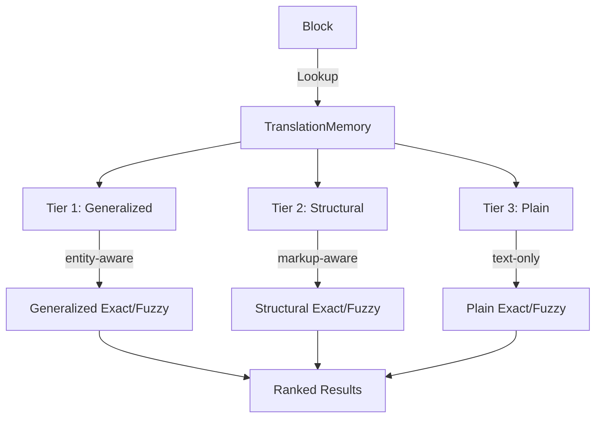

# Sievepen Library

Sievepen (`core/sievepen/`) is gokapi's content-aware translation memory system. Unlike traditional TMs that store plain strings, Sievepen works with the full content model — `Fragment` objects with inline markup — and supports tiered matching with entity-aware adaptation.

## Architecture



### Match Tiers

Each TM entry is indexed with three derived keys, computed from the source `Fragment`:

| Tier | Key Type | Derivation | Example |
|------|----------|-----------|---------|
| 1 | **Generalized** | `Fragment.GeneralizedText()` — entity spans replaced with typed placeholders, structural spans with numbered codes | "Welcome, John" → "Welcome, \{PERSON\}" |
| 2 | **Structural** | `Fragment.StructuralText()` — all spans replaced with numbered codes | "Click **here**" → "Click \{1\}here\{/1\}" |
| 3 | **Plain** | `Fragment.Text()` — all span markers stripped, raw text only | "Click here" |

Each tier produces exact (100%) or fuzzy matches. When a generalized exact match is found, entity values from the current source are adapted into the stored target.

### Match Types

```go
const (
    MatchGeneralizedExact MatchType = "generalized-exact"  // highest reuse
    MatchStructuralExact  MatchType = "structural-exact"
    MatchExact            MatchType = "exact"
    MatchGeneralizedFuzzy MatchType = "generalized-fuzzy"
    MatchStructuralFuzzy  MatchType = "structural-fuzzy"
    MatchFuzzy            MatchType = "fuzzy"               // lowest reuse
)
```

## Interface

```go
type TranslationMemory interface {
    Add(entry TMEntry) error
    Lookup(source *model.Block, sourceLocale, targetLocale model.LocaleID,
           opts LookupOptions) ([]TMMatch, error)
    LookupText(source string, sourceLocale, targetLocale model.LocaleID,
               opts LookupOptions) ([]TMMatch, error)
    Delete(id string) error
    Count() int
    Close() error
}
```

`Lookup` takes a full `*model.Block` and uses its `Fragment` for tiered matching — the Block's entity annotations are used to compute the generalized key and entity adaptations. `LookupText` takes a plain string and only performs plain-tier matching.

## Key Types

### TMEntry

```go
type TMEntry struct {
    ID           string
    ProjectID    string               // project scope (empty = workspace-scoped)
    Source       *model.Fragment      // coded text + inline spans
    Target       *model.Fragment
    SourceLocale model.LocaleID
    TargetLocale model.LocaleID
    Entities     []EntityMapping      // entity placeholders
    Properties   map[string]string
    CreatedAt    time.Time
    UpdatedAt    time.Time
}
```

Helper methods: `SourceText()`, `TargetText()`, `SourceStructural()`, `SourceGeneralized()`.

### TMMatch

```go
type TMMatch struct {
    Entry             TMEntry
    Score             float64              // 0.0-1.0
    MatchType         MatchType
    ProjectID         string               // provenance: project ID of matched entry
    EntityAdaptations []EntityAdaptation   // entity value substitutions
}
```

### LookupOptions

```go
type LookupOptions struct {
    MinScore     float64      // minimum match score (default 0.7)
    MaxResults   int          // max results to return (default 10)
    MatchModes   []MatchMode  // which tiers to use (default: all)
    ProjectID    string       // project context for scoring boost
    ProjectScope ProjectScope // project filtering mode (default: all)
}
```

## Matching Algorithm Internals

### Derived Keys

Each `Fragment` produces three matching keys via methods in `core/model/fragment_keys.go`:

- **`Fragment.Text()`** — strips all span markers (Unicode private use area characters), returning raw text. Used for the plain matching tier.
- **`Fragment.StructuralText()`** — replaces span markers with numbered placeholders (`{id}` for opening, `{/id}` for closing, `{id/}` for standalone). Preserves inline code structure while abstracting away actual markup.
- **`Fragment.GeneralizedText()`** — replaces entity spans with typed placeholders (`{PERSON}`, `{ORGANIZATION}`, etc.) and structural spans with numbered placeholders. Maximum reuse potential — segments with different entity values but identical structure produce the same key.

### 6-Tier Pipeline

Lookup tries matching strategies in order of reuse potential, with early termination:

```
Tier 1: Generalized Exact  →  score 1.0, with entity adaptations
Tier 2: Structural Exact   →  score 1.0
Tier 3: Plain Exact         →  score 1.0
  ↓ (early exit if exact matches found AND MinScore >= 1.0)
Tier 4: Generalized Fuzzy  →  Levenshtein on generalized keys
Tier 5: Structural Fuzzy   →  Levenshtein on structural keys
Tier 6: Plain Fuzzy         →  Levenshtein on plain keys
```

For each fuzzy candidate, the best-scoring tier wins (generalized > structural > plain at equal scores). Results are sorted by `MatchType` priority first, then by score descending.

An entry can appear in results at most once — a `seen` map prevents duplicates across tiers.

### Text Normalization

All matching keys are normalized via `NormalizeText()` before comparison:

1. **Unicode NFC normalization** (`golang.org/x/text/unicode/norm`) — ensures consistent representation of composed characters (Hangul jamo → syllables, combining diacritics → precomposed forms, Arabic tashkeel)
2. **Trim whitespace** — removes leading/trailing whitespace
3. **Collapse internal whitespace** — multiple spaces/tabs → single space

### Levenshtein Scoring

Fuzzy matching uses `LevenshteinRatio()` from `core/sievepen/levenshtein.go`:

- **Algorithm**: Character-level edit distance (insertions, deletions, substitutions each cost 1) using two-row dynamic programming — O(n×m) time, O(m) space
- **Scoring formula**: `1.0 - (distance / max(len(a), len(b)))` where lengths are in Unicode runes
- **Range**: 0.0 (completely different) to 1.0 (identical)
- **Threshold**: Only candidates with score ≥ `MinScore` (default 0.7) are returned

### Result Ranking

Results are sorted by:
1. **MatchType priority** (generalized-exact=0, structural-exact=1, exact=2, generalized-fuzzy=3, structural-fuzzy=4, fuzzy=5)
2. **Score descending** (within the same priority)

Limited to `MaxResults` (default 10) after sorting.

## SQLite Backend

The framework's SQLite backend (`core/sievepen/sqlite.go`) provides persistent storage with optimized matching.

### Schema

```sql
tm_entries (
    id TEXT PRIMARY KEY,
    project_id TEXT,
    stream TEXT,
    source_coded TEXT,    -- JSON-serialized Fragment
    target_coded TEXT,    -- JSON-serialized Fragment
    source_plain TEXT,    -- Fragment.Text() normalized
    source_struct TEXT,   -- Fragment.StructuralText() normalized
    source_general TEXT,  -- Fragment.GeneralizedText() normalized
    source_locale TEXT,
    target_locale TEXT,
    entities TEXT,        -- JSON array of EntityMapping
    properties TEXT,      -- JSON metadata
    created_at TEXT,
    updated_at TEXT
)
```

### Exact Matching

Indexed lookups on pre-computed key columns:

- `idx_tm_general(source_general, source_locale, target_locale)`
- `idx_tm_struct(source_struct, source_locale, target_locale)`
- `idx_tm_plain(source_plain, source_locale, target_locale)`

### Fuzzy Candidate Retrieval

Two-stage process to avoid full table scans:

1. **FTS5 trigram candidate filtering** — an FTS5 virtual table (`tm_trigram`) with `tokenize='trigram'` indexes all three key columns. `BuildTrigramQuery()` constructs the MATCH expression:
   - **Multi-word text**: OR of individual words ≥3 characters as quoted substrings
   - **CJK / single words**: overlapping 4-rune windows sampled at even intervals (max 6 windows)
   - Returns up to **200 candidates**

2. **Levenshtein scoring** — computed in Go on the candidate set. Only results ≥ `MinScore` are kept.

**Fallback**: if FTS5 trigram is unavailable, falls back to length-based pre-filtering (`LENGTH(source_plain) BETWEEN min AND max` with ±30% tolerance, up to 500 candidates).

FTS5 indexes are synced via INSERT/UPDATE/DELETE triggers.

### Full-Text Search (UI)

A separate FTS5 virtual table (`tm_search`) with `tokenize='unicode61'` provides BM25-ranked full-text search for the TM Explorer UI. Falls back to `LIKE` substring search if FTS5 matching fails.

## Entity Adaptation

When a generalized match is found, entity values are adapted:

```
TM entry:   "Welcome, Bob" → "Bienvenue, Bob"
Input text: "Welcome, Alice"
Result:     "Bienvenue, Alice" (score: 100%, type: generalized-exact)
```

`ComputeEntityAdaptations()` matches stored entities to current entities by type (left-to-right positional matching within each entity type). The `EntityAdaptations` field on `TMMatch` lists each substitution with its position, so consumers can apply the adaptations precisely.

## Backends

Four storage tiers, all implementing `TranslationMemory` with full 6-tier matching:

### 1. In-Memory (`core/sievepen/`)

```go
tm := sievepen.NewInMemoryTM()
defer tm.Close()
```

Fast, ephemeral. Used for session-scoped batch processing. Linear scan over all entries.

### 2. CLI SQLite (`core/sievepen/`)

```go
tm, err := sievepen.NewSQLiteTM("/path/to/tm.db")
defer tm.Close()
```

Persistent file-based storage for kapi and bowrain CLI. No project_id or stream columns — designed for single-user, file-based workflows. Resources are resolved via `--name` (KAPI_HOME), `--local` (cwd), or `--file` (explicit path). Created on demand.

### 3. Server SQLite (`bowrain/sievepen/`)

```go
tm, err := bowrainsievepen.NewSQLiteTM(db, projectID)
```

Server-managed with project scoping and terminology streams. See [Bowrain Platform Features](#bowrain-platform-features) below.

### 4. Server PostgreSQL (`bowrain/sievepen/`)

```go
tm, err := bowrainsievepen.NewPostgresTM(db, workspaceID, projectID)
```

Multi-user, multi-workspace. See [Bowrain Platform Features](#bowrain-platform-features) below.

### kapi vs Bowrain

| Aspect | kapi CLI | Bowrain Server |
|--------|---------|---------------|
| Storage | SQLite files on disk | SQLite or PostgreSQL |
| Location | Named in KAPI_HOME, local dir, or file path | Server-managed per workspace |
| Scope | Single user, single machine | Multi-user, multi-workspace |
| Features | CRUD, import/export, lookup, search | + streams, project scoping, REST API |

All backends implement `EntryProvider` with `Entries() []TMEntry` for export operations, and `SearchEntries(query, sourceLocale, targetLocale string, offset, limit int) ([]TMEntry, int)` for paginated search.

## Bowrain Platform Features

The following features are specific to the Bowrain Server backends (`bowrain/sievepen/`).

### PostgreSQL Backend

The PostgreSQL backend (`bowrain/sievepen/postgres.go`) provides the same 6-tier matching pipeline with PostgreSQL-native optimizations:

**Fuzzy candidate retrieval** uses the `pg_trgm` extension with GIN indexes on all three key columns:

```sql
-- GIN trigram indexes
CREATE INDEX idx_tm_trgm_plain USING gin(source_plain gin_trgm_ops);
CREATE INDEX idx_tm_trgm_struct USING gin(source_struct gin_trgm_ops);
CREATE INDEX idx_tm_trgm_general USING gin(source_general gin_trgm_ops);
```

Candidates are retrieved using the `%` similarity operator with a low threshold to maximize recall:

```sql
SELECT ... FROM tm_entries
WHERE workspace_id = $1
  AND (source_plain % $4 OR source_struct % $5 OR source_general % $6)
LIMIT 200
```

Final scoring is done in Go with Levenshtein, same as SQLite.

**Fallback**: if `pg_trgm` is unavailable, uses length-based pre-filtering (±30%, up to 500 candidates).

**Full-text search** uses a `search_tsv` tsvector column populated via a `BEFORE INSERT/UPDATE` trigger:

```sql
search_tsv tsvector GENERATED ALWAYS AS (to_tsvector('simple', source_plain || ' ' || target_coded));
CREATE INDEX idx_tm_search_tsv USING gin(search_tsv);
```

Queries use `plainto_tsquery('simple', ...)` with `ts_rank()` for BM25-like ranking. Falls back to `LIKE` substring search.

### Workspace Isolation

PostgreSQL entries include a `workspace_id` column (part of the primary key). All queries are scoped to the current workspace, providing multi-tenant isolation.

### Project Scoping

Server backends support `ProjectScope` filtering on TM lookups:

```go
const (
    ProjectScopeAll     ProjectScope = iota // workspace-wide, boost current project (default)
    ProjectScopeOnly                        // current project only
    ProjectScopeExclude                     // other projects only
)
```

When `ProjectScopeAll` is active and a fuzzy match comes from the current project, a **+0.03 score boost** is applied (capped at 1.0). This gives slight preference to project-local matches without excluding workspace-wide results.

### Stream-Aware Search

Both server backends support stream-based search with inheritance. A `streamChain` (e.g., `["feature/rebrand", "main", ""]`) defines the lookup order. Entries from earlier streams in the chain take priority:

```sql
ORDER BY CASE
    WHEN stream = 'feature/rebrand' THEN 0
    WHEN stream = 'main' THEN 1
    WHEN stream = '' THEN 2
END
```

The `idx_tm_stream(stream, source_locale, target_locale)` index supports efficient stream-scoped queries.

## TMX Import/Export

```go
// Import TMX into any TranslationMemory
count, err := sievepen.ImportTMX(tm, reader, "en", "fr")

// Export requires EntryProvider interface
err := sievepen.ExportTMX(tm, writer, "en", "fr")
```

Legacy plain-text TMX imports (no inline codes) are stored with plain Fragments and no entity mappings. They participate in plain matching only.

## Usage Example

```go
package main

import (
    "fmt"
    "github.com/gokapi/gokapi/core/model"
    "github.com/gokapi/gokapi/core/sievepen"
)

func main() {
    // Create TM
    tm := sievepen.NewInMemoryTM()
    defer tm.Close()

    // Add an entry
    tm.Add(sievepen.TMEntry{
        ID:           "e1",
        Source:       model.NewFragment("Welcome to our platform"),
        Target:       model.NewFragment("Bienvenue sur notre plateforme"),
        SourceLocale: "en",
        TargetLocale: "fr",
    })

    // Look up a block
    block := model.NewBlock("b1", "Welcome to our platform")
    matches, err := tm.Lookup(block, "en", "fr", sievepen.DefaultLookupOptions())
    if err != nil {
        panic(err)
    }

    for _, m := range matches {
        fmt.Printf("Score: %.0f%% Type: %s Target: %s\n",
            m.Score*100, m.MatchType, m.Entry.TargetText())
    }
    // Output: Score: 100% Type: exact Target: Bienvenue sur notre plateforme
}
```

## Integration Points

- **Pipeline tool**: `TMLeverageTool` uses `Lookup` to pre-fill translations during flow execution
- **Editor integration**: `Lookup` can be used by editors to show per-block TM matches with scores and match types
- **Browsing**: `SearchEntries` provides paginated search for building TM exploration UIs

## Design Decisions

### Content-Aware vs. Plain Text

Storing `*model.Fragment` (coded text + inline spans) rather than plain strings enables:
- Inline markup preservation across matches
- Structural matching tier (ignoring markup differences)
- Entity-aware matching with automatic adaptation
- Higher match rates than plain text TMs

### Three-Tier Architecture

The three tiers (generalized → structural → plain) are tried in order, with the highest-quality match returned first. This mirrors how professional translators evaluate TM matches: entity differences matter less than structural differences, which matter less than textual changes.

### Separate from Terminology

TM and terminology serve fundamentally different purposes:
- **TM**: "How was this sentence translated before?" (segment pairs)
- **Terminology**: "What is the correct term for this concept?" (multi-locale knowledge units)

They share the `Block` annotation system as an integration point but have independent data models and storage.
