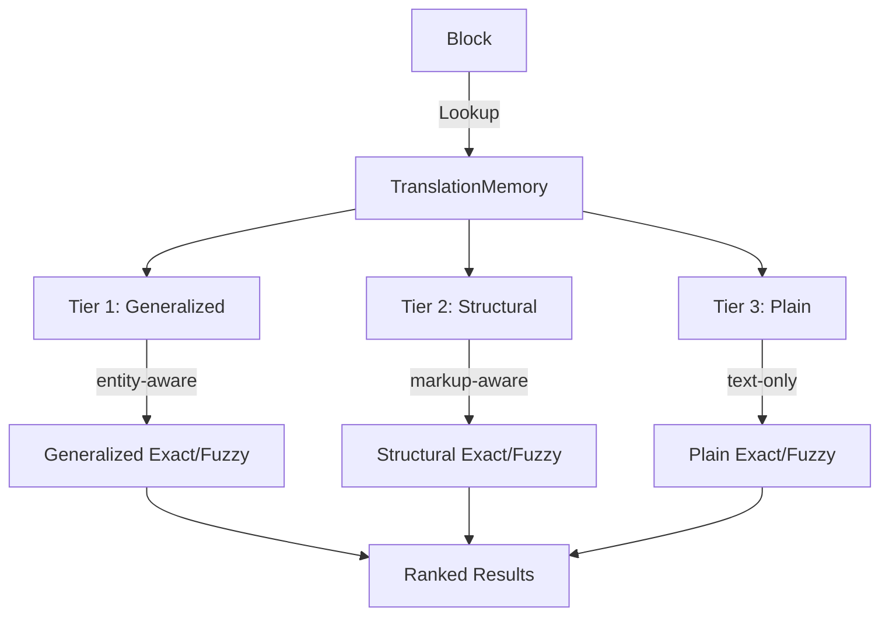

# Translation Memory Library (Sievepen)

Sievepen (`lib/sievepen/`) is gokapi's content-aware translation memory system. Unlike traditional TMs that store plain strings, Sievepen works with the full content model — `Fragment` objects with inline markup — and supports tiered matching with entity-aware adaptation.

## Architecture



### Match Tiers

Each TM entry is indexed with three keys, tried in order:

| Tier | Key Type | What It Normalizes | Example |
|------|----------|-------------------|---------|
| 1 | **Generalized** | Named entities → typed placeholders | "Welcome, John" → "Welcome, \{PERSON\}" |
| 2 | **Structural** | Inline markup → normalized codes | "Click **here**" → "Click \{1\}here\{/1\}" |
| 3 | **Plain** | Nothing (raw text) | Levenshtein fuzzy matching |

Each tier produces exact (100%) or fuzzy matches. When a generalized exact match is found, entity values from the current source are adapted into the stored target.

### Match Types

```go
const (
    MatchGeneralizedExact MatchType = "generalized-exact"  // highest reuse
    MatchStructuralExact  MatchType = "structural-exact"
    MatchExact            MatchType = "exact"
    MatchGeneralizedFuzzy MatchType = "generalized-fuzzy"
    MatchStructuralFuzzy  MatchType = "structural-fuzzy"
    MatchFuzzy            MatchType = "fuzzy"               // lowest reuse
)
```

## Interface

```go
type TranslationMemory interface {
    Add(entry TMEntry) error
    Lookup(source *model.Block, sourceLocale, targetLocale model.LocaleID,
           opts LookupOptions) ([]TMMatch, error)
    LookupText(source string, sourceLocale, targetLocale model.LocaleID,
               opts LookupOptions) ([]TMMatch, error)
    Delete(id string) error
    Count() int
    Close() error
}
```

`Lookup` takes a full `*model.Block` and uses its `Fragment` for tiered matching. `LookupText` takes a plain string and only performs plain-tier matching.

## Key Types

### TMEntry

```go
type TMEntry struct {
    ID           string
    Source       *model.Fragment          // coded text + inline spans
    Target       *model.Fragment
    SourceLocale model.LocaleID
    TargetLocale model.LocaleID
    Entities     []EntityMapping          // entity placeholders
    Annotations  map[string]model.Annotation
    Properties   map[string]string
    CreatedAt    time.Time
    UpdatedAt    time.Time
}
```

Helper methods: `SourceText()`, `TargetText()`, `SourceStructural()`, `SourceGeneralized()`.

### TMMatch

```go
type TMMatch struct {
    Entry             TMEntry
    Score             float64              // 0.0-1.0
    MatchType         MatchType
    EntityAdaptations []EntityAdaptation   // entity value substitutions
}
```

### LookupOptions

```go
type LookupOptions struct {
    MinScore   float64      // minimum match score (default 0.7)
    MaxResults int          // max results to return (default 10)
    MatchModes []MatchMode  // which tiers to use (default: all)
}
```

## Backends

Both backends implement `TranslationMemory` and support all matching tiers.

### In-Memory

```go
tm := sievepen.NewInMemoryTM()
defer tm.Close()
```

Fast, ephemeral. Used in Bowrain for per-project TMs and during batch processing.

### SQLite

```go
tm, err := sievepen.NewSQLiteTM("/path/to/project.tm")
defer tm.Close()
```

Persistent. Pure Go implementation (no CGo). Supports TMX import/export.

Both backends also implement `EntryProvider` with `Entries() []TMEntry` for export operations, and `SearchEntries(query, sourceLocale, targetLocale string, offset, limit int) ([]TMEntry, int)` for paginated search.

## TMX Import/Export

```go
// Import TMX into any TranslationMemory
count, err := sievepen.ImportTMX(tm, reader, "en", "fr")

// Export requires EntryProvider interface
err := sievepen.ExportTMX(tm, writer, "en", "fr")
```

## Usage Example

```go
package main

import (
    "fmt"
    "github.com/gokapi/gokapi/core/model"
    "github.com/gokapi/gokapi/lib/sievepen"
)

func main() {
    // Create TM
    tm := sievepen.NewInMemoryTM()
    defer tm.Close()

    // Add an entry
    tm.Add(sievepen.TMEntry{
        ID:           "e1",
        Source:       model.NewFragment("Welcome to our platform"),
        Target:       model.NewFragment("Bienvenue sur notre plateforme"),
        SourceLocale: "en",
        TargetLocale: "fr",
    })

    // Look up a block
    block := model.NewBlock("b1", "Welcome to our platform")
    matches, err := tm.Lookup(block, "en", "fr", sievepen.DefaultLookupOptions())
    if err != nil {
        panic(err)
    }

    for _, m := range matches {
        fmt.Printf("Score: %.0f%% Type: %s Target: %s\n",
            m.Score*100, m.MatchType, m.Entry.TargetText())
    }
    // Output: Score: 100% Type: exact Target: Bienvenue sur notre plateforme
}
```

## Entity Adaptation

When a generalized match is found, entity values are adapted:

```
TM entry:   "Welcome, Bob" → "Bienvenue, Bob"
Input text: "Welcome, Alice"
Result:     "Bienvenue, Alice" (score: 100%, type: generalized-exact)
```

The `EntityAdaptations` field on `TMMatch` lists each substitution with its position, so consumers can apply the adaptations precisely.

## Integration Points

- **Pipeline tool**: `lib/tools/TMLeverageTool` uses `Lookup` to pre-fill translations
- **Bowrain editor**: `LookupTMForBlock` in the backend uses `Lookup` for per-block matches in the Context panel
- **Bowrain TM Explorer**: Uses `SearchEntries` for paginated browsing
- **KAZ persistence**: TM entries are serialized as JSON in `tm/entries.json` within the `.kaz` archive

## Design Decisions

### Content-Aware vs. Plain Text

Storing `*model.Fragment` (coded text + inline spans) rather than plain strings enables:
- Inline markup preservation across matches
- Structural matching tier (ignoring markup differences)
- Entity-aware matching with automatic adaptation
- Higher match rates than plain text TMs

### Three-Tier Architecture

The three tiers (generalized → structural → plain) are tried in order, with the highest-quality match returned first. This mirrors how professional translators evaluate TM matches: entity differences matter less than structural differences, which matter less than textual changes.

### Separate from Terminology

TM and terminology serve fundamentally different purposes:
- **TM**: "How was this sentence translated before?" (segment pairs)
- **Terminology**: "What is the correct term for this concept?" (multi-locale knowledge units)

They share the `Block` annotation system as an integration point but have independent data models and storage.
